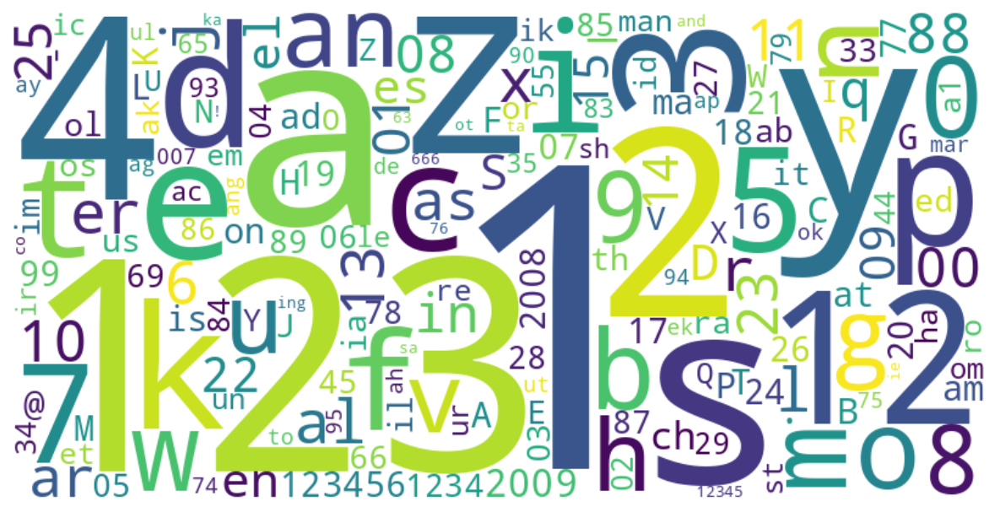

# LLM PCFG Cracking Model

基於大型語言模型（LLM）與概率上下文無關文法（PCFG）的密碼破解模型。  
核心流程：先用 BPE Tokenizer 將密碼分割成有意義的子字串（token），再透過 semantic-guesser 的 PCFG 對每個 token 貼上語義標籤，最終以此訓練 LLM 生成符合密碼分佈的候選密碼。

---

## 專案結構

```
├── config.yaml                  # 全域設定檔（BPE、資料清洗、詞雲）
├── tokenize_setting.yaml        # Tokenize + PCFG 貼標籤設定檔
├── processData.py               # 密碼資料清洗與預處理
├── trainBPE.py                  # BPE Tokenizer 訓練入口
├── run_tokenize.py              # Tokenize + PCFG 貼標籤執行入口
├── src/
│   ├── BPE.py                   # BPE 模型建構（標準模式 + PwdSegment 模式）
│   └── Tokenize.py              # Tokenizer 推論 + PCFG 貼標籤
├── util/
│   ├── data.py                  # 資料載入、清洗、去重工具
│   ├── trainTokenizer.py        # Tokenizer 訓練分派器
│   └── cloud.py                 # 詞彙頻率詞雲視覺化
├── datasets/                    # 原始密碼資料集（每行一個密碼，gitignore）
├── models/                      # 訓練產物（gitignore）
└── gen/                         # 生成圖片輸出
```

---

## 執行流程

### Step 1：資料清洗
```bash
python processData.py
```
讀取 `datasets/` 下的原始密碼檔（`.txt`），依 `config.yaml` 的 `password_cleaning` 設定進行過濾與去重。  
輸出：`datasets/cleaned/<dataset>/`

### Step 2：訓練 BPE Tokenizer
```bash
python trainBPE.py
```
輸出至 `models/tokenizer/<dataset>/`：

| 檔案 | 說明 |
|---|---|
| `tokenizer.json` | HuggingFace 標準格式，含 vocab + merge rules，供模型使用 |
| `vocab_freq.json` | 所有 token 的出現頻率 |
| `vocab_with_freq.json` | 所有 token 含 id + 頻率，依頻率排序 |
| `merged_vocab.json` | 僅合併後的多字元 token（length ≥ 2），依頻率排序 |

### Step 3：Tokenize + PCFG 貼標籤

#### 前置：安裝 semantic-guesser
```bash
git clone https://github.com/vialab/semantic-guesser ../semantic-guesser
cd ../semantic-guesser
pip install -r requirements.txt
cd -
```

#### 執行
```bash
python run_tokenize.py
```

對每個密碼的 BPE token 貼上 PCFG 語義標籤，輸出兩份 CSV：

| 輸出檔案 | 說明 |
|---|---|
| `datasets/tokenized/<dataset>_tokenized_passwords.csv` | 密碼 + token 列表 |
| `datasets/tokenized/<dataset>_tagged_passwords.csv` | 密碼 + token + 標籤 + 結構字串 |

輸出範例：

| Password | Tokens | Tags | Structure |
|---|---|---|---|
| `dragon99!` | `['dragon', '99', '!']` | `['nn', 'number2', 'special1']` | `(nn)(number2)(special1)` |
| `iloveyou` | `['i', 'love', 'you']` | `['nn', 'vv0', 'nn']` | `(nn)(vv0)(nn)` |

### Step 4：詞雲視覺化
```bash
python util/cloud.py
```
讀取 `vocab_with_freq.json`，取前 `top_k` 個 token 生成詞雲。  
輸出：`gen/cloud/<dataset>.png`

---

## BPE 模式說明

本專案支援兩種 BPE 訓練模式，由 `config.yaml` 的 `avg_len` 欄位控制：

| 模式 | `avg_len` 設定 | 停止條件 | 用途 |
|---|---|---|---|
| 標準模式 | `null` | 達到 `vocab_size` | 一般用途 |
| PwdSegment 細粒度 | `1.8` | 詞彙平均長度 ≥ 1.8 | CKL_Backoff、CKL_FLA |
| PwdSegment 粗粒度 | `4.5` | 詞彙平均長度 ≥ 4.5 | CKL_PCFG |

PwdSegment 模式實作自 Ming Xu et al. CCS'21，以詞彙表平均 token 長度作為停止條件，使分割結果更符合密碼的語義結構。

---

## 主要設定

### config.yaml（BPE 訓練與資料清洗）

```yaml
bpe:
  train: true
  vocab_size: 4096
  min_frequency: 1
  avg_len: 4.5              # null=標準模式；1.8=細粒度；4.5=粗粒度
  save_path: "models/tokenizer/000webhost"
  train_corpus: "datasets/cleaned/000webhost"

password_cleaning:
  data_path: "datasets"
  dataset: ['000webhost']
  min_length: 8
  max_length: 20
  reject_non_ascii: true
  reject_all_same_char: true
  dedup: true
  output_path: "datasets/cleaned/000webhost"
```

### tokenize_setting.yaml（Tokenize + PCFG 貼標籤）

```yaml
tokenize:
  dataset: '000webhost'
  data_path: 'datasets/000webhost.txt'
  tokenizer_path: 'models/tokenizer/000webhost/tokenizer.json'
  output:
    tokenized: 'datasets/tokenized/000webhost_tokenized_passwords.csv'
    tagged:    'datasets/tokenized/000webhost_tagged_passwords.csv'
  tagging:
    semantic_guesser_path: '../semantic-guesser'
    tagtype: 'pos'           # 'pos' | 'backoff' | 'pos_semantic'
```

#### tagtype 說明

| 值 | 說明 | 需求 |
|---|---|---|
| `pos` | 純詞性標籤（最穩定） | 僅需 semantic-guesser 基本安裝 |
| `backoff` | 語意優先，無法辨識才退回詞性 | 需先完成 PCFG 訓練 |
| `pos_semantic` | 詞性 + 語意結合 | 需先完成 PCFG 訓練 |

---

## 詞雲範例



---

---

## 評估方法（Evaluation Methodology）

評估的核心問題：**給定一個密碼的結構指紋，模型能否在不知道真實密碼的情況下，將其列入候選清單中？**

### 攻擊情境

攻擊者已知目標密碼的結構規律（例如：由哪些 BPE token 組成、各 token 的詞性/類型），但不知道實際字元。這模擬真實情境下透過社工、洩漏 hint 或帳號資訊推斷密碼結構的場景。

### 兩種推論模式

| `prompt_template_id` | 模型收到的內容 | 用途 |
|---|---|---|
| `1` | 系統提示 + `{token字串: tag說明}` | 公平測試（與訓練格式一致）|
| `2` | 系統提示 + `{"password structure": "(tag1)(tag2)..."}` | 泛化測試（不給 token 字串）|

**模式 1 prompt 範例**（密碼：`indianglaze1`）：
```
As a targeted password guessing model...
{"This password can be segmented...": [["in","ii"],["di","char2"],["ang","char3"],...],
 "For each segment...": {"ii": "介詞/連接詞", "char2": "2字元字母串", ...}}
```

**模式 2 prompt 範例**（只給結構）：
```
As a targeted password guessing model... no actual characters are provided...
{"password structure": "(ii)(char2)(char3)(char3)(mixed2)",
 "segment details": {"position 1": "介詞/連接詞 (ii)", "position 2": "2字元字母串 (char2)", ...}}
```

### 推論流程

```
測試資料: {Password: "indianglaze1", Tokens: "in|di|ang|laz|e1", Tags: "ii|char2|char3|char3|mixed2"}
                          ↓
   依 prompt_template_id 建構 prompt【真實密碼不輸入給模型】
                          ↓
   input_ids = tokenize(系統提示 + knowledge JSON)
                          ↓
   candidates = contrastive_search(model, input_ids)
   → 最多 1000 個候選密碼，依機率降序排列
                          ↓
   若真實密碼出現在候選中 → min_cracked_guess_number = 排名（1起算）
   否則                   → min_cracked_guess_number = 0（未破解）
```

### 執行指令

```bash
python run_eval.py
```

設定檔：`config/search.yaml`（搜索參數在 `contrastive_search`，eval 專用在 `eval`）

| 欄位 | 區塊 | 說明 |
|---|---|---|
| `prompt_template_id` | `contrastive_search` | 1 或 2 |
| `max_guess_number` | `contrastive_search` | 每筆密碼最多生成幾個候選 |
| `test_data_path` | `eval` | 測試集 JSONL 路徑 |
| `max_eval_samples` | `eval` | 評估的密碼數量上限（全量 53K 筆速度過慢）|
| `eval_output_file_name` | `eval` | 輸出檔名（存於 `gen/`）|
| `model_path` | `eval`（可選）| 指定 LoRA checkpoint 路徑 |

### 評估指標

| 指標 | 說明 |
|---|---|
| `min_cracked_guess_number` | 真實密碼在候選清單的排名；0 代表未破解 |
| **Crack rate @ K** | 在前 K 個候選內破解的密碼比例（K = 1, 10, 100, 1000）|

### 輸出格式（`gen/eval_results.jsonl`）

```json
{
  "index": 0,
  "real_password": "indianglaze1",
  "tokens": "in|di|ang|laz|e1",
  "tags": "ii|char2|char3|char3|mixed2",
  "source": "000webhost",
  "model_input": "<系統提示 + knowledge JSON>",
  "candidates": [["indiana123", 0.85], ["indiaglaze1", 0.72]],
  "min_cracked_guess_number": 3
}
```

---

## 參考文獻

- Ming Xu et al., *Password Cracking with PwdSegment*, ACM CCS 2021
- Vialab, *Semantic Guesser*, https://github.com/vialab/semantic-guesser
