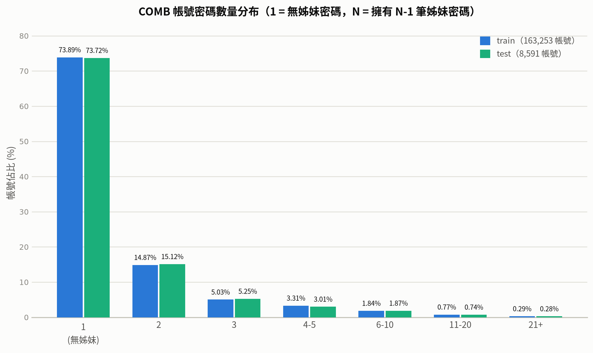

# PCFG_LLM cracking model 研究說明

## 研究動機與目標

過往密碼破解領域已累積許多研究成果，方法歷經統計式模型、類神經網路模型，逐步演進至近年以生成式模型為主的研究路線，例如以類神經網路建模密碼可猜測性的 FLA（Melicher et al., 2016）、以生成對抗網路生成密碼候選的 PassGAN（Hitaj et al., 2019），以及以 pattern 結構資訊引導生成的 PagPassGPT（Su et al., 2024）。近期 PassLLM（Zou et al., 2025）進一步以大型語言模型（LLM）作為密碼破解的基底模型，其實驗結果顯示 LLM 應用於密碼破解任務時，破解成功率可超越過往各類模型。

密碼破解依攻擊情境大致可分為「trawling（撒網式）」與「targeted（針對性）」兩種模式，其中 trawling 情境已有大量研究投入。以 PagPassGPT 為例，該研究已將密碼的**結構資訊**（pattern）引入生成過程，但其基底模型並非大語言模型，未能充分利用大語言模型龐大的預訓練知識與學習能力；而 PassLLM 雖已將大語言模型引入 targeted 密碼猜測，但目前研究多著重於讓模型學習密碼字元間的**分布關係**，尚未明確地將密碼的結構資訊納入建模。既有研究在「結構資訊」與「大語言模型基底」兩者上呈現各自發展、尚未整合的狀況，而此正是 targeted 情境所需面對的核心問題。

因此，本研究希望藉由 LLM 本身強大的學習能力，嘗試針對密碼的結構資訊進行學習，以彌補既有 targeted 密碼猜測模型在結構層面的不足。

## 方法論（架構設計理由）

**PCFG 與語意增強**

機率上下文無關文法（PCFG, Probabilistic Context-Free Grammar）是密碼分析與破解領域的經典方法，透過將密碼拆解為結構樣式（如字母、數字、特殊符號的排列組合）並統計各結構樣式與其對應終端值的機率分布，藉此建模密碼的生成規則。然而傳統 PCFG 多僅捕捉字元類別層級的結構，對密碼中蘊含的語意資訊著墨較少。SE#PCFG（Wang et al., 2025）即指出既有密碼研究對語意資訊的探索仍不足，並提出以語意增強 PCFG 的框架，涵蓋 43 種語意類型；其實驗結果顯示，相較於三個 SOTA 基準（兩個 PCFG 變體與一個神經網路模型），於使用者層級（user level）破解率最高可提升 52.55%，於唯一密碼（unique password）層級最高可提升 94.11%。此結果顯示，在結構之外進一步引入語意層級的資訊，能有效提升密碼猜測模型的表現。

**LLM 的角色與限制**

大型語言模型（LLM）具備強大的序列學習與生成能力，能透過微調（fine-tuning）從大量密碼資料中學習字元間的分布關係與生成模式，如 PassLLM（Zou et al., 2025）之研究成果所示。然而 LLM 本身並不具備密碼結構的顯式先驗知識，其學習到的規則多隱含於模型參數中，缺乏可解釋性，也難以直接控制生成結果對應特定的結構樣式。

**本研究的串接方式**

本研究希望結合 PCFG 明確的結構化／語意化表示與 LLM 強大的學習與生成能力：首先以 PCFG-native 的方式將密碼依字元類別邊界切分為片段（token），並透過 `semantic-guesser` 進行分層標註（backoff／pos／pos_semantic 三種 tag type，涵蓋率由高至低、語意粒度由粗至細），取得每個片段對應的結構與語意標籤；接著將這些標籤轉換為 prompt 中的 placeholder 描述（`<SEG1>…<SEGN>`），作為條件輸入微調 LLM，使模型在給定結構／語意條件下學習生成對應的密碼字元。如此一來，PCFG 負責提供密碼的結構化與語意化先驗知識，LLM 則負責在此先驗條件下學習具體的字元生成分布；透過兩者的結合，使模型在 targeted 密碼猜測任務中，能同時掌握密碼的「結構」與「內容」兩個層面的資訊。

**評估搜尋方法：Constrained Decoding**

在評估階段，本研究首先參考 PassLLM 採用的 beam search 作為基礎搜尋演算法：以累積機率排序候選，並於每個 step 依 EOS 機率是否超過門檻決定是否提前結束生成。然而後續觀察發現，在標籤語意粒度最粗（即 backoff tag，如 `char8`、`number6`，僅編碼字元類別與長度、不含詞性或語意資訊）的情況下，prompt 中以自然語言描述長度僅屬於「軟性引導」，模型在實際生成時仍可能提早發出 EOS，導致生成長度與標籤指定的長度不一致。

為解決此問題，本研究在搜尋法中加入 **Constrained Decoding（約束式解碼）**：當一組密碼的所有標籤皆為 backoff（最粗語意粒度，且完整編碼字元類別與長度）時，改用 Constrained Decoding，在每個 step 動態限制可選 token 為該 step 對應的字元類別，並僅在最後一個 step 才允許發出 EOS，將長度限制由「軟性引導」提升為「硬性約束」，確保生成結果的長度與標籤完全一致；反之，若標籤中含有 pos 或 pos_semantic（未編碼長度資訊），則 fallback 至與 PassLLM 相近的原始 beam search。透過依標籤類型切換搜尋策略，本研究得以在維持 pos／pos_semantic 標籤彈性的同時，確保 backoff 標籤下的生成長度穩定可控。

## 實驗結果

### Prompt 設計差異（id3/id4 vs id5）

相同模型（Qwen3-4B）與搜尋法（constrained_beam_search）下，比較兩種 prompt 設計：id=3（訓練）/id=4（推論，以自然語言描述每個 segment）與 id=5（訓練=推論，raw tag 直接作 `<tag>` placeholder，訓練推論完全一致）。

| @K | id3/id4 | id5/id5 | 提升幅度 |
|---|---|---|---|
| @1 | 1.48% | 1.88% | +27.0% |
| @10 | 2.60% | 4.06% | +56.2% |
| @100 | 4.86% | 8.12% | +67.1% |
| @1000 | 7.34% | 12.18% | +65.9% |

id=5 消除了 id3/4 的訓練推論不對稱、且大幅簡化 prompt 資訊量，破解率在所有 K 值均一致提升，其中純 backoff tag 的相對提升幅度最大（+243%）。詳見 [comparison_id3id4_vs_id5](reports/comparison_id3id4_vs_id5_Qwen3-4B_constrained_beam_search.md)。

### 模型差異（Mistral-7B-v0.1 vs Qwen3-4B）

相同 prompt（id=5）與搜尋法下，比較 7B（Mistral-7B-v0.1）與 4B（Qwen3-4B）模型：

| @K | Mistral（run_6） | Qwen3-4B（run_8） | Δ (pp) |
|---|---|---|---|
| @1 | 2.00% | 1.88% | +0.12 |
| @10 | 4.56% | 4.06% | +0.50 |
| @100 | 9.54% | 8.12% | +1.42 |
| @1000 | 15.04% | 12.18% | +2.86 |

Mistral-7B 在所有 K 值均領先 Qwen3-4B，且差距隨 K 增加而擴大，顯示較大的模型容量在 targeted 密碼猜測任務上有一定優勢；但 Mistral 訓練時使用的 LoRA 容量與 Qwen 不同（見下節），模型大小與 LoRA 容量兩個變因目前未完全分離，領先幅度不能完全歸因於參數量差異。詳見 [comparison_Mistral-7B_vs_Qwen3-4B](reports/comparison_Mistral-7B_vs_Qwen3-4B_id5_constrained_beam_search.md)。

### LoRA 容量差異（run_6 為 run_7 的 2 倍）

相同模型（Mistral-7B-v0.1）、相同 prompt（id=5）、相同 epoch 下，run_6 使用的 LoRA 容量為 run_7 的 2 倍：

| @K | run_6（2x LoRA） | run_7（1x LoRA） | Δ (pp) |
|---|---|---|---|
| @1 | 2.00% | 2.24% | -0.24 |
| @10 | 4.56% | 5.18% | -0.62 |
| @100 | 9.54% | 9.60% | -0.06 |
| @1000 | 15.04% | 14.76% | +0.28 |

低 K（@1/@10）反而是較小 LoRA 的 run_7 略優，高 K（@1000）run_6 才略微反超，整體差距在抽樣誤差範圍內，顯示將 LoRA 容量加倍並未帶來明顯且一致的效益。

### Epoch 調整

訓練過程中曾將 epoch 由 3 提升至 10，但比較結果顯示破解率並未隨 epoch 增加而有明顯提升，故後續實驗統一固定在 epoch=10，調校重心改放在 prompt 設計與模型／LoRA 選擇上。

## 下一步計畫 / 待討論事項

### 導入 COMB 資料集並與 PassLLM 對照

計畫加入 **COMB**（Compilation of Many Breaches，大型外洩密碼資料庫）作為新的訓練／測試資料來源，目前已完成清理、切分與三種 tag type（backoff／pos／pos_semantic）標註：

| 項目 | 數量 |
|---|---|
| 原始（raw）train / test | 284,072 / 14,950 |
| backoff train / test | 262,263 / 13,513 |
| pos train / test | 262,263 / 13,513 |
| pos_semantic train / test | 262,263 / 13,513 |
| PassLLM train / test  | 262,263 / 13,513 |

原始資料以帳號為單位取樣，區分「有姊妹密碼」（同帳號存在多筆歷史密碼，可用於 targeted 情境下的舊密碼線索）與「無姊妹密碼」兩類：

| 姊妹密碼覆蓋率 | train（163,253 帳號 / 284,072 筆） | test（8,591 帳號 / 14,950 筆） |
|---|---|---|
| 有姊妹密碼 | 163,452 筆（57.54%） | 8,617 筆（57.64%） |
| 無姊妹密碼 | 120,620 筆（42.46%） | 6,333 筆（42.36%） |

進一步依「單一帳號擁有的密碼總數」統計分布（=1 即無姊妹密碼，≥2 即擁有 N-1 筆姊妹密碼）：

| 帳號密碼數 | train（163,253 帳號） | test（8,591 帳號） |
|---|---|---|
| 1（無姊妹） | 120,620（73.89%） | 6,333（73.72%） |
| 2 | 24,274（14.87%） | 1,299（15.12%） |
| 3 | 8,216（5.03%） | 451（5.25%） |
| 4–5 | 5,406（3.31%） | 259（3.01%） |
| 6–10 | 3,008（1.84%） | 161（1.87%） |
| 11–20 | 1,252（0.77%） | 64（0.74%） |
| 21+ | 477（0.29%，最多 3,368 筆） | 24（0.28%，最多 408 筆） |

分布呈明顯長尾：約 74% 帳號僅有 1 筆密碼（無姊妹密碼可用），僅約 6% 帳號擁有 4 筆以上歷史密碼；train/test 兩個 split 的分布形狀高度一致，顯示取樣具代表性。

規劃在 COMB 測試集上與 **PassLLM** 進行實際對照實驗，而非僅止於文獻引用比較；「有姊妹密碼」子集合可直接對應 PassLLM targeted 模式所需的「舊密碼」線索設定。

### 結合姊妹密碼與結構資訊的評估

未來可嘗試將「姊妹密碼」（同帳號的歷史密碼）與本研究的結構資訊（PCFG tag）一併納入評估，觀察兩種線索同時提供時，模型的破解表現是否優於單獨使用結構資訊或單獨使用舊密碼線索。

## 參考文獻

- Melicher, W., Ur, B., Segreti, S. M., Komanduri, S., Bauer, L., Christin, N., & Cranor, L. F. (2016). Fast, Lean, and Accurate: Modeling Password Guessability Using Neural Networks. In *Proceedings of the 25th USENIX Security Symposium (USENIX Security '16)*, pp. 175–191.
- Hitaj, B., Gasti, P., Ateniese, G., & Perez-Cruz, F. (2019). PassGAN: A Deep Learning Approach for Password Guessing. arXiv:1709.00440.
- Su, X., Zhu, X., Li, Y., Li, Y., Chen, C., & Esteves-Veríssimo, P. (2024). PagPassGPT: Pattern Guided Password Guessing via Generative Pretrained Transformer. arXiv:2404.04886.
- Zou, Y., An, M., & Wang, D. (2025). Password Guessing Using Large Language Models. In *Proceedings of the 34th USENIX Security Symposium (USENIX Security '25)*.
- Wang, Y., Qiu, W., Tang, P., Tian, H., & Li, S. (2025). SE#PCFG: Semantically Enhanced PCFG for Password Analysis and Cracking. *IEEE Transactions on Dependable and Secure Computing*. arXiv:2306.06824.