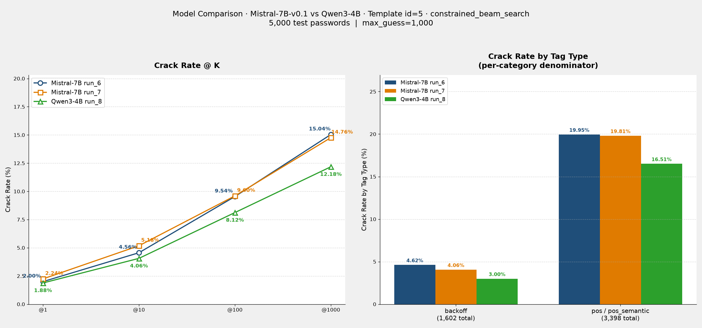

# Comparison Report: Mistral-7B-v0.1 vs Qwen3-4B

**Template：** id=5（訓練 = 推論，兩模型相同） · **搜尋法：** constrained_beam_search · **測試集：** 5,000 筆（000webhost backoff split，三次評估完全相同）

---

## 實驗設定對照

| 項目 | Mistral-7B run_6 | Mistral-7B run_7 | Qwen3-4B run_8 |
|---|---|---|---|
| 模型大小 | 7B | 7B | 4B |
| LoRA | `checkpoints/Mistral-7B-v0.1/run_6/lora_final` | `checkpoints/Mistral-7B-v0.1/run_7/lora_final` | `checkpoints/Qwen3-4B/run_8/lora_final` |
| LoRA rank / alpha | r=32, alpha=64（雙倍於 `config/train_config.yaml` 預設值） | r=32, alpha=64（雙倍於 `config/train_config.yaml` 預設值） | 未記錄（`id5_run8` 報告未保存此欄位，無法確認是否為預設 r=16/alpha=32） |
| Tokenizer | SentencePiece (SPM) | SentencePiece (SPM) | tiktoken (BPE) |
| 訓練 Template | id=5 | id=5 | id=5 |
| 推論 Template | id=5 | id=5 | id=5 |
| 搜尋法（primary） | `constrained_beam_search` | `constrained_beam_search` | `constrained_beam_search` |
| 搜尋法（fallback） | `dynamic_beam_search` | `dynamic_beam_search` | `dynamic_beam_search` |
| 來源 log | `results/eval/eval-249331.out` | `results/eval/eval-249332.out` | `results/eval/eval-246776.out` |

---

## Crack Rate 對照

| @K | Mistral run_6 | Mistral run_7 | Qwen3-4B run_8 | Δ run_6 vs Qwen (pp) | Δ run_7 vs Qwen (pp) |
|---|---|---|---|---|---|
| @1 | 100 / 5,000 (2.00%) | 112 / 5,000 (2.24%) | 94 / 5,000 (1.88%) | +0.12 | +0.36 |
| @10 | 228 / 5,000 (4.56%) | 259 / 5,000 (5.18%) | 203 / 5,000 (4.06%) | +0.50 | +1.12 |
| @100 | 477 / 5,000 (9.54%) | 480 / 5,000 (9.60%) | 406 / 5,000 (8.12%) | +1.42 | +1.48 |
| @1000 | 752 / 5,000 (15.04%) | 738 / 5,000 (14.76%) | 609 / 5,000 (12.18%) | +2.86 | +2.58 |

@1000 相對提升：Mistral run_6 較 Qwen run_8 高 **+23.5%**，run_7 高 **+21.2%**。

---

## Tag 類型破解率對照

（分母為測試集中各類型的總筆數，三次評估使用**相同測試集**）

| Tag 類型 | 測試集筆數 | Mistral run_6 破解率 | Mistral run_7 破解率 | Qwen3-4B run_8 破解率 |
|---|---|---|---|---|
| 純 backoff | 1,602 | 4.62% (74) | 4.06% (65) | 3.00% (48) |
| 含 pos / pos_semantic | 3,398 | 19.95% (678) | 19.81% (673) | 16.51% (561) |
| **合計** | **5,000** | **15.04%** (752) | **14.76%** (738) | **12.18%** (609) |

---

## 結果圖表

---

## 觀察與分析

### 1. Mistral-7B 在所有 K 值均優於 Qwen3-4B
無論 run_6 或 run_7，Mistral 在 @1/@10/@100/@1000 的破解率都高於 Qwen3-4B run_8，且差距隨 K 增加而擴大（@1 約 +0.1~0.4pp，@1000 擴大到 +2.6~2.9pp）。在相同的 prompt template（id=5）與搜尋法下，較大的模型容量（7B vs 4B）似乎轉化為更好的密碼候選生成能力。

### 2. 兩個 tag 類型上 Mistral 都全面領先
純 backoff tag：Mistral（4.06–4.62%）> Qwen（3.00%）；含 pos/pos_semantic tag：Mistral（19.81–19.95%）> Qwen（16.51%）。領先幅度在兩個類型上相近（約 35–55% 相對提升），顯示 Mistral 的優勢並非集中在某一類 tag，而是整體生成品質的提升。

### 3. Mistral 兩次 checkpoint（run_6/run_7）的一致性
run_6 與 run_7 彼此的差距（@1000 相差 0.28pp，見 [run_6 vs run_7 比較報告](comparison_run6_vs_run7_Mistral-7B_id5_constrained_beam_search.md)）遠小於 Mistral 與 Qwen 之間的差距（2.58–2.86pp），代表 Mistral vs Qwen 的差異是穩定的模型/架構效應，而非單次訓練的隨機波動。

### 4. LoRA rank 是潛在混淆因子
Mistral run_6/run_7 使用的 LoRA rank/alpha（r=32/alpha=64）是 `config/train_config.yaml` 預設值（r=16/alpha=32）的雙倍，但 Qwen run_8 實際使用的 r/alpha 未記錄在對應報告中。若 Qwen run_8 使用的是較小的預設 rank，則 Mistral 的領先可能部分來自更大的 LoRA 容量，而非單純模型大小或 tokenizer 差異；這個變因目前無法排除。

### 5. 結論
在 id=5 prompt 設計、相同搜尋法與測試集條件下，Mistral-7B-v0.1 的目標式猜測能力顯著優於 Qwen3-4B，推測與模型參數量（7B vs 4B）、tokenizer 差異（SPM vs BPE）及可能的 LoRA rank 差異有關；後續若要進一步歸因，建議在相同參數量級、相同 LoRA rank 下比較，或針對 tokenizer 差異做消融實驗。

---

## 參考報告

- [id5_run6_Mistral-7B_id5_constrained_beam_search.md](id5_run6_Mistral-7B_id5_constrained_beam_search.md)
- [id5_run7_Mistral-7B_id5_constrained_beam_search.md](id5_run7_Mistral-7B_id5_constrained_beam_search.md)
- [id5_run8_Qwen3-4B_id5_constrained_beam_search.md](id5_run8_Qwen3-4B_id5_constrained_beam_search.md)
- [comparison_run6_vs_run7_Mistral-7B_id5_constrained_beam_search.md](comparison_run6_vs_run7_Mistral-7B_id5_constrained_beam_search.md)
