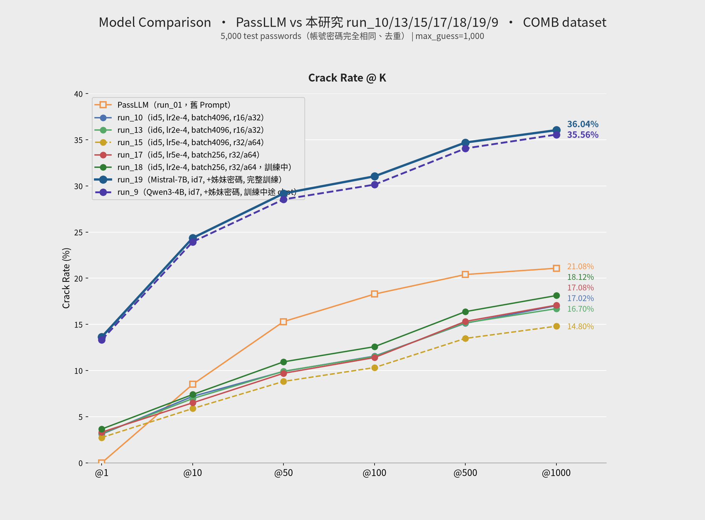
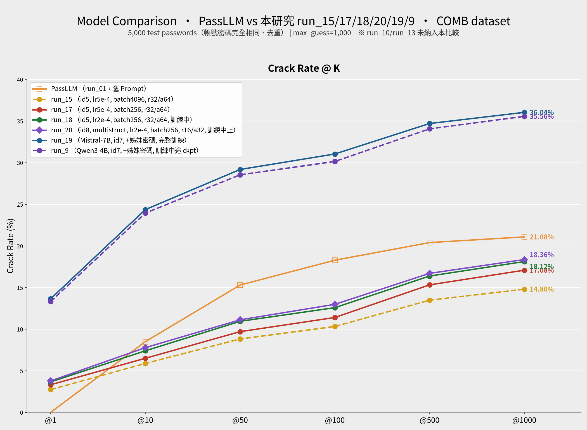
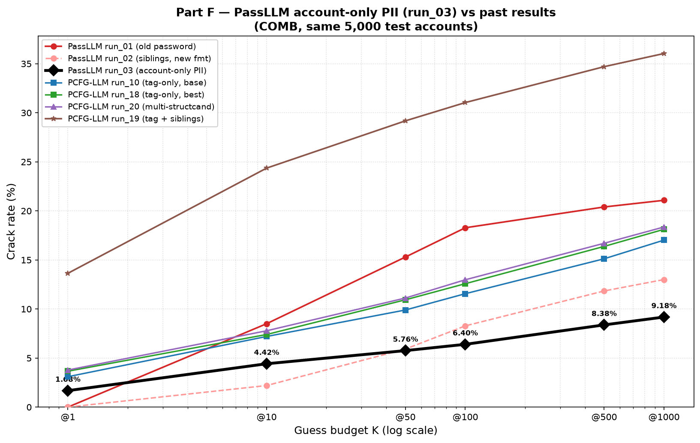

# Comparison Report: PassLLM vs 本研究 PCFG-LLM（COMB 資料集）

**資料集：** COMB（同一組 5,000 筆測試密碼，帳號取樣一致） · **基底模型：** Mistral-7B-v0.1 + LoRA（Part D 另加 Qwen3-4B 跨底模對照）

---

## 本報告的組織方式

本報告依「實驗性質」分成四大部分，各部分自成一個完整敘事，可獨立閱讀：

| 部分 | 主題 | 比較對象 | 對應舊章節 |
|---|---|---|---|
| **[Part A](#part-a--基準對照passllm-run_01-vs-本研究-run_10)** | 基準對照 | PassLLM `run_01` vs 本研究 `run_10`（兩方） | 舊 §1–6 |
| **[Part B](#part-b--單項實驗prompt-格式敏感度與多次訓練彙整)** | 單項實驗 | B.1 新／舊 prompt 四方；B.2 五次訓練六方 | 舊 §7–8 |
| **[Part C](#part-c--總合比較加入-sibling-passwords-的-run_19七方)** | 總合比較 | 加入 `sibling passwords` 的 `run_19`（七方） | 舊 §9 |
| **[Part D](#part-d--跨底模對照qwen3-4b-run_9八方)** | 跨底模對照 | Qwen3-4B `run_9`（八方） | 舊 §10 |
| **[Part E](#part-e--多候選結構run_20id8-multi-structcand)** | 多候選結構 | `run_20`（id=8, multistruct，無姊妹密碼） | 新增 |
| **[Part F](#part-f--passllm-pii-消融只用帳號資訊的-run_03)** | PassLLM PII 消融 | PassLLM `run_03`（只用帳號資訊、無舊密碼） | 新增 |

**四部分共同前提：** 兩側測試集皆為 COMB 的同一組 5,000 筆帳號密碼（一致性驗證見 [A.3](#a3-測試集筆數說明)）；PassLLM 未特別註明時一律指 `run_01`（舊 Prompt）基準；crack rate 一律以「命中筆數 / 5,000」計算，@K 表示前 K 個候選內命中。

**閱讀路徑建議：** 只想看結論 → [C.3](#c3-crack-rate-對照) 與 [D.3](#d3-crack-rate-對照)；想理解「為何 PassLLM 數字看起來較高」→ 先讀 [A.6](#a6-passllm-猜中密碼的姊妹密碼組成分析)。

---
---

# Part A — 基準對照：PassLLM `run_01` vs 本研究 `run_10`

> 本部分建立整份報告的比較基準：兩側皆為 Mistral-7B-v0.1 + LoRA，在**完全相同**的 5,000 筆 COMB 測試集上評估。本研究側使用 `run_10`（prompt id=5，只有 tag 結構、不含姊妹密碼），PassLLM 側使用 `run_01`（舊 Prompt）。最後 A.6 拆解 PassLLM 命中結果的來源，說明兩者其實鎖定不同威脅情境——這是後續 Part B/C/D 所有討論的前提。

## A.1 訓練參數對照

| 項目 | 本研究 PCFG-LLM | PassLLM |
|---|---|---|
| 訓練資料 | `datasets/processed/semanticPCFG/COMB/backoff/split/train_data.jsonl`（PCFG-native 切分 + backoff tag） | `data/COMB/TRAIN.json`（原始 targeted json，含 old password） |
| prompt_template_id | 5 | 0 |
| LoRA 種類 | lora（標準 bf16） | lora（標準 bf16） |
| LoRA r / alpha | 16 / 32 | 16 / 32 |
| LoRA target_modules | q_proj, k_proj, v_proj | q_proj, k_proj, v_proj |
| LoRA dropout | 0.2 | 0.2 |
| per_device_train_batch_size | 64 | 4 |
| gradient_accumulation_steps | 64 | 64 |
| 有效 batch size | 4,096 | 256 |
| learning_rate | 2e-4 | 5e-4 |
| num_train_epochs | 10 | 3 |
| warmup_ratio | 0.1 | 0.1 |
| weight_decay | 0.01 | 0.01 |
| optim | adamw_torch | adamw_torch |
| bf16 | true | true |
| seed / data_seed | 42 / 42 | 42 / 42 |
| checkpoint | `checkpoints/Mistral-7B-v0.1/run_10/lora_final` | `checkpoints/mistral_7b_COMB/final` |

## A.2 評估參數對照

| 項目 | 本研究 PCFG-LLM | PassLLM |
|---|---|---|
| test_data | `datasets/processed/semanticPCFG/COMB/backoff/split/test_data.jsonl` | `data/COMB/TEST.json` |
| 測試筆數（去重後） | 5,000 | 5,000 |
| prompt_template_id | 5 | 0 |
| 搜尋法 | `constrained_beam_search`（backoff tag 全部時）／fallback `dynamic_beam_search`（含 pos/pos_semantic 時） | `dynamic_beam_search` |
| beam_width | 1,000（單一 int，per-step 上界依字元集自動限制） | `[95, 1000] × 15`（逐 step list） |
| batch_size | 1,000 | 100 |
| eos_threshold | （constrained 段：最後 step 強制 EOS） | 0.001 |
| max_guess_number | 1,000 | 1,000 |
| vocab_limit | true | true |
| precision | half | half |

## A.3 測試集筆數說明

兩側 `test_limit` 皆設為 5,000，且經比對，兩份測試集的帳號／密碼**完全相同**（5,000 筆唯一密碼，交集 = 5,000）。但 PassLLM 實際輸出的 `input_output.jsonl` 有 5,054 筆紀錄，其中 20 筆密碼各被重複評估 2–5 次（共 54 筆重複，重複紀錄的 `min_cracked_guess_number` 完全一致，屬於重跑/紀錄重複，非資料不一致）。為求公平比較，以下 crack rate 已對 PassLLM 結果依密碼去重（保留唯一 5,000 筆），本研究結果本身即為 5,000 筆、無需處理。

**雙方測試集一致性驗證：** 將本研究測試集的 5,000 筆密碼與 PassLLM 去重後的 5,000 筆密碼各自取集合比對——交集為 5,000 筆，「僅存在於本研究」與「僅存在於 PassLLM」皆為 0 筆。即兩側評估的是**完全相同的一組帳號密碼**，並非碰巧筆數相同而已，因此以下 crack rate 對照具備嚴謹的同測試集基礎。

> 本節的去重與一致性結論同樣適用於 Part B、C、D 的所有比較。

## A.4 Crack Rate 對照

| @K | 本研究 PCFG-LLM | PassLLM |
|---|---|---|
| @1 | 155 / 5,000（3.10%） | 0 / 5,000（0.00%） |
| @10 | 360 / 5,000（7.20%） | 425 / 5,000（8.50%） |
| @50 | 495 / 5,000（9.90%） | 765 / 5,000（15.30%） |
| @100 | 578 / 5,000（11.56%） | 914 / 5,000（18.28%） |
| @500 | 756 / 5,000（15.12%） | 1,020 / 5,000（20.40%） |
| @1000 | 851 / 5,000（17.02%） | 1,054 / 5,000（21.08%） |

## A.5 結果圖表


## A.6 PassLLM 猜中密碼的姊妹密碼組成分析

「姊妹密碼」定義同 [About_This_project.md](../About_This_project.md)：同一帳號在 COMB 資料集中存在其他歷史密碼，可作為 PassLLM targeted 模式 `"Old password"` 欄位的線索；該欄位為空陣列則視為「無姊妹密碼」。以下依 `gen/passllm/run_01/input_output.jsonl`（5,054 筆紀錄，依密碼去重後 5,000 筆，與 [A.3](#a3-測試集筆數說明) 一致）統計 PassLLM 猜中密碼中兩者的佔比。

去重後 5,000 筆測試密碼中，2,895 筆（57.9%）帳號有姊妹密碼、2,105 筆（42.1%）無姊妹密碼。

| @K | 猜中總數 | 有姊妹密碼被猜中 | 無姊妹密碼被猜中 | 有姊妹密碼佔比 |
|---|---|---|---|---|
| @10 | 425 | 425 | 0 | 100.0% |
| @50 | 765 | 765 | 0 | 100.0% |
| @100 | 914 | 913 | 1 | 99.9% |
| @500 | 1,020 | 1,019 | 1 | 99.9% |
| @1000 | 1,054 | 1,051 | 3 | 99.7% |


**觀察：** PassLLM 猜中的密碼幾乎全數（@1000 時 99.7%）來自「有姊妹密碼」帳號，顯示模型主要依賴同帳號的舊密碼線索進行 targeted 猜測；在完全沒有舊密碼可用（`"Old password": []`）的帳號上，PassLLM 幾乎無法命中（@1000 僅 3 筆，遠低於該子集 2,105 筆的基期樣本數）。這與本研究 PCFG-LLM 不依賴舊密碼、僅憑結構標籤（tag）即可命中 851 筆（[A.4](#a4-crack-rate-對照)）形成對照——兩者鎖定的是不同威脅情境：PassLLM 對應「已知舊密碼的帳號接管」場景，本研究方法對應「僅知密碼結構、無歷史密碼線索」的場景。

> **Part A 小結：** 在純 tag 結構設定下，本研究 @1000 為 17.02%、低於 PassLLM 的 21.08%，但 @1 反而領先（3.10% vs 0.00%）；而 PassLLM 的成績有 99%+ 建立在姊妹密碼線索上。Part C 即是本研究把姊妹密碼也納入 prompt 後的結果。

---
---

# Part B — 單項實驗：Prompt 格式敏感度與多次訓練彙整

> 本部分收錄兩個彼此獨立的單項實驗，皆以 Part A 的設定為基準：**B.1** 測試「只改 prompt 格式」對兩側各自造成多大影響；**B.2** 彙整本研究在 COMB + Mistral-7B 上已跑過的五次訓練（run_10/13/15/17/18），觀察超參數變動的效果。兩節都不涉及姊妹密碼（PassLLM 除外），姊妹密碼的引入見 Part C。

## B.1 實驗一：Prompt 格式敏感度（四方比較）

PassLLM 端新增 `run_02`（`gen/passllm/run_02/`），對照 Part A 既有的 `run_01`（下稱「舊 prompt」）。兩次評估共用**同一組** checkpoint（`checkpoints/mistral_7b_COMB/final`，2026-07-11 訓練）與**同一份**評估設定（`prompt_template_id=0`、`beam_width_list=[95,1000]×15`、`dynamic_beam_search`、`test_path=data/COMB/TEST.json`、`test_limit=5000`），差異僅在於 prompt 的實際內容格式：

| | 舊 Prompt（run_01） | 新 Prompt（run_02） |
|---|---|---|
| 內容格式 | `Old password` 以 `json.dumps` 包裝成 JSON 字串塞入 prompt | 移除 JSON 包裝，改為姊妹密碼（sibling password）以 `</s>` 逐一串接 [^passllm-format] |
| 範例 | `...{"Old password": ["buffalo12"]}` | `...5438350q</s>123456789</s>qwerty123</s>...` |


本研究端同步新增對應的「新 prompt」結果：`run_13`（prompt_template_id=6，來源 log [eval-261839.out](../../results/eval/eval-261839.out)），對照 [A.4](#a4-crack-rate-對照) 既有的 `run_10`（prompt_template_id=5，下稱「舊 prompt」）。與 PassLLM 的情況不同，本研究的新／舊 prompt 是**各自獨立訓練**的 LoRA（皆為 r=16/alpha=32/q,k,v_proj，僅 prompt_template_id 不同），並非同一份 checkpoint 換評估格式：

| | 舊 Prompt（id=5, run_10） | 新 Prompt（id=6, run_13） |
|---|---|---|
| 內容格式 | tag 結構以 `json.dumps` 包裝成 JSON 字串塞入 prompt | 移除 JSON 包裝，system prompt 後直接接 inline tag 字串 |
| 範例 | `...{"structure": "<surname><rouge.n.01><number2>"}` | `...\n<surname><rouge.n.01><number2>` |

### B.1.1 Crack Rate 四方對照

| @K | 本研究舊 Prompt（id=5, run_10） | 本研究新 Prompt（id=6, run_13） | PassLLM 舊 Prompt（run_01） | PassLLM 新 Prompt（run_02） |
|---|---|---|---|---|
| @1 | 155 / 5,000（3.10%） | 159 / 5,000（3.18%） | 0 / 5,000（0.00%） | 0 / 5,000（0.00%） |
| @10 | 360 / 5,000（7.20%） | 348 / 5,000（6.96%） | 425 / 5,000（8.50%） | 110 / 5,000（2.20%） |
| @50 | 495 / 5,000（9.90%） | 496 / 5,000（9.92%） | 765 / 5,000（15.30%） | 296 / 5,000（5.92%） |
| @100 | 578 / 5,000（11.56%） | 576 / 5,000（11.52%） | 914 / 5,000（18.28%） | 414 / 5,000（8.28%） |
| @500 | 756 / 5,000（15.12%） | 758 / 5,000（15.16%） | 1,020 / 5,000（20.40%） | 592 / 5,000（11.84%） |
| @1000 | 851 / 5,000（17.02%） | 835 / 5,000（16.70%） | 1,054 / 5,000（21.08%） | 650 / 5,000（13.00%） |


> 圖中「PassLLM 新 Prompt」的姊妹密碼 `</s>` 串接格式參考 PassLLM 原始設計[^passllm-format]。

**觀察：**

- **PassLLM 對 prompt 格式極為敏感：** 改用新 prompt（移除 JSON 包裝、姊妹密碼改以 `</s>` 串接）使 crack rate 全面下滑，@1000 由 21.08% 降至 13.00%（−8.08pp）。由於模型權重未變、僅推論時輸入格式改變，顯示新格式偏離了模型訓練時實際見過的輸入分佈，猜測能力大幅衰退。
- **本研究 PCFG-LLM 對 prompt 格式幾乎不敏感：** 新／舊 prompt 各自獨立訓練後，@1000 僅由 17.02%（id=5）小幅變動至 16.70%（id=6，−0.32pp），其餘各 K 差距亦在 ±0.3pp 內，可視為訓練隨機性範圍內的正常波動，而非有意義的格式效應。這與 tag 結構本身語意單純、對 JSON 包裝與否不敏感有關；相較之下 PassLLM 的姊妹密碼線索格式改變後，模型難以將新格式對應回訓練時學到的「舊密碼→新密碼」關聯。
- 四者在各 K 的排序為：**PassLLM 舊 Prompt > 本研究（新／舊 Prompt 皆約 17%） > PassLLM 新 Prompt**。

---

## B.2 實驗二：本研究五次訓練彙整（六方比較）

本節彙整本研究在 COMB 資料集、Mistral-7B-v0.1 基底上目前已跑過的五次訓練（run_10、13、15、17、18，皆詳見 [param_compare.md](param_compare.md)），與 PassLLM 做參數與破解率的整體對照。**PassLLM 一欄採用 Part A 的基準（`run_01`，舊 Prompt）**；PassLLM 新 Prompt（`run_02`）數字已在 [B.1.1](#b111-crack-rate-四方對照) 列出，此處不重複。

### B.2.1 訓練參數對照

| 項目 | PassLLM | run_10 | run_13 | run_15 | run_17 | run_18 |
|---|---|---|---|---|---|---|
| 資料集 | COMB | COMB | COMB | COMB | COMB | COMB |
| prompt_template_id | 0 | 5 | 6 | 5 | 5 | 5 |
| LoRA r / alpha | 16 / 32 | 16 / 32 | 16 / 32 | 32 / 64 | 32 / 64 | 32 / 64 |
| target_modules | q,k,v_proj | q,k,v_proj | q,k,v_proj | q,k,v,o_proj,gate_proj | q,k,v,o_proj,gate_proj | q,k,v,o_proj,gate_proj |
| lora_dropout | 0.2 | 0.2 | 0.2 | 0.2 | 0.2 | 0.2 |
| per_device_train_batch_size | 4 | 64 | 64 | 64 | 4 | 4 |
| gradient_accumulation_steps | 64 | 64 | 64 | 64 | 64 | 64 |
| 有效 batch size | 256 | 4,096 | 4,096 | 4,096 | 256 | 256 |
| learning_rate | 5e-4 | 2e-4 | 2e-4 | 5e-4 | 5e-4 | 2e-4 |
| num_train_epochs（計畫） | 3 | 10 | 10 | 10 | 10 | 10 |
| 最終／最佳 eval_loss | 未提供 | 1.649（完成） | 1.651（完成） | 2.327（↑，已發散） | 1.662（step 3620，發散前最佳點） | 1.601（step 2900，目前最佳點） |
| 訓練狀態 | 完成 | 完成（650/650 步） | 完成（650/650 步） | 完成但已發散（10 epoch 跑完，末端劣化） | 於 step ~3966/10,250 被取消，發散 | **訓練中**，已到 step ~4385/10,250（約43%） |
| 評估用 checkpoint | `mistral_7b_COMB/final` | `run_10/lora_final`（= 最終步） | `run_13/lora_final`（= 最終步） | `run_15/lora_final`（= 最終步，發散後） | `run_17/lora_final`（= checkpoint-3620，手動截斷） | `run_18/lora_final_2900`（= checkpoint-2900，手動截斷） |

> run_17、run_18 皆非「訓練正常收斂後」的權重：run_17 用的是發散前最佳點手動截斷，run_18 評估時訓練仍在進行、僅反映目前最佳點，非最終結果。

### B.2.2 Crack Rate 對照

| @K | PassLLM | run_10 | run_13 | run_15 | run_17 | run_18 |
|---|---|---|---|---|---|---|
| @1 | 0 / 5,000（0.00%） | 155 / 5,000（3.10%） | 159 / 5,000（3.18%） | 137 / 5,000（2.74%） | 166 / 5,000（3.32%） | 183 / 5,000（3.66%） |
| @10 | 425 / 5,000（8.50%） | 360 / 5,000（7.20%） | 348 / 5,000（6.96%） | 294 / 5,000（5.88%） | 325 / 5,000（6.50%） | 370 / 5,000（7.40%） |
| @100 | 914 / 5,000（18.28%） | 578 / 5,000（11.56%） | 576 / 5,000（11.52%） | 516 / 5,000（10.32%） | 570 / 5,000（11.40%） | 629 / 5,000（12.58%） |
| @1000 | 1,054 / 5,000（21.08%） | 851 / 5,000（17.02%） | 835 / 5,000（16.70%） | 740 / 5,000（14.80%） | 854 / 5,000（17.08%） | 906 / 5,000（18.12%） |


---

# Part C — 總合比較：加入 sibling passwords 的 `run_19`（七方）


## C.1 訓練參數對照

在 [B.2.1](#b21-訓練參數對照) 六方表格上加入 run_19 一欄：

| 項目 | PassLLM | run_10 | run_13 | run_15 | run_17 | run_18 | run_19 |
|---|---|---|---|---|---|---|---|
| 資料集 | COMB | COMB | COMB | COMB | COMB | COMB | COMB（`combine/backoff` + `Siblings`） |
| prompt_template_id | 0 | 5 | 6 | 5 | 5 | 5 | 7 |
| LoRA r / alpha | 16 / 32 | 16 / 32 | 16 / 32 | 32 / 64 | 32 / 64 | 32 / 64 | 16 / 32 |
| target_modules | q,k,v_proj | q,k,v_proj | q,k,v_proj | q,k,v,o_proj,gate_proj | q,k,v,o_proj,gate_proj | q,k,v,o_proj,gate_proj | q,k,v_proj |
| lora_dropout | 0.2 | 0.2 | 0.2 | 0.2 | 0.2 | 0.2 | 0.2 |
| per_device_train_batch_size | 4 | 64 | 64 | 64 | 4 | 4 | 4 |
| gradient_accumulation_steps | 64 | 64 | 64 | 64 | 64 | 64 | 64 |
| 有效 batch size | 256 | 4,096 | 4,096 | 4,096 | 256 | 256 | 256 |
| learning_rate | 5e-4 | 2e-4 | 2e-4 | 5e-4 | 5e-4 | 2e-4 | 2e-4 |
| num_train_epochs（計畫） | 3 | 10 | 10 | 10 | 10 | 10 | 10 |
| 最終／最佳 eval_loss | 未提供 | 1.649（完成） | 1.651（完成） | 2.327（↑，已發散） | 1.662（step 3620，發散前最佳點） | 1.601（step 2900，目前最佳點） | 1.260（step 5100，最佳點） |
| 訓練狀態 | 完成 | 完成（650/650 步） | 完成（650/650 步） | 完成但已發散（10 epoch 跑完，末端劣化） | 於 step ~3966/10,250 被取消，發散 | **訓練中**，已到 step ~4385/10,250（約43%） | 完成（10,250/10,250 步跑滿） |
| 評估用 checkpoint | `mistral_7b_COMB/final` | `run_10/lora_final`（=最終步） | `run_13/lora_final`（=最終步） | `run_15/lora_final`（=最終步，發散後） | `run_17/lora_final`（=checkpoint-3620，手動截斷） | `run_18/lora_final_2900`（=checkpoint-2900，手動截斷） | `run_19/lora_final`（=checkpoint-5100，`load_best_model_at_end` 自動選點） |

> run_19 是唯一 prompt 中含 `sibling passwords` 的一組，其餘六者（PassLLM 除外）皆只有 tag 結構、無姊妹密碼；LoRA 設定上 run_19 與 run_10/13（r16/a32/qkv-only）相同，與 PassLLM 相比則只差 learning_rate（2e-4 vs 5e-4）與訓練 epoch 是否跑滿。

## C.2 完整 Prompt 對照（同一帳號實例）

以測試集 `index=2`（密碼 `shark71542`，姊妹密碼 `buffalo12`）為例，兩側 `model_input` 逐字擷取如下：

**PassLLM（`gen/passllm/run_01/input_output.jsonl`，index=2）：**

```
<s>As a targeted password guessing model, your task is to utilize the provided account information to guess the password.{"Old password": ["buffalo12"]}
```

**本研究 run_19（`gen/eval_results_id7_run_19_Mistral7B_id7_COMB.jsonl`，index=2）：**

```
As a targeted password guessing model, your task is to generate likely password candidates that match the given password information. The password structure is represented as a sequence of <tag> placeholders, and sibling passwords, if any, are prior passwords from the same account. Do not output the tag placeholders. Generate only the password characters for each segment in order.{"password structure": "<shark.n.01><number5>", "sibling passwords": ["buffalo12"]}
```

> 兩者都把同一筆姊妹密碼 `"buffalo12"` 放進 prompt，差異在於 run_19 額外提供了 `"password structure": "<shark.n.01><number5>"`（tag 結構線索），PassLLM 完全不使用結構資訊、只靠姊妹密碼與模型自身學到的密碼分布猜測。此例中 PassLLM 與 run_19 皆未在 @1000 內命中 `shark71542`。

## C.3 Crack Rate 對照

| @K | PassLLM | run_10 | run_13 | run_15 | run_17 | run_18 | run_19 |
|---|---|---|---|---|---|---|---|
| @1 | 0 / 5,000（0.00%） | 155 / 5,000（3.10%） | 159 / 5,000（3.18%） | 137 / 5,000（2.74%） | 166 / 5,000（3.32%） | 183 / 5,000（3.66%） | 682 / 5,000（**13.64%**） |
| @10 | 425 / 5,000（8.50%） | 360 / 5,000（7.20%） | 348 / 5,000（6.96%） | 294 / 5,000（5.88%） | 325 / 5,000（6.50%） | 370 / 5,000（7.40%） | 1,218 / 5,000（**24.36%**） |
| @50 | 765 / 5,000（15.30%） | 495 / 5,000（9.90%） | 496 / 5,000（9.92%） | 441 / 5,000（8.82%） | 485 / 5,000（9.70%） | 547 / 5,000（10.94%） | 1,459 / 5,000（**29.18%**） |
| @100 | 914 / 5,000（18.28%） | 578 / 5,000（11.56%） | 576 / 5,000（11.52%） | 516 / 5,000（10.32%） | 570 / 5,000（11.40%） | 629 / 5,000（12.58%） | 1,552 / 5,000（**31.04%**） |
| @500 | 1,020 / 5,000（20.40%） | 756 / 5,000（15.12%） | 758 / 5,000（15.16%） | 674 / 5,000（13.48%） | 766 / 5,000（15.32%） | 819 / 5,000（16.38%） | 1,735 / 5,000（**34.70%**） |
| @1000 | 1,054 / 5,000（21.08%） | 851 / 5,000（17.02%） | 835 / 5,000（16.70%） | 740 / 5,000（14.80%） | 854 / 5,000（17.08%） | 906 / 5,000（18.12%） | 1,802 / 5,000（**36.04%**） |


---

# Part D — 跨底模對照：Qwen3-4B `run_9`（八方）

> run_9 訓練截至本節撰寫時**尚未跑完**（`max_steps=10,250`，目前進度約 86%），以下數字用的是訓練中途另存的 `lora_final_6140`（step 6,140），**不是**目前已知的最佳點（step 6,800，eval_loss 1.2811，僅比 6,140 的 1.2833 略低）也不是最終權重。下表與圖表已明確標註此差異，待 run_9 訓練跑完、用最終/最佳權重重新評估後應更新本部分。

## D.1 訓練參數對照

在 [C.1](#c1-訓練參數對照) 七方表格上加入 run_9 一欄：

| 項目 | PassLLM | run_10 | run_13 | run_15 | run_17 | run_18 | run_19 | run_9 |
|---|---|---|---|---|---|---|---|---|
| 底模 | Mistral-7B-v0.1 | Mistral-7B-v0.1 | Mistral-7B-v0.1 | Mistral-7B-v0.1 | Mistral-7B-v0.1 | Mistral-7B-v0.1 | Mistral-7B-v0.1 | **Qwen3-4B** |
| 資料集 | COMB | COMB | COMB | COMB | COMB | COMB | COMB（`combine/backoff` + `Siblings`） | COMB（`combine/backoff` + `Siblings`） |
| prompt_template_id | 0 | 5 | 6 | 5 | 5 | 5 | 7 | 7 |
| LoRA r / alpha | 16 / 32 | 16 / 32 | 16 / 32 | 32 / 64 | 32 / 64 | 32 / 64 | 16 / 32 | 16 / 32 |
| target_modules | q,k,v_proj | q,k,v_proj | q,k,v_proj | q,k,v,o_proj,gate_proj | q,k,v,o_proj,gate_proj | q,k,v,o_proj,gate_proj | q,k,v_proj | q,k,v_proj |
| lora_dropout | 0.2 | 0.2 | 0.2 | 0.2 | 0.2 | 0.2 | 0.2 | 0.2 |
| per_device_train_batch_size | 4 | 64 | 64 | 64 | 4 | 4 | 4 | 4 |
| gradient_accumulation_steps | 64 | 64 | 64 | 64 | 64 | 64 | 64 | 64 |
| 有效 batch size | 256 | 4,096 | 4,096 | 4,096 | 256 | 256 | 256 | 256 |
| learning_rate | 5e-4 | 2e-4 | 2e-4 | 5e-4 | 5e-4 | 2e-4 | 2e-4 | 2e-4 |
| num_train_epochs（計畫） | 3 | 10 | 10 | 10 | 10 | 10 | 10 | 10 |
| 最終／最佳 eval_loss | 未提供 | 1.649（完成） | 1.651（完成） | 2.327（↑，已發散） | 1.662（step 3620，發散前最佳點） | 1.601（step 2900，目前最佳點） | 1.260（step 5100，最佳點） | 1.283（step 6140，**評估用權重，非最佳點**；目前最佳點 1.281 @ step 6800） |
| 訓練狀態 | 完成 | 完成（650/650 步） | 完成（650/650 步） | 完成但已發散（10 epoch 跑完，末端劣化） | 於 step ~3966/10,250 被取消，發散 | **訓練中**，已到 step ~4385/10,250（約43%） | 完成（10,250/10,250 步跑滿） | **訓練中**，已到 step ~8780/10,250（約86%） |
| 評估用 checkpoint | `mistral_7b_COMB/final` | `run_10/lora_final`（=最終步） | `run_13/lora_final`（=最終步） | `run_15/lora_final`（=最終步，發散後） | `run_17/lora_final`（=checkpoint-3620，手動截斷） | `run_18/lora_final_2900`（=checkpoint-2900，手動截斷） | `run_19/lora_final`（=checkpoint-5100，`load_best_model_at_end` 自動選點） | `run_9/lora_final_6140`（=checkpoint-6140，訓練中途手動另存，**非最佳點**） |

## D.2 Prompt 格式

run_9 與 run_19 使用完全相同的 prompt template（id=7），以測試集 `index=2`（密碼 `shark71542`，姊妹密碼 `buffalo12`）為例，run_9 端的 `model_input` 與 [C.2](#c2-完整-prompt-對照同一帳號實例) 列出的 run_19 版本逐字相同：

```
As a targeted password guessing model, your task is to generate likely password candidates that match the given password information. The password structure is represented as a sequence of <tag> placeholders, and sibling passwords, if any, are prior passwords from the same account. Do not output the tag placeholders. Generate only the password characters for each segment in order.{"password structure": "<shark.n.01><number5>", "sibling passwords": ["buffalo12"]}
```

> 兩個 run 的 prompt 文字完全一致（差異只在底模與 tokenizer），因此不重複列出完整對照，細節與 PassLLM 側的比較請見 [C.2](#c2-完整-prompt-對照同一帳號實例)。

## D.3 Crack Rate 對照

在 [C.3](#c3-crack-rate-對照) 七方表格上加入 run_9 一欄：

| @K | PassLLM | run_10 | run_13 | run_15 | run_17 | run_18 | run_19 | run_9 |
|---|---|---|---|---|---|---|---|---|
| @1 | 0 / 5,000（0.00%） | 155 / 5,000（3.10%） | 159 / 5,000（3.18%） | 137 / 5,000（2.74%） | 166 / 5,000（3.32%） | 183 / 5,000（3.66%） | 682 / 5,000（**13.64%**） | 666 / 5,000（**13.32%**） |
| @10 | 425 / 5,000（8.50%） | 360 / 5,000（7.20%） | 348 / 5,000（6.96%） | 294 / 5,000（5.88%） | 325 / 5,000（6.50%） | 370 / 5,000（7.40%） | 1,218 / 5,000（**24.36%**） | 1,197 / 5,000（**23.94%**） |
| @50 | 765 / 5,000（15.30%） | 495 / 5,000（9.90%） | 496 / 5,000（9.92%） | 441 / 5,000（8.82%） | 485 / 5,000（9.70%） | 547 / 5,000（10.94%） | 1,459 / 5,000（**29.18%**） | 1,427 / 5,000（**28.54%**） |
| @100 | 914 / 5,000（18.28%） | 578 / 5,000（11.56%） | 576 / 5,000（11.52%） | 516 / 5,000（10.32%） | 570 / 5,000（11.40%） | 629 / 5,000（12.58%） | 1,552 / 5,000（**31.04%**） | 1,507 / 5,000（**30.14%**） |
| @500 | 1,020 / 5,000（20.40%） | 756 / 5,000（15.12%） | 758 / 5,000（15.16%） | 674 / 5,000（13.48%） | 766 / 5,000（15.32%） | 819 / 5,000（16.38%） | 1,735 / 5,000（**34.70%**） | 1,703 / 5,000（**34.06%**） |
| @1000 | 1,054 / 5,000（21.08%） | 851 / 5,000（17.02%） | 835 / 5,000（16.70%） | 740 / 5,000（14.80%） | 854 / 5,000（17.08%） | 906 / 5,000（18.12%） | 1,802 / 5,000（**36.04%**） | 1,778 / 5,000（**35.56%**） |

> run_9 數字取自 `gen/eval_results_id7_run_9_Qwen4B_id7_COMB.jsonl`（`eval-285824.out`），@1/@10/@100/@1000 與 [id7_run9 報告](id7_run9_Qwen3-4B_id7_constrained_beam_search.md) 一致，@50/@500 另外統計補上。

## D.4 結果圖表



> 圖中 run_9 用紫色虛線標示，以區別於已完整訓練的其餘各線（run_15 的虛線代表「已發散」，run_9 的虛線代表「訓練尚未完成、評估用中途權重」，兩者虛線含義不同，見圖例與各自章節說明）。

---

# Part E — 多候選結構：`run_20`（id=8, multi-structcand）

> `run_20`（[id8_run20 報告](id8_run20_Mistral-7B_id8_multistruct.md)）是本研究第一個使用 **prompt template id=8（multi-structcand）** 的訓練。id=8 沿用 id=5 的 system prompt，但 JSON payload 除主結構（`Tags`，backoff 標記）外，另附上同一組密碼的 **candidate structures**（其他 tag-type 如 pos / pos_semantic 的 `<tag>` 結構列表，來源 `CandTags` 欄位）。與 Part C/D 不同，**run_20 不使用姊妹密碼**，走的是「同一密碼提供多種 tag 結構視角」這條路線。本節列出 run_20 的最高 crack rate（dynamic 搜尋）並與 Part B 的 tag-only 基準對照。底模為 Mistral-7B-v0.1，LoRA 設定同 run_19（r16/α32/dropout0.2/qkv-only、lr 2e-4）。

> **⚠️ 重要限制：** run_20 訓練**未跑完**（SLURM job 321018 於 2026-08-31 10:52 手動取消，約在 step ≈7,100 / 10,250）。以下用的是 `load_best_model_at_end` 自動選出的最佳點 `lora_final_4100`（step 4,100，eval_loss 1.6027 @ epoch 4.0）；因最佳點出現在第 4 epoch、之後曲線走平並輕微過擬合，此權重與跑滿 10 epoch 應選回的最佳點差異很小。

## E.1 訓練參數對照（含 Prompt 差異）

在 [D.1](#d1-訓練參數對照) 的八方表格基礎上加入 run_20 一欄，並**移除 run_10、run_13**（此二者在 [B.2](#b2-實驗二本研究五次訓練彙整六方比較) 已充分討論、且與 run_15/17/18 同屬 tag-only 家族，本節不再重複納入比較）。表格新增「Prompt 內容差異」一列，明確標出各 run prompt payload 的實際內容：

| 項目 | PassLLM | run_15 | run_17 | run_18 | run_19 | run_9 | run_20 |
|---|---|---|---|---|---|---|---|
| 底模 | Mistral-7B-v0.1 | Mistral-7B-v0.1 | Mistral-7B-v0.1 | Mistral-7B-v0.1 | Mistral-7B-v0.1 | **Qwen3-4B** | Mistral-7B-v0.1 |
| 資料集 | COMB | COMB | COMB | COMB | COMB（+`Siblings`） | COMB（+`Siblings`） | COMB（`multistruct`） |
| prompt_template_id | 0 | 5 | 5 | 5 | 7 | 7 | **8** |
| **Prompt 內容差異** | 帳號舊密碼 `{"Old password": [...]}` | inline `<tag>` 結構（JSON 包裝，無姊妹密碼） | inline `<tag>` 結構（同 id5） | inline `<tag>` 結構（同 id5） | id5 結構 + `sibling passwords`（同帳號舊密碼） | id5 結構 + `sibling passwords`（同 run_19） | id5 結構 + **`candidate structures`**（同密碼多 tag-type 結構，**無姊妹密碼**） |
| LoRA r / alpha | 16 / 32 | 32 / 64 | 32 / 64 | 32 / 64 | 16 / 32 | 16 / 32 | 16 / 32 |
| target_modules | q,k,v_proj | q,k,v,o_proj,gate_proj | q,k,v,o_proj,gate_proj | q,k,v,o_proj,gate_proj | q,k,v_proj | q,k,v_proj | q,k,v_proj |
| lora_dropout | 0.2 | 0.2 | 0.2 | 0.2 | 0.2 | 0.2 | 0.2 |
| per_device_train_batch_size | 4 | 64 | 4 | 4 | 4 | 4 | 4 |
| gradient_accumulation_steps | 64 | 64 | 64 | 64 | 64 | 64 | 64 |
| 有效 batch size | 256 | 4,096 | 256 | 256 | 256 | 256 | 256 |
| learning_rate | 5e-4 | 5e-4 | 5e-4 | 2e-4 | 2e-4 | 2e-4 | 2e-4 |
| num_train_epochs（計畫） | 3 | 10 | 10 | 10 | 10 | 10 | 10 |
| 最終／最佳 eval_loss | 未提供 | 2.327（↑，已發散） | 1.662（step 3620，發散前最佳點） | 1.601（step 2900，目前最佳點） | 1.260（step 5100，最佳點） | 1.283（step 6140，評估用權重，非最佳點） | 1.603（step 4100，最佳點） |
| 訓練狀態 | 完成 | 完成但已發散 | 於 step ~3966 被取消，發散 | **訓練中**（~4385/10,250） | 完成（跑滿 10,250 步） | **訓練中**（~8780/10,250） | **訓練中被取消**（~7,100/10,250，約 69%） |
| 評估用 checkpoint | `mistral_7b_COMB/final` | `run_15/lora_final`（發散後） | `run_17/lora_final`（=ckpt-3620，手動截斷） | `run_18/lora_final_2900`（=ckpt-2900，手動截斷） | `run_19/lora_final`（=ckpt-5100，自動選點） | `run_9/lora_final_6140`（=ckpt-6140，中途另存，非最佳點） | `run_20/lora_final_4100`（=ckpt-4100，`load_best_model_at_end` 自動選點） |

> run_20 與 run_19/run_9 共用相同的 LoRA 設定（r16/α32/dropout0.2/qkv-only、lr 2e-4、有效 batch 256），三者唯一差別在 **prompt 線索**：run_19/run_9 提供姊妹密碼，run_20 改提供同一密碼的多 tag-type 候選結構（`candidate structures`），皆**不使用**姊妹密碼。因此 run_20 vs run_19 是「多候選結構 vs 姊妹密碼」在相同 LoRA/底模下的乾淨對照。run_20 評估採最高的 dynamic 搜尋（constrained 因 3,227/5,000 筆帶語意 tag 觸發 fallback→dynamic，@1000 = 18.34%，與 dynamic 僅差 1 筆）。

## E.2 Crack Rate 對照

同樣移除 run_10、run_13，在其餘各 run 上加入 run_20（dynamic，最高）：

| @K | PassLLM | run_15 | run_17 | run_18 | **run_20（id8）** | run_19（id7） | run_9（Qwen） |
|---|---|---|---|---|---|---|---|
| @1 | 0（0.00%） | 137（2.74%） | 166（3.32%） | 183（3.66%） | **189（3.78%）** | 682（13.64%） | 666（13.32%） |
| @10 | 425（8.50%） | 294（5.88%） | 325（6.50%） | 370（7.40%） | **389（7.78%）** | 1,218（24.36%） | 1,197（23.94%） |
| @50 | 765（15.30%） | 441（8.82%） | 485（9.70%） | 547（10.94%） | **556（11.12%）** | 1,459（29.18%） | 1,427（28.54%） |
| @100 | 914（18.28%） | 516（10.32%） | 570（11.40%） | 629（12.58%） | **649（12.98%）** | 1,552（31.04%） | 1,507（30.14%） |
| @500 | 1,020（20.40%） | 674（13.48%） | 766（15.32%） | 819（16.38%） | **835（16.70%）** | 1,735（34.70%） | 1,703（34.06%） |
| @1000 | 1,054（21.08%） | 740（14.80%） | 854（17.08%） | 906（18.12%） | **918（18.36%）** | 1,802（36.04%） | 1,778（35.56%） |

> 分母皆為 5,000 筆；run_20 在 tag-only 家族（run_15/17/18）中各 @K 皆最高，但與含姊妹密碼的 run_19/run_9 仍有約 18pp 的差距。

## E.3 結果圖表

**七方 crack rate 對照（PassLLM + run_15/17/18/20/19/9，未含 run_10/run_13）：**



---

# Part F — PassLLM PII 消融：只用帳號資訊的 `run_03`

> [A.6](#a6-passllm-猜中密碼的姊妹密碼組成分析) 已從「評估結果」的角度指出 PassLLM `run_01` 猜中的密碼 99%+ 建立在姊妹密碼（`"Old password"`）線索上。`run_03` 則從「訓練＋評估」兩端同時抽掉舊密碼，改成只提供**帳號資訊（account information，即使用者帳號名／username）**這一種 PII——**訓練資料與測試資料皆換成 account-only 版本**（`data/COMB/train_addacc_only.json` / `test_addacc_only.json`），prompt 只把帳號字串接在指令後、不含任何舊密碼或 tag 結構。本部分即這組 PassLLM 內部消融的結果：當 targeted 模型手上只剩「帳號名」這一條 PII 時，還能猜中多少。此節純屬 **PassLLM 側**的實驗（底模 Mistral-7B-v0.1），與本研究 PCFG-LLM 的方法無關。

## F.1 訓練／評估參數對照

在 [A.1](#a1-訓練參數對照)／[A.2](#a2-評估參數對照) 的 PassLLM 設定基礎上，列出 `run_03`（PII only）與既有 `run_01`（舊密碼基準）的差異；兩者 LoRA／超參數完全相同，**唯一差別在提供給模型的 PII 種類**（舊密碼 → 帳號名）：

| 項目 | PassLLM `run_01`（舊密碼） | PassLLM `run_03`（PII，只用帳號） |
|---|---|---|
| 底模 | Mistral-7B-v0.1 | Mistral-7B-v0.1 |
| 訓練資料 | `data/COMB/TRAIN.json`（含 `Old password`） | `data/COMB/train_addacc_only.json`（含帳號名、**無舊密碼**） |
| 測試資料 | `data/COMB/TEST.json` | `data/COMB/test_addacc_only.json` |
| PII 內容 | 同帳號歷史舊密碼（sibling passwords） | 帳號名／username（account information） |
| prompt_template_id | 0 | 0 |
| LoRA r / alpha | 16 / 32 | 16 / 32 |
| target_modules | q,k,v_proj | q,k,v_proj |
| lora_dropout | 0.2 | 0.2 |
| per_device_train_batch_size | 4 | 4 |
| gradient_accumulation_steps | 64 | 64 |
| 有效 batch size | 256 | 256 |
| learning_rate | 5e-4 | 5e-4 |
| num_train_epochs | 3 | 3 |
| optim | adamw_torch | adamw_torch |
| 評估搜尋法 | `dynamic_beam_search` | `dynamic_beam_search` |
| beam_width | `[95, 1000] × 15` | `[95, 1000] × 15` |
| batch_size | 100 | 100 |
| eos_threshold | 0.001 | 0.001 |
| max_guess_number | 1,000 | 1,000 |
| 測試筆數 | 5,000 | 5,000 |
| checkpoint | `checkpoints/mistral_7b_COMB/final` | `checkpoints/mistral_7b_COMB_pii_only/final` |

> `run_03` 的測試集與其餘各 Part 為**同一組** 5,000 筆帳號密碼（例：`index=2` 的真實密碼為 `shark71542`，與 [C.2](#c2-完整-prompt-對照同一帳號實例) run_19 的 `index=2` 一致），僅把可見的 PII 欄位換成帳號名，因此 crack rate 可與其他 Part 直接對照。

## F.2 Prompt 對照（同一帳號實例）

以 `index=2`（帳號 `jrbuff1994`，姊妹密碼 `buffalo12`，真實密碼 `shark71542`）為例：

**PassLLM `run_01`（舊密碼，`gen/passllm/run_01/input_output.jsonl`）：**

```
<s>As a targeted password guessing model, your task is to utilize the provided account information to guess the password.{"Old password": ["buffalo12"]}
```

**PassLLM `run_03`（PII／只用帳號，`gen/passllm/run_03/result/COMB/pii_only/input_output.jsonl`）：**

```
<s>As a targeted password guessing model, your task is to utilize the provided account information to guess the password.jrbuff1994
```

> `run_03` 把 prompt 中的舊密碼 JSON 整段換成帳號字串 `jrbuff1994`（無 JSON 包裝）。從候選輸出可見模型主要圍繞帳號名變形猜測（如 `jrbuff1994`、`buff1994`、`jrbuff94`）並穿插通用密碼（`password`、`123456789`），此例 @1000 內未命中 `shark71542`。

## F.3 Crack Rate 對照

將 `run_03` 與兩個既有的 PassLLM 基準並列（`run_01` 舊密碼 JSON、`run_02` 姊妹密碼 `</s>` 串接，數字分別取自 [A.4](#a4-crack-rate-對照)、[B.1.1](#b111-crack-rate-四方對照)）：

| @K | PassLLM `run_01`（舊密碼） | PassLLM `run_02`（姊妹密碼新格式） | PassLLM `run_03`（PII，只用帳號） |
|---|---|---|---|
| @1 | 0 / 5,000（0.00%） | 0 / 5,000（0.00%） | 84 / 5,000（**1.68%**） |
| @10 | 425 / 5,000（8.50%） | 110 / 5,000（2.20%） | 221 / 5,000（4.42%） |
| @50 | 765 / 5,000（15.30%） | 296 / 5,000（5.92%） | 288 / 5,000（5.76%） |
| @100 | 914 / 5,000（18.28%） | 414 / 5,000（8.28%） | 320 / 5,000（6.40%） |
| @500 | 1,020 / 5,000（20.40%） | 592 / 5,000（11.84%） | 419 / 5,000（8.38%） |
| @1000 | 1,054 / 5,000（21.08%） | 650 / 5,000（13.00%） | 459 / 5,000（**9.18%**） |

## F.4 與過往結果的對照

把 `run_03`（帳號名 PII）放進本報告各 Part 已有的結果一起看（同一組 5,000 筆測試集），取每一路線的代表 run 對照 @1 / @100 / @1000：

| 線索類型 | 代表 run | @1 | @100 | @1000 |
|---|---|---|---|---|
| PassLLM — 舊密碼（JSON） | run_01（[A.4](#a4-crack-rate-對照)） | 0.00% | 18.28% | 21.08% |
| PassLLM — 姊妹密碼（新格式） | run_02（[B.1.1](#b111-crack-rate-四方對照)） | 0.00% | 8.28% | 13.00% |
| **PassLLM — 帳號名 PII** | **run_03（本節）** | **1.68%** | **6.40%** | **9.18%** |
| 本研究 — 純 tag 結構（基準） | run_10（[B.2.2](#b22-crack-rate-對照)） | 3.10% | 11.56% | 17.02% |
| 本研究 — 純 tag 結構（最佳） | run_18（[B.2.2](#b22-crack-rate-對照)） | 3.66% | 12.58% | 18.12% |
| 本研究 — 多候選結構 | run_20（[E.2](#e2-crack-rate-對照)） | 3.78% | 12.98% | 18.36% |
| 本研究 — tag 結構＋姊妹密碼 | run_19（[C.3](#c3-crack-rate-對照)） | 13.64% | 31.04% | 36.04% |


## F.5 結果圖表

下圖把 [F.4](#f4-與過往結果的對照) 表格的七條線畫在同一張圖上（x 軸為 @K，對數刻度），`run_03`（帳號名 PII）以**黑色粗實線**標示：其曲線位於所有本研究 tag 結構線（藍／綠／紫）之下，僅在 @1 高於兩個 PassLLM 舊密碼版本（紅色系）。



> **Part F 小結：** 把 PassLLM 的 PII 從「舊密碼」換成「只有帳號名」，@1000 由 21.08% 掉到 9.18%，不僅低於 PassLLM 舊密碼基準，也低於本研究所有純 tag 結構的 run；帳號名僅在 @1 段落（1.68%）勝過 PassLLM 的舊密碼版本（0.00%）。整體而言，帳號名是本報告所有線索類型中最弱的一種。

