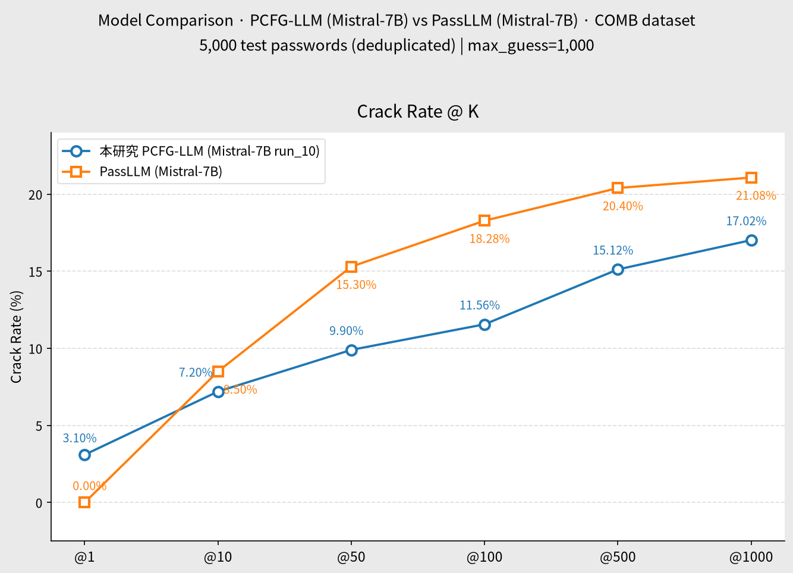
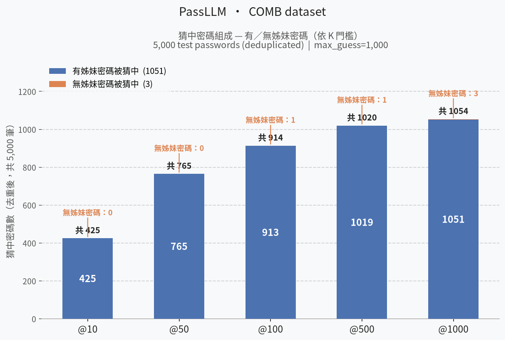
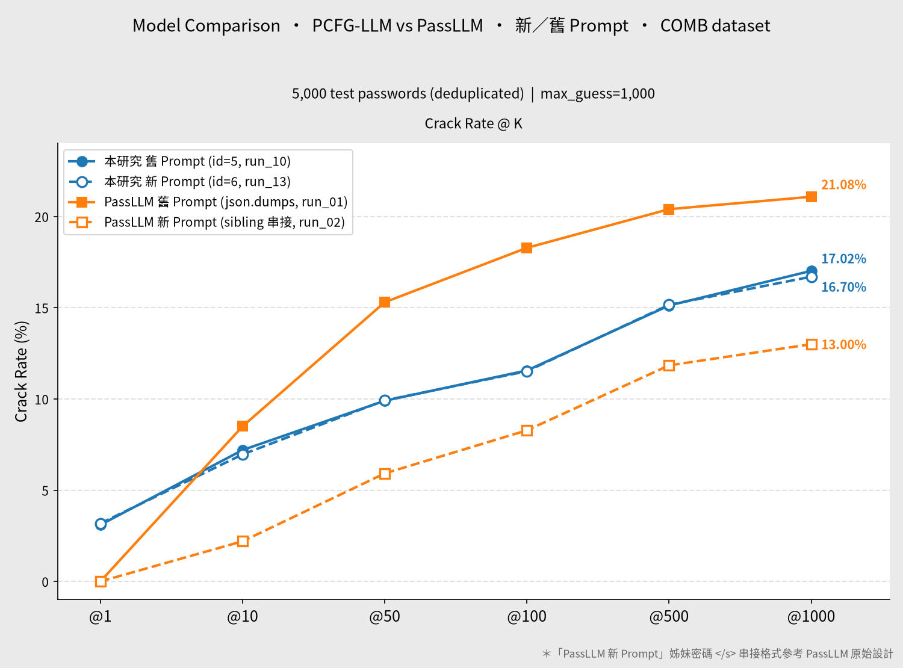
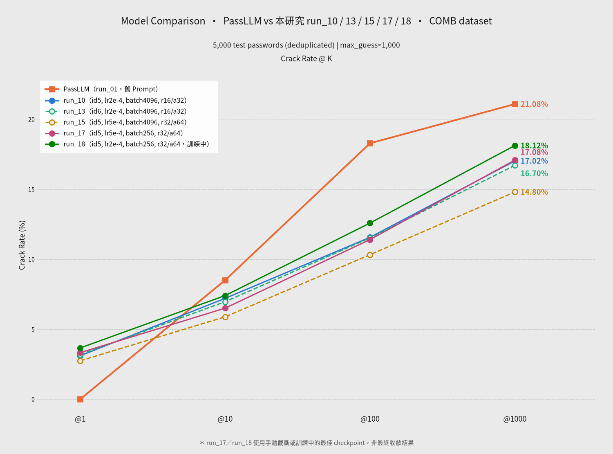
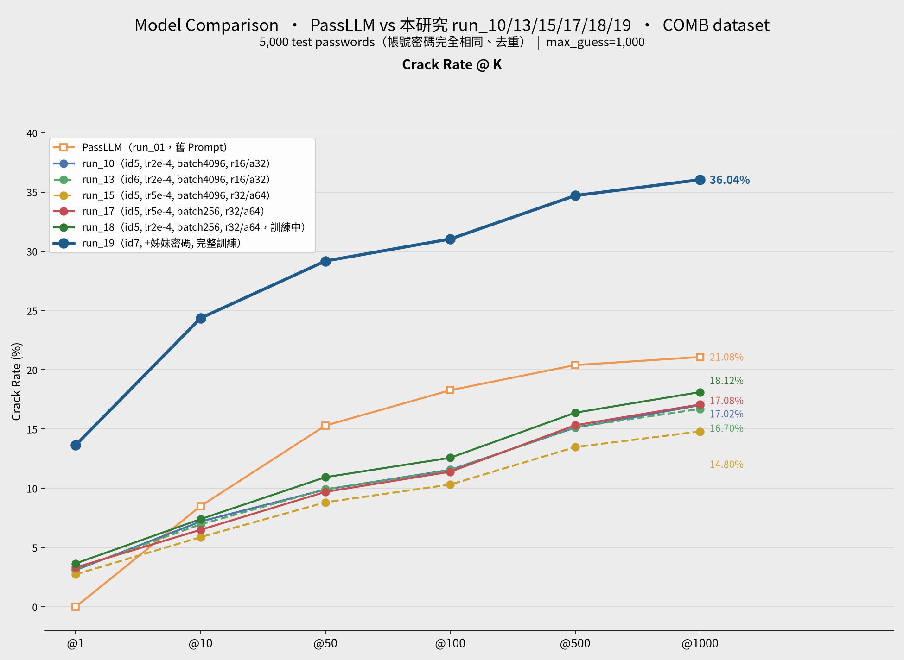
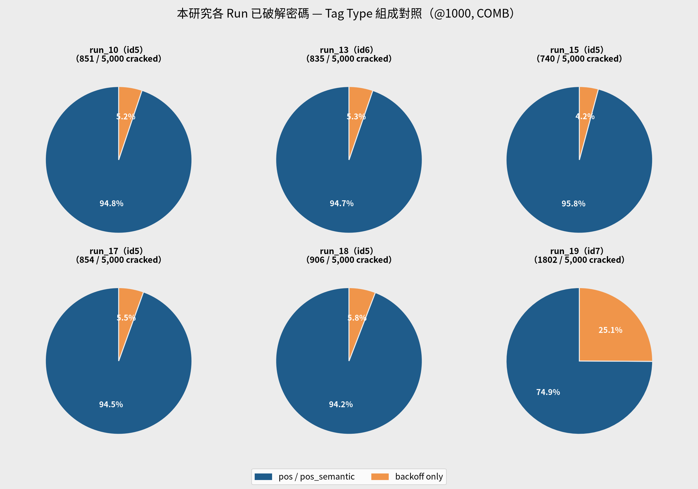

# Comparison Report: PassLLM vs 本研究 PCFG-LLM（COMB 資料集）

**資料集：** COMB（同一組 5,000 筆測試密碼，帳號取樣一致） · **基底模型：** 兩側皆為 Mistral-7B-v0.1 + LoRA

---

## 1. 訓練參數對照

| 項目 | 本研究 PCFG-LLM | PassLLM |
|---|---|---|
| 訓練資料 | `datasets/processed/semanticPCFG/COMB/backoff/split/train_data.jsonl`（PCFG-native 切分 + backoff tag） | `data/COMB/TRAIN.json`（原始 targeted json，含 old password） |
| prompt_template_id | 5 | 0 |
| LoRA 種類 | lora（標準 bf16） | lora（標準 bf16） |
| LoRA r / alpha | 16 / 32 | 16 / 32 |
| LoRA target_modules | q_proj, k_proj, v_proj | q_proj, k_proj, v_proj |
| LoRA dropout | 0.2 | 0.2 |
| per_device_train_batch_size | 64 | 4 |
| gradient_accumulation_steps | 64 | 64 |
| 有效 batch size | 4,096 | 256 |
| learning_rate | 2e-4 | 5e-4 |
| num_train_epochs | 10 | 3 |
| warmup_ratio | 0.1 | 0.1 |
| weight_decay | 0.01 | 0.01 |
| optim | adamw_torch | adamw_torch |
| bf16 | true | true |
| seed / data_seed | 42 / 42 | 42 / 42 |
| checkpoint | `checkpoints/Mistral-7B-v0.1/run_10/lora_final` | `checkpoints/mistral_7b_COMB/final` |

---

## 2. 評估參數對照

| 項目 | 本研究 PCFG-LLM | PassLLM |
|---|---|---|
| test_data | `datasets/processed/semanticPCFG/COMB/backoff/split/test_data.jsonl` | `data/COMB/TEST.json` |
| 測試筆數（去重後） | 5,000 | 5,000 |
| prompt_template_id | 5 | 0 |
| 搜尋法 | `constrained_beam_search`（backoff tag 全部時）／fallback `dynamic_beam_search`（含 pos/pos_semantic 時） | `dynamic_beam_search` |
| beam_width | 1,000（單一 int，per-step 上界依字元集自動限制） | `[95, 1000] × 15`（逐 step list） |
| batch_size | 1,000 | 100 |
| eos_threshold | （constrained 段：最後 step 強制 EOS） | 0.001 |
| max_guess_number | 1,000 | 1,000 |
| vocab_limit | true | true |
| precision | half | half |

---

## 3. 測試集筆數說明

兩側 `test_limit` 皆設為 5,000，且經比對，兩份測試集的帳號／密碼**完全相同**（5,000 筆唯一密碼，交集 = 5,000）。但 PassLLM 實際輸出的 `input_output.jsonl` 有 5,054 筆紀錄，其中 20 筆密碼各被重複評估 2–5 次（共 54 筆重複，重複紀錄的 `min_cracked_guess_number` 完全一致，屬於重跑/紀錄重複，非資料不一致）。為求公平比較，以下 crack rate 已對 PassLLM 結果依密碼去重（保留唯一 5,000 筆），本研究結果本身即為 5,000 筆、無需處理。

**雙方測試集一致性驗證：** 將本研究測試集的 5,000 筆密碼與 PassLLM 去重後的 5,000 筆密碼各自取集合比對——交集為 5,000 筆，「僅存在於本研究」與「僅存在於 PassLLM」皆為 0 筆。即兩側評估的是**完全相同的一組帳號密碼**，並非碰巧筆數相同而已，因此以下 crack rate 對照具備嚴謹的同測試集基礎。

---

## 4. Crack Rate 對照

| @K | 本研究 PCFG-LLM | PassLLM |
|---|---|---|
| @1 | 155 / 5,000（3.10%） | 0 / 5,000（0.00%） |
| @10 | 360 / 5,000（7.20%） | 425 / 5,000（8.50%） |
| @50 | 495 / 5,000（9.90%） | 765 / 5,000（15.30%） |
| @100 | 578 / 5,000（11.56%） | 914 / 5,000（18.28%） |
| @500 | 756 / 5,000（15.12%） | 1,020 / 5,000（20.40%） |
| @1000 | 851 / 5,000（17.02%） | 1,054 / 5,000（21.08%） |

## 5. 結果圖表



---

## 6. PassLLM 猜中密碼的姊妹密碼組成分析

「姊妹密碼」定義同 [About_This_project.md](../About_This_project.md)：同一帳號在 COMB 資料集中存在其他歷史密碼，可作為 PassLLM targeted 模式 `"Old password"` 欄位的線索；該欄位為空陣列則視為「無姊妹密碼」。以下依 `gen/passllm/run_01/input_output.jsonl`（5,054 筆紀錄，依密碼去重後 5,000 筆，與第 3 節一致）統計 PassLLM 猜中密碼中兩者的佔比。

去重後 5,000 筆測試密碼中，2,895 筆（57.9%）帳號有姊妹密碼、2,105 筆（42.1%）無姊妹密碼。

| @K | 猜中總數 | 有姊妹密碼被猜中 | 無姊妹密碼被猜中 | 有姊妹密碼佔比 |
|---|---|---|---|---|
| @10 | 425 | 425 | 0 | 100.0% |
| @50 | 765 | 765 | 0 | 100.0% |
| @100 | 914 | 913 | 1 | 99.9% |
| @500 | 1,020 | 1,019 | 1 | 99.9% |
| @1000 | 1,054 | 1,051 | 3 | 99.7% |



**觀察：** PassLLM 猜中的密碼幾乎全數（@1000 時 99.7%）來自「有姊妹密碼」帳號，顯示模型主要依賴同帳號的舊密碼線索進行 targeted 猜測；在完全沒有舊密碼可用（`"Old password": []`）的帳號上，PassLLM 幾乎無法命中（@1000 僅 3 筆，遠低於該子集 2,105 筆的基期樣本數）。這與本研究 PCFG-LLM 不依賴舊密碼、僅憑結構標籤（tag）即可命中 851 筆（第 4 節）形成對照——兩者鎖定的是不同威脅情境：PassLLM 對應「已知舊密碼的帳號接管」場景，本研究方法對應「僅知密碼結構、無歷史密碼線索」的場景。

---

## 7. 四方比較：PassLLM 新／舊 Prompt vs 本研究 PCFG-LLM 新／舊 Prompt

PassLLM 端新增 `run_02`（`gen/passllm/run_02/`），對照第 1–6 節既有的 `run_01`（下稱「舊 prompt」）。兩次評估共用**同一組** checkpoint（`checkpoints/mistral_7b_COMB/final`，2026-07-11 訓練）與**同一份**評估設定（`prompt_template_id=0`、`beam_width_list=[95,1000]×15`、`dynamic_beam_search`、`test_path=data/COMB/TEST.json`、`test_limit=5000`），差異僅在於 prompt 的實際內容格式：

| | 舊 Prompt（run_01） | 新 Prompt（run_02） |
|---|---|---|
| 內容格式 | `Old password` 以 `json.dumps` 包裝成 JSON 字串塞入 prompt | 移除 JSON 包裝，改為姊妹密碼（sibling password）以 `</s>` 逐一串接 [^passllm-format] |
| 範例 | `...{"Old password": ["buffalo12"]}` | `...5438350q</s>123456789</s>qwerty123</s>...` |

[^passllm-format]: 此串接格式參考 PassLLM 原始設計（非本專案自訂），詳細出處待補充完整引用資訊。

**⚠️ 資料檔案說明：** `gen/passllm/run_02/passllm_run2_COMB.json` 實際內容是 run_01 全部 5,054 筆 + run_02 自己的 5,000 筆**串接**而成（共 10,054 筆）。本節數字僅取檔案**末尾 5,000 筆**（真正的 run_02 資料，經比對密碼集合與 run_01/本研究測試集完全一致），並與 `gen/passllm/run_02/eval-260642_params_summary.md` 記錄的官方 crack rate 數字（650/5,000, 13.00% @1000）核對一致。

本研究端同步新增對應的「新 prompt」結果：`run_13`（prompt_template_id=6，來源 log [eval-261839.out](../../results/eval/eval-261839.out)），對照第 4 節既有的 `run_10`（prompt_template_id=5，下稱「舊 prompt」）。與 PassLLM 的情況不同，本研究的新／舊 prompt 是**各自獨立訓練**的 LoRA（皆為 r=16/alpha=32/q,k,v_proj，僅 prompt_template_id 不同），並非同一份 checkpoint 換評估格式：

| | 舊 Prompt（id=5, run_10） | 新 Prompt（id=6, run_13） |
|---|---|---|
| 內容格式 | tag 結構以 `json.dumps` 包裝成 JSON 字串塞入 prompt | 移除 JSON 包裝，system prompt 後直接接 inline tag 字串 |
| 範例 | `...{"structure": "<surname><rouge.n.01><number2>"}` | `...\n<surname><rouge.n.01><number2>` |

### Crack Rate 四方對照

| @K | 本研究舊 Prompt（id=5, run_10） | 本研究新 Prompt（id=6, run_13） | PassLLM 舊 Prompt（run_01） | PassLLM 新 Prompt（run_02） |
|---|---|---|---|---|
| @1 | 155 / 5,000（3.10%） | 159 / 5,000（3.18%） | 0 / 5,000（0.00%） | 0 / 5,000（0.00%） |
| @10 | 360 / 5,000（7.20%） | 348 / 5,000（6.96%） | 425 / 5,000（8.50%） | 110 / 5,000（2.20%） |
| @50 | 495 / 5,000（9.90%） | 496 / 5,000（9.92%） | 765 / 5,000（15.30%） | 296 / 5,000（5.92%） |
| @100 | 578 / 5,000（11.56%） | 576 / 5,000（11.52%） | 914 / 5,000（18.28%） | 414 / 5,000（8.28%） |
| @500 | 756 / 5,000（15.12%） | 758 / 5,000（15.16%） | 1,020 / 5,000（20.40%） | 592 / 5,000（11.84%） |
| @1000 | 851 / 5,000（17.02%） | 835 / 5,000（16.70%） | 1,054 / 5,000（21.08%） | 650 / 5,000（13.00%） |



> 圖中「PassLLM 新 Prompt」的姊妹密碼 `</s>` 串接格式參考 PassLLM 原始設計[^passllm-format]。

**觀察：**

- **PassLLM 對 prompt 格式極為敏感：** 改用新 prompt（移除 JSON 包裝、姊妹密碼改以 `</s>` 串接）使 crack rate 全面下滑，@1000 由 21.08% 降至 13.00%（−8.08pp）。由於模型權重未變、僅推論時輸入格式改變，顯示新格式偏離了模型訓練時實際見過的輸入分佈，猜測能力大幅衰退。
- **本研究 PCFG-LLM 對 prompt 格式幾乎不敏感：** 新／舊 prompt 各自獨立訓練後，@1000 僅由 17.02%（id=5）小幅變動至 16.70%（id=6，−0.32pp），其餘各 K 差距亦在 ±0.3pp 內，可視為訓練隨機性範圍內的正常波動，而非有意義的格式效應。這與 tag 結構本身語意單純、對 JSON 包裝與否不敏感有關；相較之下 PassLLM 的姊妹密碼線索格式改變後，模型難以將新格式對應回訓練時學到的「舊密碼→新密碼」關聯。
- 四者在各 K 的排序為：**PassLLM 舊 Prompt > 本研究（新／舊 Prompt 皆約 17%） > PassLLM 新 Prompt**。

---

## 8. 六方比較：PassLLM vs 本研究 run_10／13／15／17／18（COMB, Mistral-7B-v0.1）

本節彙整本研究在 COMB 資料集、Mistral-7B-v0.1 基底上目前已跑過的五次訓練（run_10、13、15、17、18，皆詳見 [param_compare.md](param_compare.md)），與 PassLLM 做參數與破解率的整體對照。**PassLLM 一欄採用第 1–6 節的基準（`run_01`，舊 Prompt）**；PassLLM 新 Prompt（`run_02`）數字已在第 7 節列出，此處不重複。

### 8.1 訓練參數對照

| 項目 | PassLLM | run_10 | run_13 | run_15 | run_17 | run_18 |
|---|---|---|---|---|---|---|
| 資料集 | COMB | COMB | COMB | COMB | COMB | COMB |
| prompt_template_id | 0 | 5 | 6 | 5 | 5 | 5 |
| LoRA r / alpha | 16 / 32 | 16 / 32 | 16 / 32 | 32 / 64 | 32 / 64 | 32 / 64 |
| target_modules | q,k,v_proj | q,k,v_proj | q,k,v_proj | q,k,v,o_proj,gate_proj | q,k,v,o_proj,gate_proj | q,k,v,o_proj,gate_proj |
| lora_dropout | 0.2 | 0.2 | 0.2 | 0.2 | 0.2 | 0.2 |
| per_device_train_batch_size | 4 | 64 | 64 | 64 | 4 | 4 |
| gradient_accumulation_steps | 64 | 64 | 64 | 64 | 64 | 64 |
| 有效 batch size | 256 | 4,096 | 4,096 | 4,096 | 256 | 256 |
| learning_rate | 5e-4 | 2e-4 | 2e-4 | 5e-4 | 5e-4 | 2e-4 |
| num_train_epochs（計畫） | 3 | 10 | 10 | 10 | 10 | 10 |
| 最終／最佳 eval_loss | 未提供 | 1.649（完成） | 1.651（完成） | 2.327（↑，已發散） | 1.662（step 3620，發散前最佳點） | 1.601（step 2900，目前最佳點） |
| 訓練狀態 | 完成 | 完成（650/650 步） | 完成（650/650 步） | 完成但已發散（10 epoch 跑完，末端劣化） | 於 step ~3966/10,250 被取消，發散 | **訓練中**，已到 step ~4385/10,250（約43%） |
| 評估用 checkpoint | `mistral_7b_COMB/final` | `run_10/lora_final`（= 最終步） | `run_13/lora_final`（= 最終步） | `run_15/lora_final`（= 最終步，發散後） | `run_17/lora_final`（= checkpoint-3620，手動截斷） | `run_18/lora_final_2900`（= checkpoint-2900，手動截斷） |

> run_17、run_18 皆非「訓練正常收斂後」的權重：run_17 用的是發散前最佳點手動截斷，run_18 評估時訓練仍在進行、僅反映目前最佳點，非最終結果。

### 8.2 Crack Rate 對照

| @K | PassLLM | run_10 | run_13 | run_15 | run_17 | run_18 |
|---|---|---|---|---|---|---|
| @1 | 0 / 5,000（0.00%） | 155 / 5,000（3.10%） | 159 / 5,000（3.18%） | 137 / 5,000（2.74%） | 166 / 5,000（3.32%） | 183 / 5,000（3.66%） |
| @10 | 425 / 5,000（8.50%） | 360 / 5,000（7.20%） | 348 / 5,000（6.96%） | 294 / 5,000（5.88%） | 325 / 5,000（6.50%） | 370 / 5,000（7.40%） |
| @100 | 914 / 5,000（18.28%） | 578 / 5,000（11.56%） | 576 / 5,000（11.52%） | 516 / 5,000（10.32%） | 570 / 5,000（11.40%） | 629 / 5,000（12.58%） |
| @1000 | 1,054 / 5,000（21.08%） | 851 / 5,000（17.02%） | 835 / 5,000（16.70%） | 740 / 5,000（14.80%） | 854 / 5,000（17.08%） | 906 / 5,000（18.12%） |



**觀察：**

- **PassLLM 在各 K 皆領先本研究五次訓練**，@1000 領先幅度介於 +2.96pp（vs run_18）至 +6.28pp（vs run_15）。但第 6 節已指出，PassLLM 猜中的密碼有 99%+ 依賴「姊妹密碼」（同帳號舊密碼）線索，本研究方法不使用此線索、僅憑 tag 結構猜測，兩者鎖定的威脅情境不同，數字不宜直接視為「方法優劣」。
- **PassLLM @1 為 0%**：`dynamic_beam_search` 搜尋策略與本研究 `constrained_beam_search` 不同，加上 PassLLM 缺乏姊妹密碼時幾乎猜不中（第 6 節），首位猜測命中率偏低。
- **本研究內部排序（@1000）：** run_18（18.12%，訓練中）> run_17（17.08%，發散前最佳點）> run_10（17.02%，完整訓練）≈ run_13（16.70%，僅 prompt 格式不同）> run_15（14.80%，高 lr＋大 LoRA 導致過擬合發散）。run_18 目前為最佳，但尚未訓練完成，需待完整結果出爐後再確認是否維持領先。

---

## 9. 全體比較：PassLLM vs 本研究 run_10/13/15/17/18/19（COMB, Mistral-7B-v0.1）

第 6、8 節已指出：PassLLM 猜中密碼 99%+ 依賴姊妹密碼（`"Old password"`）線索，而第 8 節的 run_10/13/15/17/18 完全不使用姊妹密碼、只憑 tag 結構猜測，兩者鎖定的是不同威脅情境，數字不宜直接視為方法優劣。run_19（`docs/reports/id7_run19_Mistral-7B_id7_constrained_beam_search.md`）是本研究第一個在 prompt 中加入 `sibling passwords` 的訓練（prompt id=7，見 [docs/promt.md](../promt.md) id=7 章節），本節在第 8 節既有的六方比較基礎上加入 run_19，一併列出訓練參數、完整 prompt 範例與 crack rate 對照。

### 9.1 訓練參數對照

在第 8.1 節六方表格上加入 run_19 一欄：

| 項目 | PassLLM | run_10 | run_13 | run_15 | run_17 | run_18 | run_19 |
|---|---|---|---|---|---|---|---|
| 資料集 | COMB | COMB | COMB | COMB | COMB | COMB | COMB（`combine/backoff` + `Siblings`） |
| prompt_template_id | 0 | 5 | 6 | 5 | 5 | 5 | 7 |
| LoRA r / alpha | 16 / 32 | 16 / 32 | 16 / 32 | 32 / 64 | 32 / 64 | 32 / 64 | 16 / 32 |
| target_modules | q,k,v_proj | q,k,v_proj | q,k,v_proj | q,k,v,o_proj,gate_proj | q,k,v,o_proj,gate_proj | q,k,v,o_proj,gate_proj | q,k,v_proj |
| lora_dropout | 0.2 | 0.2 | 0.2 | 0.2 | 0.2 | 0.2 | 0.2 |
| per_device_train_batch_size | 4 | 64 | 64 | 64 | 4 | 4 | 4 |
| gradient_accumulation_steps | 64 | 64 | 64 | 64 | 64 | 64 | 64 |
| 有效 batch size | 256 | 4,096 | 4,096 | 4,096 | 256 | 256 | 256 |
| learning_rate | 5e-4 | 2e-4 | 2e-4 | 5e-4 | 5e-4 | 2e-4 | 2e-4 |
| num_train_epochs（計畫） | 3 | 10 | 10 | 10 | 10 | 10 | 10 |
| 最終／最佳 eval_loss | 未提供 | 1.649（完成） | 1.651（完成） | 2.327（↑，已發散） | 1.662（step 3620，發散前最佳點） | 1.601（step 2900，目前最佳點） | 1.260（step 5100，最佳點） |
| 訓練狀態 | 完成 | 完成（650/650 步） | 完成（650/650 步） | 完成但已發散（10 epoch 跑完，末端劣化） | 於 step ~3966/10,250 被取消，發散 | **訓練中**，已到 step ~4385/10,250（約43%） | 完成（10,250/10,250 步跑滿） |
| 評估用 checkpoint | `mistral_7b_COMB/final` | `run_10/lora_final`（=最終步） | `run_13/lora_final`（=最終步） | `run_15/lora_final`（=最終步，發散後） | `run_17/lora_final`（=checkpoint-3620，手動截斷） | `run_18/lora_final_2900`（=checkpoint-2900，手動截斷） | `run_19/lora_final`（=checkpoint-5100，`load_best_model_at_end` 自動選點） |

> run_19 是唯一 prompt 中含 `sibling passwords` 的一組，其餘六者（PassLLM 除外）皆只有 tag 結構、無姊妹密碼；LoRA 設定上 run_19 與 run_10/13（r16/a32/qkv-only）相同，與 PassLLM 相比則只差 learning_rate（2e-4 vs 5e-4）與訓練 epoch 是否跑滿。詳細討論見第 9.4 節。

### 9.2 完整 Prompt 對照（同一帳號實例）

以測試集 `index=2`（密碼 `shark71542`，姊妹密碼 `buffalo12`）為例，兩側 `model_input` 逐字擷取如下：

**PassLLM（`gen/passllm/run_01/input_output.jsonl`，index=2）：**

```
<s>As a targeted password guessing model, your task is to utilize the provided account information to guess the password.{"Old password": ["buffalo12"]}
```

**本研究 run_19（`gen/eval_results_id7_run_19_Mistral7B_id7_COMB.jsonl`，index=2）：**

```
As a targeted password guessing model, your task is to generate likely password candidates that match the given password information. The password structure is represented as a sequence of <tag> placeholders, and sibling passwords, if any, are prior passwords from the same account. Do not output the tag placeholders. Generate only the password characters for each segment in order.{"password structure": "<shark.n.01><number5>", "sibling passwords": ["buffalo12"]}
```

> 兩者都把同一筆姊妹密碼 `"buffalo12"` 放進 prompt，差異在於 run_19 額外提供了 `"password structure": "<shark.n.01><number5>"`（tag 結構線索），PassLLM 完全不使用結構資訊、只靠姊妹密碼與模型自身學到的密碼分布猜測。此例中 PassLLM 與 run_19 皆未在 @1000 內命中 `shark71542`。

### 9.3 Crack Rate 對照

| @K | PassLLM | run_10 | run_13 | run_15 | run_17 | run_18 | run_19 |
|---|---|---|---|---|---|---|---|
| @1 | 0 / 5,000（0.00%） | 155 / 5,000（3.10%） | 159 / 5,000（3.18%） | 137 / 5,000（2.74%） | 166 / 5,000（3.32%） | 183 / 5,000（3.66%） | 682 / 5,000（**13.64%**） |
| @10 | 425 / 5,000（8.50%） | 360 / 5,000（7.20%） | 348 / 5,000（6.96%） | 294 / 5,000（5.88%） | 325 / 5,000（6.50%） | 370 / 5,000（7.40%） | 1,218 / 5,000（**24.36%**） |
| @50 | 765 / 5,000（15.30%） | 495 / 5,000（9.90%） | 496 / 5,000（9.92%） | 441 / 5,000（8.82%） | 485 / 5,000（9.70%） | 547 / 5,000（10.94%） | 1,459 / 5,000（**29.18%**） |
| @100 | 914 / 5,000（18.28%） | 578 / 5,000（11.56%） | 576 / 5,000（11.52%） | 516 / 5,000（10.32%） | 570 / 5,000（11.40%） | 629 / 5,000（12.58%） | 1,552 / 5,000（**31.04%**） |
| @500 | 1,020 / 5,000（20.40%） | 756 / 5,000（15.12%） | 758 / 5,000（15.16%） | 674 / 5,000（13.48%） | 766 / 5,000（15.32%） | 819 / 5,000（16.38%） | 1,735 / 5,000（**34.70%**） |
| @1000 | 1,054 / 5,000（21.08%） | 851 / 5,000（17.02%） | 835 / 5,000（16.70%） | 740 / 5,000（14.80%） | 854 / 5,000（17.08%） | 906 / 5,000（18.12%） | 1,802 / 5,000（**36.04%**） |

> run_10/13/15/17/18 的 @1/@10/@100/@1000 數字與第 8.2 節一致；@50/@500 由對應的 `gen/eval_results_id5_run_10/15/17/18_Mistral7B_..._COMB.jsonl`、`gen/eval_results_id6_run_13_Mistral7B_id6_COMB.jsonl` 重新統計補上。

### 9.4 結果圖表



### 9.5 Tag Type 占比

PassLLM 無 tag 結構，故僅列本研究六個 run 已破解密碼（@1000）的 Tag Type 組成（分類規則同 `id7_run19` 報告）：



| Run | Cracked (@1000) | backoff only | pos / pos_semantic |
|---|---|---|---|
| run_10（id5） | 851 | 44（5.2%） | 807（94.8%） |
| run_13（id6） | 835 | 44（5.3%） | 791（94.7%） |
| run_15（id5） | 740 | 31（4.2%） | 709（95.8%） |
| run_17（id5） | 854 | 47（5.5%） | 807（94.5%） |
| run_18（id5） | 906 | 53（5.8%） | 853（94.2%） |
| run_19（id7） | 1,802 | 452（25.1%） | 1,350（74.9%） |

**觀察：** run_10/13/15/17/18 幾乎全靠 pos/pos_semantic 語意線索命中，backoff only 僅占 4–6%；run_19 加入姊妹密碼後 backoff only 占比跳升到 25.1%，顯示姊妹密碼補強的正是「純結構、無語意線索」這段本來最弱的猜測情境。


