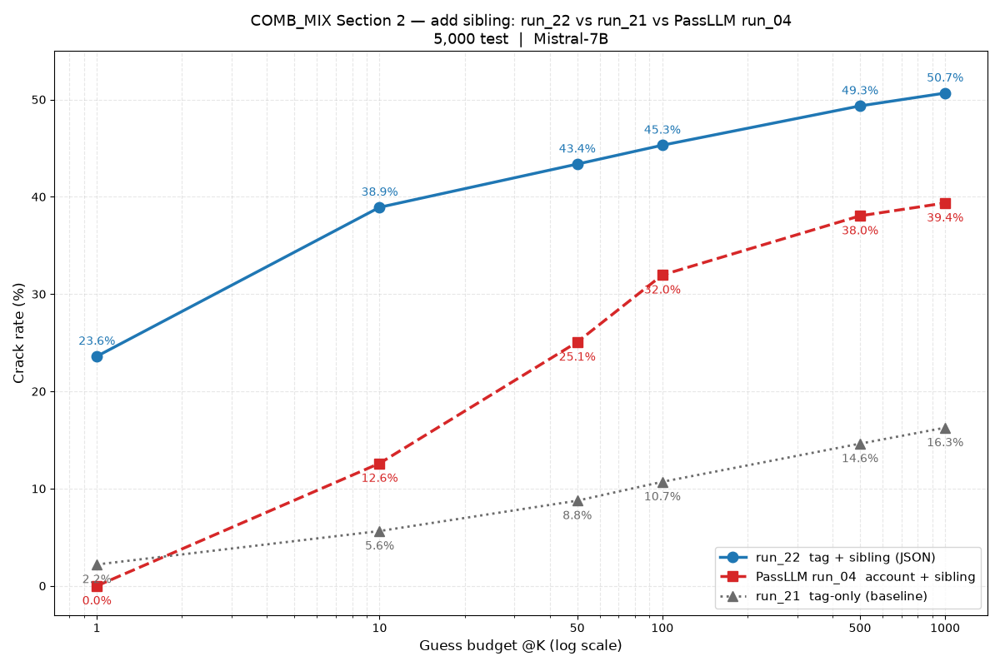
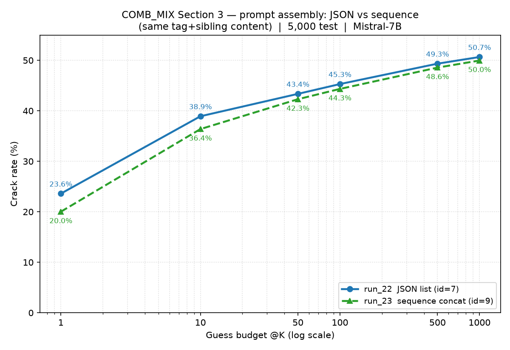

# Comparison Report: PassLLM vs 本研究 PCFG-LLM（COMB_MIX 資料集：帳號 + 姊妹密碼）

**資料集：** COMB_MIX · **基底模型：** Mistral-7B-v0.1 + LoRA（四方相同底模）

> 本報告是 [comparison_PassLLM_vs_PCFG-LLM_COMB.md](comparison_PassLLM_vs_PCFG-LLM_COMB.md) 的**姊妹報告**。
>
> **COMB_MIX 與 COMB 最大差異：** COMB_MIX 對應到 `datasets/processed/semanticPCFG/combine_acc_sibling`，其取樣**保證每個帳號至少有 1 筆姊妹密碼**（sibling password，同帳號歷史舊密碼）；COMB 則含大量「無姊妹密碼」的帳號。因此 COMB_MIX 是專門用來檢驗「姊妹密碼線索」效果的乾淨測試場景——每一筆測試密碼的帳號都必然有可用的舊密碼線索。

---

## 本報告的組織方式

本報告依三個實驗問題分節，各節皆含 **Prompt 比較 / 參數比較 / 結果比較** 三段：

| 節 | 主題 | 比較對象 | 核心問題 |
|---|---|---|---|
| **[Section 1](#section-1--新採樣的比較run_21-vs-passllm-run_04)** | 新採樣的基準對照 | `run_21`（tag-only）vs PassLLM `run_04` | 在 COMB_MIX 新採樣上，兩側各自的基準水準 |
| **[Section 2](#section-2--加上-sibling-比較run_22-vs-run_21--passllm-run_04)** | 加上 sibling | `run_22`（tag+sibling）vs `run_21` + PassLLM `run_04` | 把姊妹密碼加進本研究方法，帶來多少增益 |
| **[Section 3](#section-3--調整-prompt-組裝run_23-vs-run_22)** | 調整 prompt 組裝 | `run_23`（sequence）vs `run_22`（JSON） | 相同 tag+sibling 內容，改變組裝格式的影響 |

### 四個 run 一覽

| run | 側 | 底模 | 線索 | prompt 格式 | template |
|---|---|---|---|---|---|
| `run_21` | 本研究 | Mistral-7B-v0.1 | 只有 tag 結構（**無** sibling） | JSON | id=5 |
| `run_22` | 本研究 | Mistral-7B-v0.1 | tag 結構 + sibling | **JSON list** | id=7 |
| `run_23` | 本研究 | Mistral-7B-v0.1 | tag 結構 + sibling | **sequence 串接** | id=9 |
| `run_04` | PassLLM | Mistral-7B-v0.1 | 帳號名 + sibling | sequence 串接 | id=0 |

**共同前提：** `run_22`、`run_23`、`run_04` 皆評估於 COMB_MIX 的**同一組 5,000 筆**測試密碼（交集 = 5,000，逐一驗證）；crack rate 一律以「命中筆數 / 5,000」計。`run_21` 的 COMB_MIX 同集重評見 [Section 1](#section-1--新採樣的比較run_21-vs-passllm-run_04)。

> 以下多處以測試集 `index=0` 為共同範例：真實密碼 `lala123abc`、tags `char2|char2|number3|np1`、該帳號姊妹密碼 `["@ggeafw1", "jelugina", "lala123a"]`（正好示範 COMB_MIX「每帳號 ≥1 姊妹密碼」的特性）。

---
---

# Section 1 — 新採樣的比較：`run_21` vs PassLLM `run_04`

> 本節建立 COMB_MIX 新採樣上的**兩側基準水準**：一側是本研究只用 tag 結構的 `run_21`（無任何帳號 / 姊妹密碼線索），另一側是 PassLLM 的 `run_04`（帳號名 + 姊妹密碼）。兩者評估於 COMB_MIX 同一組 5,000 筆測試集。
>
> **背景（測試集修正）：** `run_21`（id=5，tag-only 基準）是**訓練於 COMB_MIX**（`COMB_MIX/backoff`）的模型，但其先前評估誤用了 **plain COMB** 測試集（實際評估的 5,000 筆密碼 100% 落在 plain COMB、與 COMB_MIX 的 5,000 筆交集僅 1 筆），無法與 `run_04` 做同測試集對照。已於 `config/search.yaml` 調整為以 `run_21/lora_final_5500` 在 COMB_MIX 的同一組 5,000 筆上重評（id=5 只讀 `Tags`、忽略 `Siblings` 欄；輸出 `eval_results_id5_run_21_Mist7B_id5_COMB_MIX_constrain_5000.jsonl`），詳見 [20260913_modify.md](../logs/20260913_modify.md)。本節數字即取自此次重評（eval log `eval-340916.out`）。

## 1.1 Prompt 比較

以 `index=0`（密碼 `lala123abc`，tags `char2|char2|number3|np1`，姊妹密碼 `["@ggeafw1", "jelugina", "lala123a"]`）為例，逐字擷取兩側 `model_input`：

**`run_21`（id=5，只有 tag 結構）：**

```
As a targeted password guessing model, your task is to generate likely password candidates that match the given tag structure. Each <tag> placeholder names the character class for that segment. Do not output the tag placeholders. Generate only the password characters for each segment in order.{"password structure": "<char2><char2><number3><np1>"}
```

**PassLLM `run_04`（id=0，帳號名 + sibling，sequence 串接）：**

```
<s>As a targeted password guessing model, your task is to utilize the provided account information to guess the password.
blutmage@ggeafw1jeluginalala123a
```

**比對重點：**

- `run_21` 只給 tag 結構 `<char2><char2><number3><np1>`（長度與字元類別約束），**完全沒有**帳號名或姊妹密碼線索。
- PassLLM `run_04` 反之：**沒有** tag 結構，只給帳號名 `blutmage` + 同帳號三筆姊妹密碼（無分隔符串接）。
- 因此本節不是單一變因對照，而是**兩種完全不同的線索型態**（純結構 vs 帳號 + 舊密碼）在同測試集上的基準較量。

## 1.2 參數比較

| 項目 | `run_21`（本研究，tag-only） | PassLLM `run_04`（帳號 + sibling） |
|---|---|---|
| 底模 | Mistral-7B-v0.1 | Mistral-7B-v0.1 |
| 訓練資料 | `semanticPCFG/COMB_MIX/backoff`（tag-only） | COMB_MIX targeted json（帳號 + 舊密碼） |
| 線索 | tag 結構（**無** sibling / 帳號） | 帳號名 + sibling |
| prompt_template_id | 5 | 0 |
| prompt 格式 | JSON（`"password structure"`） | sequence 串接（無分隔符） |
| LoRA r / alpha | 16 / 32 | 16 / 32 |
| target_modules | q,k,v_proj | q,k,v_proj |
| lora_dropout | 0.2 | 0.2 |
| 有效 batch size | 256 | 256 |
| learning_rate | 2e-4 | 5e-4 |
| num_train_epochs（計畫） | 10 | 3 |
| 訓練狀態 | **中途取消**（2026-09-11，step ≈6,232 / 14,800） | 完成 |
| 評估用 checkpoint | `run_21/lora_final_5500`（step 5,500 ≈ epoch 3.7） | `mistral_7b_COMB_pii_sibling/final` |
| 搜尋法 | constrained_beam_search + fallback→dynamic | dynamic_beam_search |
| batch_size / max_guess | 1,000 / 1,000 | 100 / 1,000 |
| 測試集 | COMB_MIX 5,000 | COMB_MIX 5,000 |

## 1.3 結果比較

| @K | `run_21`（tag-only） | PassLLM `run_04`（帳號 + sibling） | 差距（run_21 − run_04） |
|---|---|---|---|
| @1 | 110 / 5,000（**2.20%**） | 0 / 5,000（0.00%） | **+2.20pp** |
| @10 | 282 / 5,000（5.64%） | 630 / 5,000（**12.60%**） | −6.96pp |
| @50 | 438 / 5,000（8.76%） | 1,253 / 5,000（**25.06%**） | −16.30pp |
| @100 | 535 / 5,000（10.70%） | 1,598 / 5,000（**31.96%**） | −21.26pp |
| @500 | 731 / 5,000（14.62%） | 1,902 / 5,000（**38.04%**） | −23.42pp |
| @1000 | 813 / 5,000（16.26%） | 1,968 / 5,000（**39.36%**） | −23.10pp |

**觀察：**

- **@1 本研究 tag-only 反而領先：** `run_21` 首猜命中 2.20%，PassLLM `run_04` 為 0.00%——tag 結構把長度與字元類別約束住，讓首猜較容易對上；PassLLM `dynamic_beam_search` 在 @1 幾乎不命中。
- **@10 起 PassLLM 全面反超且差距持續拉大：** @10 起 `run_04` 領先，@100 已達 +21.26pp、@1000 達 +23.10pp。在每帳號都有姊妹密碼的 COMB_MIX 上，「帳號名 + 舊密碼」提供的線索遠比「純 tag 結構」豐富，隨猜測預算增大優勢越明顯。
- **本節基準的意義：** `run_21` 是「只有結構、沒有任何個人線索」的下界；`run_04` 是「有個人線索但沒有 tag 結構」的外部參照。[Section 2](#section-2--加上-sibling-比較run_22-vs-run_21--passllm-run_04) 進一步顯示，當本研究方法**同時**握有 tag 結構 + 姊妹密碼（`run_22`）時，可在各 @K 全面超越 `run_04`。

---
---

# Section 2 — 加上 sibling 比較：`run_22` vs `run_21` + PassLLM `run_04`

> 本節檢驗「把姊妹密碼加進本研究方法」的效果：以 `run_21`（tag-only，**無** sibling）為基準，對照 `run_22`（tag + sibling，JSON 格式），並列 PassLLM `run_04`（帳號 + sibling）作為外部參照。三者評估於 COMB_MIX 同一組 5,000 筆測試集。

## 2.1 Prompt 比較

以 `index=0`（密碼 `lala123abc`，tags `char2|char2|number3|np1`，姊妹密碼 `["@ggeafw1", "jelugina", "lala123a"]`）為例，逐字擷取三側 `model_input`：

**`run_21`（id=5，只有 tag 結構）：** [^run21-prompt]

```
As a targeted password guessing model, your task is to generate likely password candidates that match the given tag structure. Each <tag> placeholder names the character class for that segment. Do not output the tag placeholders. Generate only the password characters for each segment in order.{"password structure": "<char2><char2><number3><np1>"}
```

**`run_22`（id=7，tag 結構 + sibling，JSON list）：**

```
As a targeted password guessing model, your task is to generate likely password candidates that match the given password information. The password structure is represented as a sequence of <tag> placeholders, and sibling passwords, if any, are prior passwords from the same account. Do not output the tag placeholders. Generate only the password characters for each segment in order.{"password structure": "<char2><char2><number3><np1>", "sibling passwords": ["@ggeafw1", "jelugina", "lala123a"]}
```

**PassLLM `run_04`（id=0，帳號名 + sibling，sequence 串接）：**

```
<s>As a targeted password guessing model, your task is to utilize the provided account information to guess the password.
blutmage@ggeafw1jeluginalala123a
```

**比對重點：**

- `run_21` → `run_22` 的差異就是**多了 `"sibling passwords"` 欄位**（其餘 system prompt 與 `"password structure"` 皆同源），因此 `run_21`→`run_22` 是「加不加姊妹密碼」的乾淨對照。
- `run_22` 以 **JSON list** 明確分隔三筆姊妹密碼 `["@ggeafw1", "jelugina", "lala123a"]`；PassLLM `run_04` 則把**帳號名 `blutmage` + 同三筆姊妹密碼**無分隔符直接串接成 `blutmage@ggeafw1jeluginalala123a`。
- 三者都用到同一組姊妹密碼；`run_22` 用 tag 結構 + sibling，`run_04` 用帳號名 + sibling。

[^run21-prompt]: 此 `run_21` 字串已於 COMB_MIX 重評輸出 `eval_results_id5_run_21_Mist7B_id5_COMB_MIX_constrain_5000.jsonl` 的 `index=0` `model_input` 逐字確認（見 [Section 1](#section-1--新採樣的比較run_21-vs-passllm-run_04)）。

## 2.2 參數比較

| 項目 | `run_21`（本研究） | `run_22`（本研究） | PassLLM `run_04` |
|---|---|---|---|
| 底模 | Mistral-7B-v0.1 | Mistral-7B-v0.1 | Mistral-7B-v0.1 |
| 訓練資料 | `semanticPCFG/COMB_MIX/backoff`（tag-only） | `semanticPCFG/combine_acc_sibling/sibling/backoff` | COMB_MIX targeted json（帳號 + 舊密碼） |
| 線索 | tag 結構（**無** sibling） | tag 結構 + sibling | 帳號名 + sibling |
| prompt_template_id | 5 | 7 | 0 |
| prompt 格式 | JSON（`"password structure"`） | JSON（+ `"sibling passwords"` list） | sequence 串接（無分隔符） |
| LoRA 種類 | lora（bf16） | lora（bf16） | lora（bf16） |
| LoRA r / alpha | 16 / 32 | 16 / 32 | 16 / 32 |
| target_modules | q,k,v_proj | q,k,v_proj | q,k,v_proj |
| lora_dropout | 0.2 | 0.2 | 0.2 |
| per_device_train_batch_size | 4 | 4 | 4 |
| gradient_accumulation_steps | 64 | 64 | 64 |
| 有效 batch size | 256 | 256 | 256 |
| learning_rate | 2e-4 | 2e-4 | 5e-4 |
| num_train_epochs（計畫） | 10 | 10 | 3 |
| eval_loss（評估用權重附近） | ≈1.60 | ≈0.96 | 未提供 |
| 訓練狀態 | **中途取消**（2026-09-11，step ≈6,232 / 14,800） | **中途取消**（2026-09-13，step ≈8,110 / 14,800） | 完成 |
| 評估用 checkpoint | `run_21/lora_final_5500`（step 5,500 ≈ epoch 3.7） | `run_22/lora_final_7200`（step 7,200 ≈ epoch 4.9） | `mistral_7b_COMB_pii_sibling/final` |
| 搜尋法 | constrained_beam_search + fallback→dynamic | constrained_beam_search + fallback→dynamic | dynamic_beam_search |
| beam_width | 1,000（constrained；fallback [95,1000]×15） | 1,000（constrained；fallback [95,1000]×15） | [95, 1000] × 15 |
| batch_size / max_guess | 1,000 / 1,000 | 1,000 / 1,000 | 100 / 1,000 |
| 測試集 | COMB_MIX 5,000 | COMB_MIX 5,000 | COMB_MIX 5,000 |

> `run_21`／`run_22` 除了 prompt_template_id（5 vs 7）與訓練資料是否含 sibling 欄之外，LoRA 與其餘超參數完全相同，屬乾淨對照；與 PassLLM `run_04` 相比則另有 learning_rate（2e-4 vs 5e-4）與訓練 epoch（10 vs 3）差異。三者評估用權重皆為中途 checkpoint（PassLLM `run_04` 已完成）。

## 2.3 結果比較

| @K | `run_21`（tag-only 基準） | `run_22`（tag + sibling, JSON） | PassLLM `run_04`（帳號 + sibling） |
|---|---|---|---|
| @1 | 110 / 5,000（2.20%） | 1,180 / 5,000（**23.60%**） | 0 / 5,000（0.00%） |
| @10 | 282 / 5,000（5.64%） | 1,946 / 5,000（**38.92%**） | 630 / 5,000（12.60%） |
| @50 | 438 / 5,000（8.76%） | 2,168 / 5,000（**43.36%**） | 1,253 / 5,000（25.06%） |
| @100 | 535 / 5,000（10.70%） | 2,265 / 5,000（**45.30%**） | 1,598 / 5,000（31.96%） |
| @500 | 731 / 5,000（14.62%） | 2,467 / 5,000（**49.34%**） | 1,902 / 5,000（38.04%） |
| @1000 | 813 / 5,000（16.26%） | 2,533 / 5,000（**50.66%**） | 1,968 / 5,000（39.36%） |

> `run_21`（tag-only）為「加 sibling 前」的基準，數字取自 COMB_MIX 重評（見 [Section 1](#section-1--新採樣的比較run_21-vs-passllm-run_04)）。

**觀察：**

- **加上姊妹密碼帶來巨大增益（`run_21` → `run_22`，本研究內部乾淨對照）：** 相同底模與 tag 結構下，只多了 `"sibling passwords"` 欄，@1000 由 16.26% 躍升至 50.66%（**+34.40pp**）、@1 由 2.20% 躍升至 23.60%（+21.40pp）。姊妹密碼是本方法最關鍵的線索。
- **本研究 `run_22`（tag + sibling）在各 @K 全面領先 PassLLM `run_04`**，@1000 為 50.66% vs 39.36%（+11.30pp）；在每帳號都有姊妹密碼的 COMB_MIX 上，「tag 結構 + 姊妹密碼」比「帳號名 + 姊妹密碼」更強。
- **@1 差距最極端：** `run_22` 首猜命中 23.60%，`run_04` 為 0.00%——tag 結構把長度與字元類別約束住，首猜即能對上大批密碼，PassLLM 的 `dynamic_beam_search` 在 @1 幾乎不命中。
- `run_22` 對 `run_04` 的差距隨 K 收斂（@10 +26.3pp → @1000 +11.3pp），但 `run_22` 始終領先。

## 2.4 結果圖表



> 圖含三線：`run_22`（tag + sibling，藍實線）、`run_04`（帳號 + sibling，紅虛線）、`run_21`（tag-only 基準，灰點線）。`run_21` → `run_22` 的落差即「加姊妹密碼」的增益。

---
---

# Section 3 — 調整 prompt 組裝：`run_23` vs `run_22`

> 本節在**完全相同的內容**（同底模、同訓練資料 `combine_acc_sibling/sibling`、同一組 tag 結構 + 同一組姊妹密碼、同一組 5,000 筆測試集、同 LoRA 超參數）下，只改變 **prompt 的組裝格式**：`run_22` 用 **JSON list**、`run_23` 用 **sequence 串接**（PassLLM 風格、無分隔符）。因此本節是「prompt 組裝格式」單一變因的乾淨對照。

## 3.1 Prompt 比較

以 `index=0`（`lala123abc`，tags `char2|char2|number3|np1`，姊妹密碼 `["@ggeafw1", "jelugina", "lala123a"]`）為例：

**`run_22`（id=7，JSON list 格式）：**

```
As a targeted password guessing model, your task is to generate likely password candidates that match the given password information. The password structure is represented as a sequence of <tag> placeholders, and sibling passwords, if any, are prior passwords from the same account. Do not output the tag placeholders. Generate only the password characters for each segment in order.{"password structure": "<char2><char2><number3><np1>", "sibling passwords": ["@ggeafw1", "jelugina", "lala123a"]}
```

**`run_23`（id=9，sequence 串接格式）：**

```
As a targeted password guessing model, your task is to utilize the provided account information to guess the password.
<char2><char2><number3><np1>@ggeafw1jeluginalala123a
```

**比對重點：**

- **內容完全相同**：兩者都提供 tag 結構 `<char2><char2><number3><np1>` 與同三筆姊妹密碼；差異純粹在**呈現方式**。
- `run_22`（JSON）：以 `{"password structure": ..., "sibling passwords": [...]}` 明確標示欄位與邊界，姊妹密碼以 list 逐筆分隔。
- `run_23`（sequence）：沿用 PassLLM 串接風格，instruction 換行後把 tag 結構與三筆姊妹密碼**無分隔符直接黏接**成 `<char2><char2><number3><np1>@ggeafw1jeluginalala123a`（組裝方式由 `config/knowledge_format.yaml` 的 `passllm` 模式控制：`include_structure=true`、`separator=""`）。

## 3.2 參數比較

| 項目 | `run_22`（JSON, id=7） | `run_23`（sequence, id=9） |
|---|---|---|
| 底模 | Mistral-7B-v0.1 | Mistral-7B-v0.1 |
| 訓練資料 | `combine_acc_sibling/sibling/backoff` | `combine_acc_sibling/sibling/backoff` |
| 線索 | tag 結構 + sibling | tag 結構 + sibling |
| prompt_template_id | 7 | 9 |
| prompt 組裝格式 | **JSON list** | **sequence 串接**（`knowledge_format=passllm`） |
| LoRA r / alpha / targets / dropout | 16 / 32 / q,k,v_proj / 0.2 | 16 / 32 / q,k,v_proj / 0.2 |
| per_device bs / grad_accum / 有效 batch | 4 / 64 / 256 | 4 / 64 / 256 |
| learning_rate / epochs（計畫） | 2e-4 / 10 | 2e-4 / 10 |
| eval_loss（評估用權重附近） | ≈0.96 | ≈1.00 |
| 訓練狀態 | 中途取消（2026-09-13，step ≈8,110 / 14,800） | 中途取消（2026-09-13，step ≈8,279 / 14,800） |
| 評估用 checkpoint | `run_22/lora_final_7200`（step 7,200 ≈ epoch 4.9） | `run_23/lora_final_7400`（step 7,400 ≈ epoch 5.0） |
| 搜尋法 | constrained_beam_search + fallback→dynamic | constrained_beam_search + fallback→dynamic |
| 測試集 | COMB_MIX 5,000 | COMB_MIX 5,000 |

> `run_22` 與 `run_23` **唯一有意義的差異是 prompt 組裝格式**（JSON vs sequence，對應 template id=7 vs id=9）；訓練資料、LoRA、超參數、搜尋法、測試集皆相同，評估用權重亦為相近步數的中途 checkpoint（step 7,200 vs 7,400）。

## 3.3 結果比較

| @K | `run_22`（JSON, id=7） | `run_23`（sequence, id=9） | 差距（JSON − sequence） |
|---|---|---|---|
| @1 | 1,180 / 5,000（**23.60%**） | 1,001 / 5,000（20.02%） | +3.58pp |
| @10 | 1,946 / 5,000（**38.92%**） | 1,819 / 5,000（36.38%） | +2.54pp |
| @50 | 2,168 / 5,000（**43.36%**） | 2,115 / 5,000（42.30%） | +1.06pp |
| @100 | 2,265 / 5,000（**45.30%**） | 2,217 / 5,000（44.34%） | +0.96pp |
| @500 | 2,467 / 5,000（**49.34%**） | 2,428 / 5,000（48.56%） | +0.78pp |
| @1000 | 2,533 / 5,000（**50.66%**） | 2,498 / 5,000（49.96%） | +0.70pp |

**觀察：**

- **JSON 組裝（`run_22`）在各 @K 皆略優於 sequence 串接（`run_23`）**，但差距不大：@1 +3.58pp、@1000 僅 +0.70pp。內容相同、僅組裝格式不同的前提下，JSON 明確標示欄位邊界（尤其把三筆姊妹密碼以 list 分隔）似乎讓模型較易利用線索，優勢在低猜測預算（@1）時最明顯，隨 K 增大而縮小。
- eval_loss 也一致（`run_22` ≈0.96 < `run_23` ≈1.00），與 crack rate 的排序方向相符。
- 兩者差距整體在 ~1–3.6pp，遠小於 [Section 2](#23-結果比較) 中「加不加姊妹密碼」造成的量級——顯示**線索內容（有無姊妹密碼）遠比組裝格式（JSON vs sequence）重要**，但在內容固定時，JSON 組裝有小幅、穩定的優勢。

## 3.4 結果圖表


