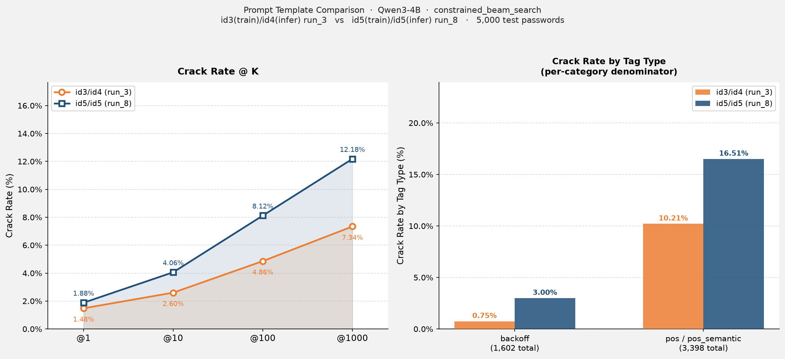

# Comparison Report: Prompt Template id3/id4 vs id5

**模型：** Qwen3-4B · **搜尋法：** constrained_beam_search · **測試集：** 5,000 筆（000webhost backoff split）

---

## 實驗設定對照

| 項目 | id3-train / id4-infer | id5-train / id5-infer |
|---|---|---|
| 訓練 Template | id=3 | id=5 |
| 推論 Template | id=4 | id=5 |
| LoRA | `run_3/lora_final` | `run_8/lora_final` |
| 搜尋法（primary） | `constrained_beam_search` | `constrained_beam_search` |
| 搜尋法（fallback） | `dynamic_beam_search` | `dynamic_beam_search` |
| 來源 log | `results/eval-245621.out` | `results/eval-246776.out` |

---

## Prompt 設計差異

| 面向 | id=3（訓練）/ id=4（推論） | id=5（訓練 = 推論） |
|---|---|---|
| 結構表示 | `<SEG1>…<SEGN>` + 自然語言描述 | `<tag>` 直接作佔位符 |
| 描述函數 | id=3: `get_explanation()` / id=4: `expand_tag_description()` | 無描述 |
| Prompt 範例 | `{"password structure": "(<SEG1>)(<SEG2>)", "segment details": {"<SEG1>": "A singular common noun.", "<SEG2>": "A sequence of exactly 2 digit characters (0-9)."}}` | `{"password structure": "<nn><number2>"}` |
| 訓練推論一致性 | **不一致**（訓練用 id=3，推論用 id=4，描述格式不同） | **完全一致** |
| Prompt 資訊量 | 豐富（自然語言說明每個 segment 的意義） | 精簡（只有 tag 名稱，模型須從 tag 自行推斷） |

> **核心差異：** id=5 將 raw tag 名稱直接作為 `<tag>` 佔位符，消除了 id=3/4 的訓練推論不對稱問題，同時大幅簡化 prompt。

---

## Crack Rate 對照

| @K | id3/id4 (run_3) | id5/id5 (run_8) | Δ (pp) | 提升幅度 |
|---|---|---|---|---|
| @1 | 74 / 5,000 (1.48%) | 94 / 5,000 (1.88%) | +0.40 | +27.0% |
| @10 | 130 / 5,000 (2.60%) | 203 / 5,000 (4.06%) | +1.46 | +56.2% |
| @100 | 243 / 5,000 (4.86%) | 406 / 5,000 (8.12%) | +3.26 | +67.1% |
| @1000 | 367 / 5,000 (7.34%) | 609 / 5,000 (12.18%) | +4.84 | +65.9% |

---

## Tag 類型破解率對照

（分母為測試集中各類型的總筆數，兩次實驗使用**相同測試集**）

| Tag 類型 | 測試集筆數 | id3/id4 破解 | id3/id4 破解率 | id5/id5 破解 | id5/id5 破解率 | 提升幅度 |
|---|---|---|---|---|---|---|
| 純 backoff | 1,602 | 12 | 0.75% | 48 | 3.00% | +300% |
| 含 pos / pos_semantic | 3,398 | 347 | 10.21% | 561 | 16.51% | +62% |
| **合計** | **5,000** | **359*** | **7.18%*** | **609** | **12.18%** | **+70%** |

\* id3/id4 官方統計為 367 筆；359 筆為 log parser 解析數。

---

## 結果圖表

---

## 觀察與分析

### 1. id=5 全面提升 crack rate
@1000 破解率從 7.34% 提升至 12.18%（+4.84 pp，+65.9%），且提升在所有 K 值均一致，代表改善是系統性的而非只在高 K 邊際增益。

### 2. backoff tag 的改善最顯著
純 backoff tag 的破解率從 0.75% 提升至 3.00%（+300%），比例雖仍低，但相對提升幅度遠高於 pos/pos_semantic 類型。這意味著 id=5 的精簡 prompt 讓模型在純結構 tag 上更有效地利用了學習到的密碼分佈，而非依賴自然語言描述來理解 tag 意義。

### 3. 訓練推論一致性的效益
id=3/4 存在訓練推論不對稱：訓練時 prompt 使用 `get_explanation()` 自然語言描述，推論時改用 `expand_tag_description()` 格式。id=5 消除了這個不一致，訓練與推論 prompt 完全相同，讓模型在推論時不需適應格式切換。

### 4. 精簡 prompt 的優勢
id=5 的 prompt 資訊量更少（無自然語言說明），但破解率反而更高。推測原因：模型在訓練時直接學習 `<tag>` → 字元的映射，而不是透過自然語言描述的中介，減少了推論時的語義轉換開銷，對常見 tag 的生成更直接。

---

## 參考報告

- [id3_Qwen3-4B_id4_constrained_beam_search.md](id3_Qwen3-4B_id4_constrained_beam_search.md)
- [id5_run8_Qwen3-4B_id5_constrained_beam_search.md](id5_run8_Qwen3-4B_id5_constrained_beam_search.md)
