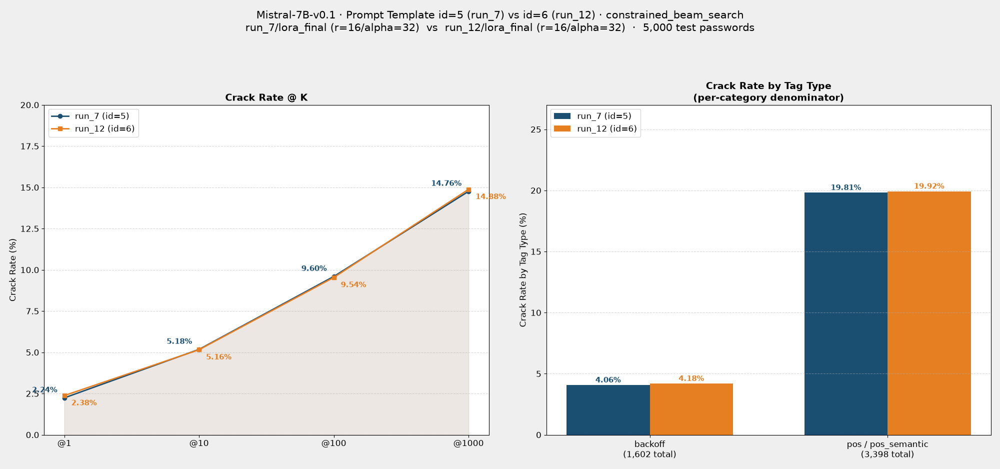

# Comparison Report: Prompt Template id=5 (run_7) vs id=6 (run_12)

**模型：** Mistral-7B-v0.1 · **搜尋法：** constrained_beam_search（含 dynamic_beam_search fallback） · **測試集：** 5,000 筆（000webhost backoff split，與兩次評估完全相同）

---

## 實驗設定對照

| 項目 | id=5（run_7） | id=6（run_12） |
|---|---|---|
| LoRA | `checkpoints/Mistral-7B-v0.1/run_7/lora_final` | `checkpoints/Mistral-7B-v0.1/run_12/lora_final` |
| LoRA 種類 | `lora`（標準 bf16） | `lora`（標準 bf16） |
| LoRA rank / alpha | r=16, alpha=32（`train_config.yaml` 預設值） | r=16, alpha=32（`train_config.yaml` 預設值） |
| LoRA target_modules | q_proj, k_proj, v_proj | q_proj, k_proj, v_proj |
| 訓練 Template | id=5 | id=6 |
| 推論 Template | id=5 | id=6 |
| 搜尋法（primary） | `constrained_beam_search` | `constrained_beam_search` |
| 搜尋法（fallback） | `dynamic_beam_search` | `dynamic_beam_search` |
| 來源 log | `results/eval/eval-249332.out` | `results/eval/eval-260704.out` |

> **LoRA 設定核對：** 直接讀取 `run_7/lora_final/adapter_config.json` 確認為 r=16/alpha=32/target_modules=[q,k,v]，與 `run_12` 完全相同（皆為 `train_config.yaml` 預設值）。**先前 `comparison_run6_vs_run7...md` 報告誤記 run_7 與 run_6 一樣使用加大過的 r=32/alpha=64（實際僅 run_6 如此），本報告數值已改以 `adapter_config.json` 為準。** 因此本次比較中 LoRA 容量完全一致，唯一差異變因就是 prompt template（id=5 vs id=6）。

---

## Prompt 設計差異

| 面向 | id=5（訓練 = 推論） | id=6（訓練 = 推論） |
|---|---|---|
| System 指示 | "...generate likely password candidates that match the given tag structure. Each `<tag>` placeholder names the character class for that segment. Do not output the tag placeholders. Generate only the password characters for each segment in order." | "...utilize the provided structure information to guess the corresponding password."（大幅精簡） |
| 結構表示 | JSON 包裝：`{"password structure": "<tag1><tag2>..."}` | 純文字，接在字面換行符後：`<tag1><tag2>...`（無 JSON） |
| 兩者共通點 | 都是 `<tag>` 直接作佔位符（同一組 tag 名稱），訓練與推論 prompt 完全一致 | 同左 |
| Prompt 範例（同一筆資料，`26812428v`，tags=`number8\|char1`） | `As a targeted password guessing model, your task is to generate likely password candidates that match the given tag structure. Each <tag> placeholder names the character class for that segment. Do not output the tag placeholders. Generate only the password characters for each segment in order.{"password structure": "<number8><char1>"}` | `As a targeted password guessing model, your task is to utilize the provided structure information to guess the corresponding password.\n<number8><char1>` |
| Prompt 資訊量 | 較多（詳細指示 tag 佔位符的用途 + JSON 包裝） | 更精簡（單句指示 + 無 JSON 包裝，直接換行接結構） |

> **核心差異：** id=6 移除了 JSON 包裝格式，並將 system 指示精簡為一句話，訓練目標與 id=5 相同都是輸出以空格分隔的字元序列。id=6 是目前 `config/search.yaml`、`config/train_config.yaml` 的現行預設 template。

---

## Crack Rate 對照

| @K | id=5 (run_7) | id=6 (run_12) | Δ (pp) | 變化幅度 |
|---|---|---|---|---|
| @1 | 112 / 5,000 (2.24%) | 119 / 5,000 (2.38%) | +0.14 | +6.3% |
| @10 | 259 / 5,000 (5.18%) | 258 / 5,000 (5.16%) | -0.02 | -0.4% |
| @100 | 480 / 5,000 (9.60%) | 477 / 5,000 (9.54%) | -0.06 | -0.6% |
| @1000 | 738 / 5,000 (14.76%) | 744 / 5,000 (14.88%) | +0.12 | +0.8% |

---

## Tag 類型破解率對照

（分母為測試集中各類型的總筆數，兩次評估使用**相同測試集**）

| Tag 類型 | 測試集筆數 | id=5 破解 | id=5 破解率 | id=6 破解 | id=6 破解率 | Δ (pp) |
|---|---|---|---|---|---|---|
| 純 backoff | 1,602 | 65 | 4.06% | 67 | 4.18% | +0.12 |
| 含 pos / pos_semantic | 3,398 | 673 | 19.81% | 677 | 19.92% | +0.11 |
| **合計** | **5,000** | **738** | **14.76%** | **744** | **14.88%** | **+0.12** |

---

## 結果圖表

---

## 觀察與分析

### 1. 整體 crack rate 幾乎完全相同
在 LoRA 設定完全一致的前提下，@1000 破解率 id=5（run_7）=14.76%、id=6（run_12）=14.88%，差距僅 +0.12pp（+0.8%）；@10 與 @100 甚至反向微幅落後（-0.4% / -0.6%）。四個 K 值的差距都在 5,000 筆抽樣下的隨機波動範圍內，沒有一個 K 值呈現系統性差距。

### 2. 兩種 tag 類型走勢一致
純 backoff（4.06% → 4.18%，+0.12pp）與含 pos/pos_semantic（19.81% → 19.92%，+0.11pp）的變化幅度幾乎相同，說明 id=6 精簡 prompt 不論在稀疏結構或語意豐富結構上都沒有造成偏移，兩種 prompt 設計對模型學習 tag → 字元映射的效果基本等價。

### 3. 精簡 prompt 不影響效果，但可降低訓練/推論成本
id=6 移除了 id=5 的 JSON 包裝與詳細指示語句，system prompt 更短、user 端也少了 JSON 語法 token。在破解率幾乎持平的情況下，這代表精簡格式沒有帶來效果損失，卻能縮短 prompt 長度（減少 tokenizer 產生的 token 數），對訓練/推論吞吐量有正面幫助。

### 4. 本次比較排除了 LoRA 容量的混淆變因
與先前 run_6 vs run_7 的比較不同，這次 run_7 與 run_12 的 LoRA rank/alpha/target_modules 完全相同（皆為預設 r=16/alpha=32/[q,k,v]），因此本報告的差異可以更乾淨地歸因於 prompt template 本身，而非訓練容量差異。

### 5. 結論
在相同 LoRA 設定下，id=6（精簡、無 JSON 包裝）與 id=5 的破解率統計上幾乎相同（@1000 差距僅 +0.8%），可視為等效設計；由於 prompt 更精簡、無 JSON 語法開銷，id=6 是目前更具成本效益的選擇，`config/search.yaml` 與 `config/train_config.yaml` 也已切換至 id=6 作為現行預設。

---

## 參考報告

- [id5_run10_Mistral-7B_id5_constrained_beam_search.md](id5_run10_Mistral-7B_id5_constrained_beam_search.md)
- [comparison_run6_vs_run7_Mistral-7B_id5_constrained_beam_search.md](comparison_run6_vs_run7_Mistral-7B_id5_constrained_beam_search.md)（**注意：** 該報告記錄的 run_7 LoRA rank 有誤，已於本報告修正）
