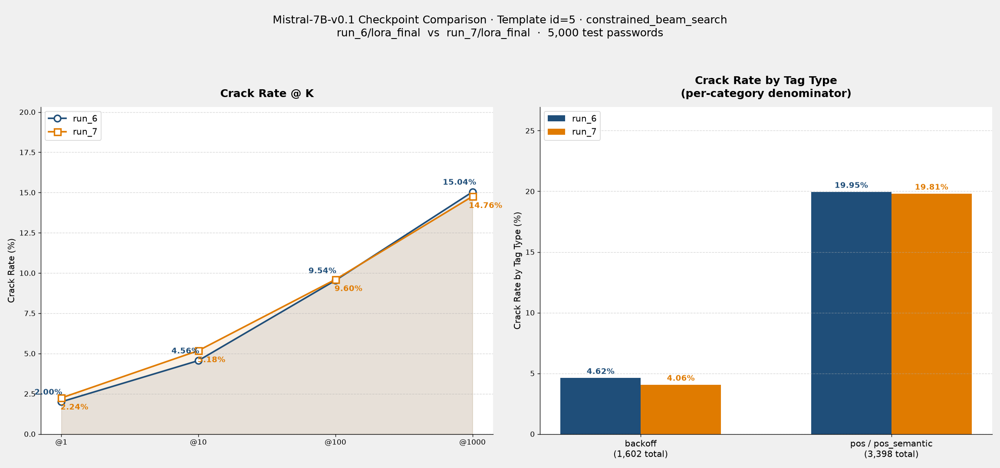

# Comparison Report: Mistral-7B-v0.1 run_6 vs run_7

**模型：** Mistral-7B-v0.1 · **Template：** id=5（訓練 = 推論） · **搜尋法：** constrained_beam_search · **測試集：** 5,000 筆（000webhost backoff split，與兩次評估完全相同）

---

## 實驗設定對照

| 項目 | run_6 | run_7 |
|---|---|---|
| LoRA | `checkpoints/Mistral-7B-v0.1/run_6/lora_final` | `checkpoints/Mistral-7B-v0.1/run_7/lora_final` |
| 訓練 Template | id=5 | id=5 |
| 推論 Template | id=5 | id=5 |
| 搜尋法（primary） | `constrained_beam_search` | `constrained_beam_search` |
| 搜尋法（fallback） | `dynamic_beam_search` | `dynamic_beam_search` |
| 來源 log | `results/eval/eval-249331.out` | `results/eval/eval-249332.out` |

---

## Crack Rate 對照

| @K | run_6 | run_7 | Δ (pp) | 變化幅度 |
|---|---|---|---|---|
| @1 | 100 / 5,000 (2.00%) | 112 / 5,000 (2.24%) | +0.24 | +12.0% |
| @10 | 228 / 5,000 (4.56%) | 259 / 5,000 (5.18%) | +0.62 | +13.6% |
| @100 | 477 / 5,000 (9.54%) | 480 / 5,000 (9.60%) | +0.06 | +0.6% |
| @1000 | 752 / 5,000 (15.04%) | 738 / 5,000 (14.76%) | -0.28 | -1.9% |

---

## Tag 類型破解率對照

（分母為測試集中各類型的總筆數，兩次評估使用**相同測試集**）

| Tag 類型 | 測試集筆數 | run_6 破解 | run_6 破解率 | run_7 破解 | run_7 破解率 | Δ (pp) |
|---|---|---|---|---|---|---|
| 純 backoff | 1,602 | 74 | 4.62% | 65 | 4.06% | -0.56 |
| 含 pos / pos_semantic | 3,398 | 678 | 19.95% | 673 | 19.81% | -0.14 |
| **合計** | **5,000** | **752** | **15.04%** | **738** | **14.76%** | **-0.28** |

---

## 結果圖表

---

## 觀察與分析

### 1. 兩次 checkpoint 表現非常接近
@1000 破解率 run_6=15.04%、run_7=14.76%，差距僅 -0.28pp（-1.9%），在 5,000 筆抽樣下屬於可能的隨機波動範圍，並非明顯的訓練退化或進步。

### 2. 低 K 區段 run_7 略優，高 K 區段 run_6 略優
@1/@10 run_7 領先（+12.0% / +13.6%），@100 兩者幾乎相同，@1000 run_6 反超（+1.9%）。這代表 run_7 在最容易命中的 top 排名上略有優勢，但 run_6 在需要更大候選空間才能命中的密碼上略多破解了一些。

### 3. Tag 類型破解率走勢一致
無論 run_6 或 run_7，含 pos/pos_semantic tag 的破解率（約 19.8–20.0%）都遠高於純 backoff tag（約 4.1–4.6%），兩次 checkpoint 在這個結構性差異上的表現模式一致，說明差異主要來自 checkpoint 間的訓練噪音，而非搜尋策略或 prompt 設計的系統性偏移。

### 4. 結論
run_6 與 run_7 可視為同一訓練設定下的相近結果，無需特別挑選「更優」版本；若要進一步比較，建議用多個 checkpoint 的平均值或更大樣本數來降低抽樣誤差。

---

## 參考報告

- [id5_run6_Mistral-7B_id5_constrained_beam_search.md](id5_run6_Mistral-7B_id5_constrained_beam_search.md)
- [id5_run7_Mistral-7B_id5_constrained_beam_search.md](id5_run7_Mistral-7B_id5_constrained_beam_search.md)
