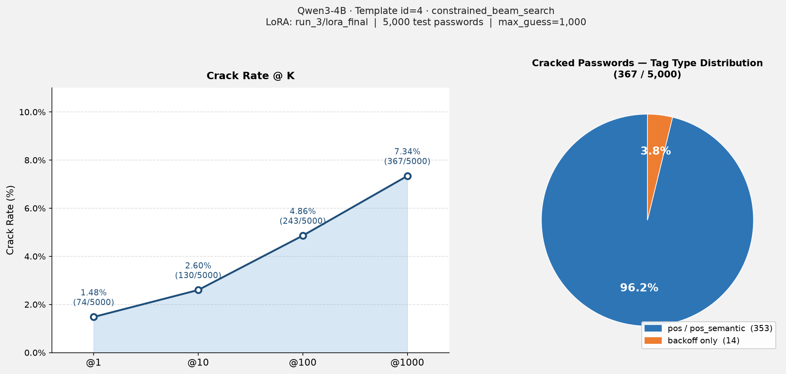

# Eval Report: Qwen3-4B · Template id=4 · constrained_beam_search

## 實驗設定

| 項目 | 值 |
|---|---|
| 模型 | Qwen3-4B |
| LoRA | `checkpoints/Qwen3-4B/run_3/lora_final` |
| 訓練 Template ID | 3 |
| 推論 Template ID | 4 |
| 評估筆數 | 5,000 |
| Max guess | 1,000 |
| 搜尋法（primary） | `constrained_beam_search` |
| 搜尋法（fallback） | `dynamic_beam_search`（當 tags 含 pos/pos_semantic 時） |
| 測試集 | `datasets/processed/semanticPCFG/000webhost/backoff/split/test_data.jsonl` |
| 輸出檔 | `results/eval-245621.out` |

## Crack Rate

| @K | Cracked | Rate |
|---|---|---|
| @1 | 74 / 5,000 | 1.48% |
| @10 | 130 / 5,000 | 2.60% |
| @100 | 243 / 5,000 | 4.86% |
| @1000 | 367 / 5,000 | 7.34% |

## 結果圖表



## 破解密碼的 Tag 類型分佈

| Tag 類型 | 筆數 | 比例 |
|---|---|---|
| 純 backoff tag | 14 | 3.8% |
| 含 pos / pos_semantic tag | 353 | 96.2% |

> **觀察：** 絕大多數被破解的密碼都含有 pos/pos_semantic tag（96.2%），透過 fallback 到 dynamic_beam_search 才被破解。純 backoff tag 密碼極少被破解，代表 constrained_beam_search 在 backoff 結構上的實際破解能力很有限。

## 破解密碼列表

格式：`idx | pw | rank | has_pos_semantic | tags`

```
   11 | itclub123456                   |     5 | True  | pph1|baseball_club.n.01|number6
   24 | greenday007                    |     5 | True  | green.s.01|day.n.01|number3
   25 | iseerainbows1                  |    89 | True  | ppis1|see.v.01|rainbow.n.01|number1
   36 | livetodie1                     |   249 | True  | populate.v.01|to|die.v.01|number1
   39 | 12apower                       |     1 | True  | number2|at1|power.n.01
   44 | welcome12                      |     1 | True  | welcome.v.01|number2
   64 | completeman09                  |     9 | True  | complete.a.01|man.n.01|number2
   94 | godlike1                       |   213 | True  | divine.s.05|number1
  115 | speedy78                       |   561 | True  | rapid.s.02|number2
  120 | wordup12                       |     1 | True  | word.n.01|up.r.01|number2
  123 | friday13                       |     9 | True  | friday.n.01|number2
  133 | 24info24                       |   173 | True  | number2|information.n.01|number2
  154 | 123456789+                     |     1 | False | number9|special1
  192 | timeshow12345                  |     1 | True  | time.n.01|show.n.01|number5
  231 | burgerking2                    |     9 | True  | burger.n.01|king.n.01|number1
  273 | mailing1                       |    19 | True  | mailing.n.01|number1
  274 | peace12345                     |     3 | True  | peace.n.01|number5
  275 | night457                       |   755 | True  | night.n.01|number3
  283 | forumbest55                    |   177 | True  | forum.n.01|best.r.01|number2
  284 | badboy75                       |   417 | True  | bad.a.01|male_child.n.01|number2
  313 | goodmiracle21                  |    81 | True  | good.a.01|miracle.n.01|number2
  323 | ahimsa13                       |     5 | True  | ahimsa.n.01|number2
  325 | 123456as123456                 |    72 | False | number6|char2|number6
  338 | 01matrix1                      |    37 | True  | number2|matrix.n.01|number1
  344 | 1212money                      |   101 | True  | number4|money.n.01
  345 | darksky123                     |     1 | True  | dark.a.01|sky.n.01|number3
  368 | blind1234                      |     1 | True  | blind.a.01|number4
  377 | unavailable1                   |     1 | True  | unavailable.a.01|number1
  401 | counter42                      |    89 | True  | counter.n.01|number2
  418 | jakejake1                      |    41 | True  | mname|mname|number1
  427 | 12345678ka                     |   324 | False | number8|char2
  430 | mcan2008                       |    29 | True  | char1|can.v.01|number4
  431 | keept4ever                     |   721 | True  | keep.v.01|char1|number1|ever.r.01
  458 | anima420                       |   121 | True  | anima.n.01|number3
  478 | freewild999                    |    29 | True  | free.a.01|wild.a.01|number3
  520 | cupacups1                      |     9 | True  | cup.n.01|at1|cup.v.01|number1
  524 | asura123                       |     1 | True  | asura.n.01|number3
  535 | brave2008                      |     3 | True  | brave.a.01|number4
  538 | online07                       |     9 | True  | on-line.a.01|number2
  582 | misterphd123                   |     1 | True  | mister.n.01|ph.d..n.01|number3
  591 | fury1234                       |     1 | True  | fury.n.01|number4
  605 | jaguar2121                     |   553 | True  | jaguar.n.01|number4
  610 | mylove82                       |   281 | True  | appge|love.n.01|number2
  618 | 2iceberg14                     |   273 | True  | number1|iceberg.n.01|number2
  663 | arctic09                       |     7 | True  | north-polar.s.01|number2
  674 | flamelight007                  |    21 | True  | fire.n.03|light.n.01|number3
  678 | spring2009                     |     3 | True  | spring.n.01|number4
  686 | robert77                       |   285 | True  | mname|number2
  690 | hotsauce3                      |     9 | True  | hot.a.01|sauce.n.01|number1
  702 | 1234567bb                      |   211 | False | number7|char2
  704 | passwords3                     |    27 | True  | password.n.01|number1
  754 | energizer0                     |     3 | True  | energizer.n.01|number1
  796 | butter10                       |     3 | True  | butter.n.01|number2
  798 | scorpions32                    |   289 | True  | scorpio.n.01|number2
  803 | down4you13                     |   289 | True  | down.r.01|number1|ppy|number2
  808 | 0computer                      |     5 | True  | number1|computer.n.01
  824 | gorilla123                     |     1 | True  | gorilla.n.01|number3
  835 | cradle_66                      |   585 | True  | cradle.n.01|special1|number2
  846 | secret23                       |    19 | True  | secret.s.01|number2
  851 | sunset135                      |    35 | True  | sunset.n.01|number3
  857 | finland123                     |   155 | True  | country|number3
  867 | thedoors1                      |    45 | True  | at|door.n.01|number1
  889 | tunerillas3                    |     9 | True  | tuner.n.01|ill.a.01|csa|number1
  938 | skither7                       |   109 | True  | skit.n.01|appge|number1
  944 | heyheynow1                     |    17 | True  | uh|uh|now.r.01|number1
  949 | virus123456                    |     1 | True  | virus.n.01|number6
  952 | bookmark1234                   |     1 | True  | bookmark.n.01|number4
  960 | admin_data                     |     5 | True  | nn1|special1|data.n.01
  981 | dreama2004                     |    37 | True  | dream.n.01|at1|number4
 1013 | 234567asd                      |   285 | False | number6|char3
 1040 | moonflower88                   |    77 | True  | moonflower.n.01|number2
 1046 | passass1                       |   181 | True  | pass.v.01|char3|number1
 1047 | Shadow123456                   |    39 | True  | shadow.n.01|number6
 1053 | getlow123                      |     1 | True  | get.v.01|low.a.01|number3
 1056 | damageking12                   |     1 | True  | damage.n.01|king.n.01|number2
 1062 | atom2009                       |     5 | True  | atom.n.01|number4
 1066 | iamtheman1                     |     1 | True  | ppis1|be.v.01|at|man.n.01|number1
 1093 | mydear1982                     |   233 | True  | appge|beloved.s.01|number4
 1116 | admin1982                      |   339 | True  | nn1|number4
 1136 | bolec100                       |   777 | True  | bole.n.01|char1|number3
 1140 | corndogs11                     |   453 | True  | corn.n.01|dog.n.01|number2
 1153 | saffron1                       |     1 | True  | saffron.n.01|number1
 1167 | rebirth3                       |   503 | True  | metempsychosis.n.01|number1
 1169 | 13miracles                     |     3 | True  | number2|miracle.n.01
 1177 | 123456kwe                      |    29 | True  | number6|char1|ppis2
 1185 | iamgenius786                   |   529 | True  | ppis1|be.v.01|genius.n.01|number3
 1190 | manxpower1                     |     1 | True  | manx.a.01|power.n.01|number1
 1210 | mianali123                     |    57 | True  | char2|anal.a.01|ppis1|number3
 1230 | confident09                    |     5 | True  | confident.a.01|number2
 1236 | angel_56                       |   753 | True  | angel.n.01|special1|number2
 1240 | ccash123                       |    25 | True  | char1|cash.n.01|number3
 1248 | imaginary12345                 |   241 | True  | fanciful.s.02|number5
 1259 | supermarket69                  |    79 | True  | supermarket.n.01|number2
 1269 | recall123                      |     5 | True  | remember.v.01|number3
 1299 | killer10                       |     5 | True  | killer.n.01|number2
 1303 | boones12                       |    21 | True  | boone.n.01|number2
 1304 | power1234                      |     1 | True  | power.n.01|number4
 1309 | freeagent0100                  |   521 | True  | free.a.01|agent.n.01|number4
 1320 | swat1lost2                     |   417 | True  | swat.n.01|number1|lose.v.01|number1
 1347 | freeman88                      |    59 | True  | freeman.n.01|number2
 1362 | cocacola2006                   |    33 | True  | erythroxylon_coca.n.01|cola.n.01|number4
 1373 | chinping77                     |   117 | True  | chin.n.01|ping.n.01|number2
 1405 | camaleon2                      |    73 | True  | vm|male.a.01|ii|number1
 1407 | yellow21                       |    37 | True  | yellow.s.01|number2
 1409 | dustybottoms1                  |   237 | True  | dusty.s.01|bottom.n.01|number1
 1413 | answer123                      |     1 | True  | answer.n.01|number3
 1436 | snooker22                      |    41 | True  | snooker.n.01|number2
 1452 | sport200                       |    41 | True  | sport.n.01|number3
 1456 | karate20                       |    33 | True  | karate.n.01|number2
 1459 | artist38                       |   159 | True  | artist.n.01|number2
 1464 | redhot78                       |   205 | True  | red.s.01|hot.a.01|number2
 1466 | redhotnet23                    |    65 | True  | red.s.01|hot.a.01|net.a.01|number2
 1471 | wik123456789                   |    40 | False | char3|number9
 1480 | sparty1234                     |   141 | True  | char1|party.n.01|number4
 1481 | iamlegend12                    |     1 | True  | ppis1|be.v.01|legend.n.01|number2
 1482 | chilla68                       |   405 | True  | chill.n.01|at1|number2
 1489 | goodnice123                    |     1 | True  | good.a.01|nice.a.01|number3
 1519 | 12andre12                      |   339 | True  | number2|mname|number2
 1520 | blacks77                       |   479 | True  | black.n.01|number2
 1524 | webclass1                      |     1 | True  | web.n.01|class.n.01|number1
 1536 | nether2121                     |   653 | True  | nether.s.01|number4
 1539 | listenland1                    |     1 | True  | listen.v.01|land.n.01|number1
 1553 | strike123456                   |     1 | True  | strike.n.01|number6
 1612 | jefferson123                   |   277 | True  | mname|number3
 1643 | rock1000                       |    47 | True  | rock.n.01|number4
 1648 | blackout10                     |     5 | True  | blackout.n.01|number2
 1667 | Redtree1                       |    81 | True  | red.s.01|tree.n.01|number1
 1671 | blackmaster1                   |     1 | True  | black.a.01|maestro.n.01|number1
 1682 | jose2008                       |   105 | True  | mname|number4
 1695 | panda111                       |    15 | True  | giant_panda.n.01|number3
 1702 | strike88                       |    63 | True  | strike.n.01|number2
 1722 | 2004balsa                      |    31 | True  | number4|balsa.n.01
 1737 | latino23                       |   323 | True  | latin_american.n.01|number2
 1779 | 123cancer                      |     1 | True  | number3|cancer.n.01
 1785 | lemonsink131                   |   301 | True  | lemon.n.01|sink.n.01|number3
 1794 | friday1956                     |   849 | True  | friday.n.01|number4
 1795 | flame1996                      |   357 | True  | fire.n.03|number4
 1814 | slavisa79                      |   793 | True  | slav.a.01|be.v.01|at1|number2
 1819 | asdfgh123456                   |    46 | False | char4|char2|number6
 1823 | huangyu123                     |   301 | True  | surname|char2|number3
 1843 | binary_pass                    |     9 | True  | binary.a.01|special1|pass.v.01
 1881 | password91                     |   105 | True  | password.n.01|number2
 1886 | ancient13                      |     9 | True  | ancient.s.01|number2
 1891 | munita12                       |     9 | True  | char1|unit_of_measurement.n.01|at1|number2
 1898 | prosperity1                    |     1 | True  | prosperity.n.01|number1
 1915 | nutshe11                       |   237 | True  | nut.n.01|pphs1|number2
 1930 | some1one                       |    41 | True  | dd|number1|mc1
 1940 | none123456                     |    17 | True  | pn|number6
 1941 | parth123                       |    81 | True  | part.n.01|char1|number3
 1942 | master2master                  |     9 | True  | maestro.n.01|number1|maestro.n.01
 1959 | anand123456#                   |   865 | True  | at1|cc|number6|special1
 1972 | online321                      |    25 | True  | on-line.a.01|number3
 1991 | school122                      |   405 | True  | school.n.01|number3
 1996 | paradise21                     |   471 | True  | eden.n.01|number2
 2042 | panzer89                       |    67 | True  | panzer.n.01|number2
 2044 | sport4good                     |    13 | True  | sport.n.01|number1|good.a.01
 2045 | oldsink5                       |    21 | True  | old.a.01|sink.n.01|number1
 2068 | 1z2z3z4z5z                     |   132 | False | number1|char1|number1|char1|number1|char1|number1|char1|number1|char1
 2093 | myweb4free                     |    33 | True  | appge|web.n.01|number1|free.a.01
 2115 | supermom1                      |     1 | True  | supermom.n.01|number1
 2123 | bigbrother1                    |     1 | True  | large.a.01|brother.n.01|number1
 2138 | blackdance89                   |   109 | True  | black.a.01|dance.n.01|number2
 2143 | office123                      |     1 | True  | office.n.01|number3
 2163 | ironlady2                      |     9 | True  | iron.n.01|lady.n.01|number1
 2185 | susanita123                    |   361 | True  | fname|pph1|at1|number3
 2207 | woofwoof1234                   |     1 | True  | woof.n.01|woof.n.01|number4
 2210 | sweetie1                       |   117 | True  | sweetheart.n.01|number1
 2219 | alphabet1                      |     1 | True  | alphabet.n.01|number1
 2223 | bigfish111                     |    89 | True  | large.a.01|fish.n.01|number3
 2228 | qwer321ty                      |   433 | False | char1|char3|number3|char2
 2262 | server2009                     |     7 | True  | waiter.n.01|number4
 2291 | packers12                      |    15 | True  | packer.n.01|number2
 2297 | judomaster1                    |     1 | True  | judo.n.01|maestro.n.01|number1
 2304 | overkill17                     |    43 | True  | overkill.n.01|number2
 2306 | slangcell123                   |     1 | True  | slang.n.01|cell.n.01|number3
 2310 | studio123                      |     1 | True  | studio.n.01|number3
 2315 | 123456toast                    |     1 | True  | number6|toast.n.01
 2333 | milksoap23                     |    21 | True  | milk.n.01|soap.n.01|number2
 2335 | solder123                      |     1 | True  | solder.n.01|number3
 2342 | 12345678asdf                   |    41 | False | number8|char4
 2354 | newfuture@09                   |   161 | True  | new.a.01|future.n.01|special1|number2
 2361 | angels2009                     |    39 | True  | angel.n.01|number4
 2368 | jasmine2                       |     7 | True  | jasmine.n.01|number1
 2380 | 1992friendship                 |    69 | True  | number4|friendship.n.01
 2382 | german22                       |    45 | True  | german.a.01|number2
 2392 | missyou55                      |   213 | True  | miss.v.01|ppy|number2
 2417 | realbeing2                     |    17 | True  | real.a.01|being.n.01|number1
 2418 | missled10                      |   421 | True  | miss.v.01|lead.v.01|number2
 2420 | siteadmin1                     |    93 | True  | site.n.01|nn1|number1
 2425 | womanology2                    |     9 | True  | woman.n.01|ology.n.01|number1
 2428 | makan12345                     |    83 | False | char5|number5
 2440 | justhack1                      |     1 | True  | merely.r.01|hack.n.01|number1
 2442 | hamburger1                     |     3 | True  | hamburger.n.01|number1
 2452 | kindrat123                     |     1 | True  | kind.n.01|rat.n.01|number3
 2474 | google001                      |   627 | True  | np|number3
 2477 | spank_123                      |     5 | True  | spank.v.01|special1|number3
 2511 | 169forum                       |   403 | True  | number3|forum.n.01
 2523 | slavco2009                     |   173 | True  | slav.a.01|char2|number4
 2569 | gateway4                       |     9 | True  | gateway.n.01|number1
 2572 | pretender4u                    |   397 | True  | pretender.n.01|number1|char1
 2599 | angel110                       |    61 | True  | angel.n.01|number3
 2602 | papamama1                      |   233 | True  | dad.n.01|ma.n.01|number1
 2607 | master1984                     |    21 | True  | maestro.n.01|number4
 2648 | computer33                     |    59 | True  | computer.n.01|number2
 2656 | nonsense.                      |     5 | True  | nonsense.n.01|special1
 2658 | viruschat2                     |     9 | True  | virus.n.01|chat.n.01|number1
 2664 | genie111                       |    19 | True  | genie.n.01|number3
 2693 | thai1992                       |    57 | True  | thai.a.01|number4
 2705 | gogreen1                       |     1 | True  | travel.v.01|green.s.01|number1
 2710 | housesink40                    |   325 | True  | house.n.01|sink.n.01|number2
 2716 | bubbles123                     |     1 | True  | bubble.n.01|number3
 2756 | 6starfoods                     |   281 | True  | number1|star.n.01|food.n.01
 2767 | videoline2009                  |     5 | True  | video.n.01|line.n.01|number4
 2773 | protect12                      |     1 | True  | protect.v.01|number2
 2784 | foundation0                    |     5 | True  | foundation.n.01|number1
 2792 | ison1234                       |     5 | True  | be.v.01|ii|number4
 2812 | 2002jeep                       |    79 | True  | number4|jeep.n.01
 2833 | radio4forlife                  |    33 | True  | radio.n.01|number1|if|life.n.01
 2840 | counter09051987                |   285 | True  | counter.n.01|number8
 2862 | goodnews9                      |    29 | True  | good.a.01|news.n.01|number1
 2879 | arsenal4                       |     9 | True  | arsenal.n.01|number1
 2904 | apple123456789                 |     1 | True  | apple.n.01|number9
 2924 | manman521                      |   349 | True  | man.n.01|man.n.01|number3
 2934 | muevasion123                   |   257 | True  | char2|evasion.n.01|number3
 2945 | loveu123                       |    53 | True  | love.n.01|char1|number3
 2958 | growing1                       |     1 | True  | growing.a.01|number1
 2987 | genius_90                      |   513 | True  | genius.n.01|special1|number2
 2998 | piano123                       |     1 | True  | piano.n.01|number3
 3072 | 4notrust                       |   125 | True  | number1|at|trust.n.01
 3075 | coldspy123                     |     1 | True  | cold.a.01|spy.n.01|number3
 3078 | 1234genti                      |     1 | True  | number4|gent.n.01|ppis1
 3087 | online007                      |     3 | True  | on-line.a.01|number3
 3099 | weed1234                       |     1 | True  | weed.n.01|number4
 3101 | notleftyet1                    |     1 | True  | xx|leave.v.01|yet.r.01|number1
 3104 | epsilon25                      |    47 | True  | epsilon.n.01|number2
 3120 | incognito2008                  |     3 | True  | incognito.r.01|number4
 3127 | nemesis75                      |   585 | True  | nemesis.n.01|number2
 3150 | cool1111                       |    33 | True  | cool.a.01|number4
 3162 | hummingbirds1                  |    37 | True  | hummingbird.n.01|number1
 3167 | 123456789paulo                 |   531 | True  | number9|mname
 3173 | starwars29                     |   629 | True  | star.n.01|war.n.01|number2
 3232 | symbol33                       |    57 | True  | symbol.n.01|number2
 3256 | webhost67                      |   293 | True  | web.n.01|host.n.01|number2
 3262 | designer456                    |    27 | True  | interior_designer.n.01|number3
 3269 | pebbles7                       |    35 | True  | pebble.n.01|number1
 3282 | anous11111                     |    37 | True  | at1|nous.n.01|number5
 3285 | sarajevo2008                   |   770 | True  | city|number4
 3289 | delta1994                      |    63 | True  | delta.n.01|number4
 3316 | truster08                      |   189 | True  | trust.n.01|char2|number2
 3320 | iloveyou30                     |   297 | True  | ppis1|love.v.01|ppy|number2
 3325 | smartguy123                    |     1 | True  | smart.a.01|guy.n.01|number3
 3333 | canallita12                    |     1 | True  | can.v.01|db|pph1|at1|number2
 3340 | helpme09                       |     5 | True  | help.v.01|ppio1|number2
 3345 | rich9999                       |   167 | True  | rich.a.01|number4
 3349 | linuxwin77                     |   113 | True  | linux.n.01|win.n.01|number2
 3365 | airfile*1                      |    41 | True  | air.n.01|file.n.01|special1|number1
 3371 | cocoapuff1                     |     1 | True  | cocoa.n.01|puff.n.01|number1
 3377 | creator2                       |   877 | True  | godhead.n.01|number1
 3388 | fake2000                       |   203 | True  | bogus.s.01|number4
 3399 | deadlove3                      |    13 | True  | dead.a.01|love.n.01|number1
 3419 | asdfghjkl123456789             |    81 | False | char4|char2|char3|number9
 3428 | idream79                       |   525 | True  | ppis1|dream.n.01|number2
 3446 | pornsite1                      |     1 | True  | pornography.n.01|site.n.01|number1
 3472 | meandyou1                      |     1 | True  | ppio1|cc|ppy|number1
 3483 | psychic1                       |     1 | True  | psychic.s.01|number1
 3486 | aitor105                       |   425 | True  | at1|pph1|cc|number3
 3489 | 123456hobby                    |     1 | True  | number6|avocation.n.01
 3491 | tan123456                      |     1 | True  | tan.s.01|number6
 3496 | jajanbatik11                   |    65 | True  | char2|january.n.01|batik.n.01|number2
 3514 | comics2008                     |     3 | True  | comic_strip.n.01|number4
 3519 | joeissexy1                     |    41 | True  | mname|be.v.01|sexy.a.01|number1
 3536 | neverd0that                    |   249 | True  | never.r.01|char1|number1|cst
 3547 | november.3                     |   373 | True  | november.n.01|special1|number1
 3548 | deadmeat8                      |    37 | True  | dead.a.01|meat.n.01|number1
 3556 | neverlose777                   |    45 | True  | never.r.01|lose.v.01|number3
 3583 | braves10                       |   347 | True  | brave.n.01|number2
 3590 | redgin00                       |    41 | True  | red.s.01|gin.n.01|number2
 3614 | 123456angel                    |     1 | True  | number6|angel.n.01
 3667 | memorysafe2                    |     9 | True  | memory.n.01|safe.n.01|number1
 3689 | server09                       |     5 | True  | waiter.n.01|number2
 3697 | cansu123456                    |   201 | True  | can.v.01|char2|number6
 3708 | keep3210                       |   147 | True  | keep.v.01|number4
 3713 | 100mychemical                  |    33 | True  | number3|appge|chemical.a.01
 3723 | wildan99                       |   481 | True  | wild.a.01|at1|number2
 3748 | love4metal                     |    37 | True  | love.n.01|number1|metallic_element.n.01
 3761 | windows40                      |   153 | True  | windows.n.01|number2
 3815 | 11yeahbaby                     |   979 | True  | number2|uh|baby.n.01
 3830 | muslim1984                     |    17 | True  | muslim.a.01|number4
 3832 | loveran123                     |    25 | True  | lover.n.01|at1|number3
 3844 | explorer3                      |     7 | True  | explorer.n.01|number1
 3854 | cornet**                       |     1 | True  | cornet.n.01|special2
 3863 | asad123456                     |     1 | True  | at1|sad.a.01|number6
 3872 | webhost9                       |    29 | True  | web.n.01|host.n.01|number1
 3879 | freemoney10                    |    17 | True  | free.a.01|money.n.01|number2
 3881 | 123456abcdefg                  |     1 | False | number6|char7
 3893 | handsome123                    |   243 | True  | fine-looking.s.01|number3
 3909 | arsenal09                      |     3 | True  | arsenal.n.01|number2
 3939 | dairyman88                     |    87 | True  | dairyman.n.01|number2
 3945 | mindBend1                      |   333 | True  | mind.n.01|bend.v.01|number1
 3953 | webcam1!                       |     1 | True  | webcam.n.01|number1|special1
 3956 | komit123                       |   377 | True  | char3|pph1|number3
 3957 | mymaster24                     |   105 | True  | appge|maestro.n.01|number2
 3961 | pulpufiction2                  |   841 | True  | pulp.n.01|char1|fiction.n.01|number1
 3993 | pass4sure                      |    37 | True  | pass.v.01|number1|certain.a.02
 4000 | shahid123                      |   285 | True  | np1|number3
 4012 | gravity82                      |   175 | True  | gravity.n.01|number2
 4021 | 786editorial                   |   123 | True  | number3|editorial.a.01
 4026 | junior88                       |    61 | True  | junior.a.01|number2
 4052 | 123456789asdf                  |   179 | False | number9|char4
 4059 | brave999                       |    19 | True  | brave.a.01|number3
 4079 | landers9                       |    47 | True  | lander.n.01|number1
 4083 | amstaff1                       |     5 | True  | be.v.01|staff.n.01|number1
 4084 | memet123                       |     1 | True  | ppio1|meet.v.01|number3
 4087 | formula_1                      |     5 | True  | formula.n.01|special1|number1
 4091 | beat1009                       |   161 | True  | beat.n.01|number4
 4098 | edge020202                     |    93 | True  | edge.n.01|number6
 4102 | cmand100                       |   361 | True  | nnu|cc|number3
 4105 | hoteyes21                      |    49 | True  | hot.a.01|eyes.n.01|number2
 4111 | onepiece12                     |     1 | True  | mc1|piece.n.01|number2
 4153 | timepolice2009                 |     5 | True  | time.n.01|police.n.01|number4
 4155 | idream56                       |   413 | True  | ppis1|dream.n.01|number2
 4211 | ahmed12345                     |    79 | True  | mname|number5
 4223 | bijounasset1                   |    97 | True  | bijou.n.01|char1|asset.n.01|number1
 4227 | blowme69                       |   101 | True  | blow.n.01|ppio1|number2
 4237 | gatelband123                   |    41 | True  | gate.n.01|nnu|cc|number3
 4252 | gshop2008                      |   109 | True  | char1|shop.n.01|number4
 4264 | oceanocean2                    |     9 | True  | ocean.n.01|ocean.n.01|number1
 4269 | art4u123                       |   649 | True  | art.n.01|number1|char1|number3
 4287 | jason2009                      |   459 | True  | mname|number4
 4295 | windows101                     |    43 | True  | windows.n.01|number3
 4296 | games4free                     |    53 | True  | game.n.01|number1|free.a.01
 4299 | option2009                     |     5 | True  | option.n.01|number4
 4306 | resbox123                      |   497 | True  | char3|box.n.01|number3
 4307 | innocent123                    |     1 | True  | innocent.a.01|number3
 4319 | 3comhome                       |   105 | True  | number1|char3|home.n.01
 4336 | changed911                     |   299 | True  | change.v.01|number3
 4361 | playnet01                      |    17 | True  | play.v.01|net.a.01|number2
 4386 | thejack2009                    |     1 | True  | at|mname|number4
 4395 | pasha939                       |   925 | True  | pasha.n.01|number3
 4483 | wysiwyg27                      |    75 | True  | wysiwyg.a.01|number2
 4490 | tennis123                      |     1 | True  | tennis.n.01|number3
 4514 | realist67                      |   171 | True  | realist.n.01|number2
 4560 | hackernigga007                 |    25 | True  | hacker.n.01|nigger.n.01|number3
 4602 | alienchat88                    |   269 | True  | alien.s.01|chat.n.01|number2
 4606 | mystery29                      |   103 | True  | mystery.n.01|number2
 4623 | zigzag08                       |    21 | True  | zigzag.n.01|number2
 4654 | daniel_123456                  |   225 | True  | mname|special1|number6
 4655 | adminwarrior1                  |     1 | True  | nn1|warrior.n.01|number1
 4687 | breakit1                       |    17 | True  | interruption.n.02|pph1|number1
 4689 | predate3                       |    19 | True  | predate.v.01|number1
 4707 | david2009                      |     5 | True  | mname|number4
 4748 | mypassword5                    |    29 | True  | appge|password.n.01|number1
 4756 | revival1                       |     1 | True  | revival.n.01|number1
 4761 | advocate9                      |    15 | True  | advocate.n.01|number1
 4768 | web654321                      |    19 | True  | web.n.01|number6
 4784 | road2hell                      |     9 | True  | road.n.01|number1|hell.n.01
 4805 | penisface1                     |     1 | True  | penis.n.01|face.n.01|number1
 4816 | hamster29                      |    65 | True  | hamster.n.01|number2
 4819 | polarbear1                     |     1 | True  | polar.s.01|bear.n.01|number1
 4829 | verify84                       |   205 | True  | verify.v.01|number2
 4840 | cameraman22                    |    41 | True  | cameraman.n.01|number2
 4864 | cereixa2008                    |    49 | True  | cere.n.01|mc|at1|number4
 4890 | libido123                      |     1 | True  | libido.n.01|number3
 4898 | magentaboy55                   |   177 | True  | magenta.n.01|male_child.n.01|number2
 4923 | uhood123456                    |   101 | True  | char1|hood.n.01|number6
 4991 | samurai185                     |   513 | True  | samurai.n.01|number3
 4993 | icecurtain02                   |    41 | True  | ice.n.01|curtain.n.01|number2
```
