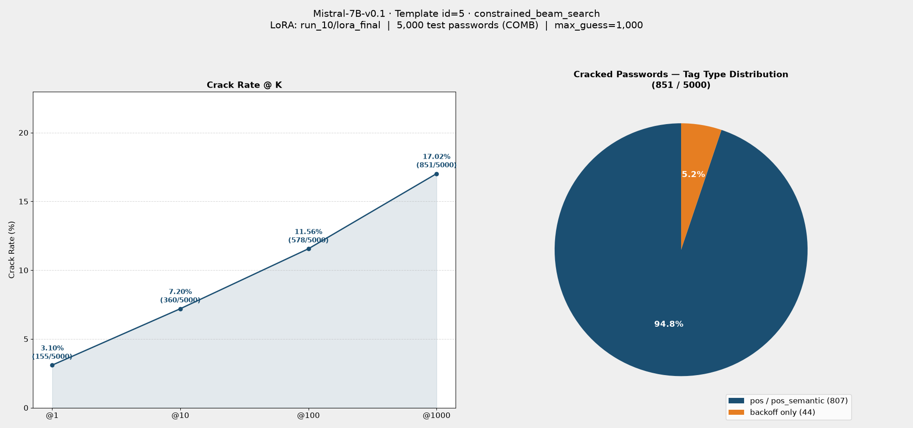

# Eval Report: Mistral-7B-v0.1 · Template id=5 · constrained_beam_search（COMB dataset）

來源：[results/train/job-258508.out](../../results/train/job-258508.out)、[results/eval/eval-258985.out](../../results/eval/eval-258985.out)

## 實驗設定

| 項目 | 值 |
|---|---|
| 模型 | Mistral-7B-v0.1 |
| LoRA | `checkpoints/Mistral-7B-v0.1/run_10/lora_final` |
| LoRA rank / alpha / target_modules | r=16, alpha=32, [q_proj, k_proj, v_proj]（`train_config.yaml` 預設值） |
| 訓練 Template ID | 5 |
| 推論 Template ID | 5 |
| 評估筆數 | 5,000 |
| Max guess | 1,000 |
| 搜尋法（primary） | `constrained_beam_search` |
| 搜尋法（fallback） | `dynamic_beam_search`（當 tags 含 pos/pos_semantic 時） |
| 測試集 | `datasets/processed/semanticPCFG/COMB/backoff/split/test_data.jsonl`（訓練資料同為 COMB，非 000webhost） |
| 來源 log | `results/eval/eval-258985.out` |

### Trainer 超參數（`results/train/job-258508.out`）

| 參數 | 值 |
|---|---|
| 訓練資料 | `datasets/processed/semanticPCFG/COMB/backoff/split/train_data.jsonl`（262,263 筆） |
| 驗證資料 | 同目錄 `test_data.jsonl`（13,513 筆） |
| per_device_train_batch_size | 64 |
| gradient_accumulation_steps | 64（有效 batch = 4096） |
| per_device_eval_batch_size | 32 |
| num_train_epochs | 10 |
| total_steps / max_steps | 640（log 開頭列印）／650（trainer_state 實際 global_step） |
| warmup_steps | 64 |
| learning_rate | 2e-4 |
| lr_scheduler_type | linear |
| weight_decay | 0.01 |
| optim | adamw_torch |
| adam_beta1 / beta2 / epsilon | 0.9 / 0.999 / 1e-8 |
| max_grad_norm | 1.0 |
| bf16 / fp16 | true / false |
| gradient_checkpointing | true |
| seed / data_seed | 42 |
| eval_strategy / eval_steps | steps / 20 |
| save_strategy / save_steps | steps / 20 |
| logging_steps | 10 |

### LoRA 設定（`adapter_config.json`）

| 參數 | 值 |
|---|---|
| r | 16 |
| lora_alpha | 32 |
| lora_dropout | 0.2 |
| target_modules | `q_proj`, `k_proj`, `v_proj` |
| bias | none |
| init_lora_weights | true |
| task_type | CAUSAL_LM |

### 訓練結果（log 尾端）

| 指標 | 值 |
|---|---|
| 最終 train_loss | 1.74 |
| 最終 eval_loss（epoch 10） | 1.649 |
| train_runtime | 3.043e4 秒（約 8.45 小時） |
| train_samples_per_second | 86.18 |

## Crack Rate

| @K | Cracked | Rate |
|---|---|---|
| @1 | 155 / 5,000 | 3.10% |
| @10 | 360 / 5,000 | 7.20% |
| @100 | 578 / 5,000 | 11.56% |
| @1000 | 851 / 5,000 | 17.02% |

## 結果圖表

## 破解密碼的 Tag 類型分佈

（分母為 COMB 測試集：純 backoff 1,773 筆 / 含 pos-pos_semantic 3,227 筆，與 000webhost 測試集比例不同）

| Tag 類型 | 筆數 | 比例 |
|---|---|---|
| 純 backoff tag | 44 | 5.2% |
| 含 pos / pos_semantic tag | 807 | 94.8% |

> **觀察：** COMB 資料集（訓練+測試皆為 COMB）的 @1000 破解率（17.02%）高於同 template（id=5）在 000webhost 上的 run_6/run_7（15.04% / 14.76%），推測與 COMB 資料量更大、密碼組成更多樣有關；破解密碼中含 pos/pos_semantic tag 的比例（94.8%）也高於 000webhost 上的結果（約 90%），需交叉比對訓練/測試資料集是否一致才能公平比較不同 run 之間的破解率。
