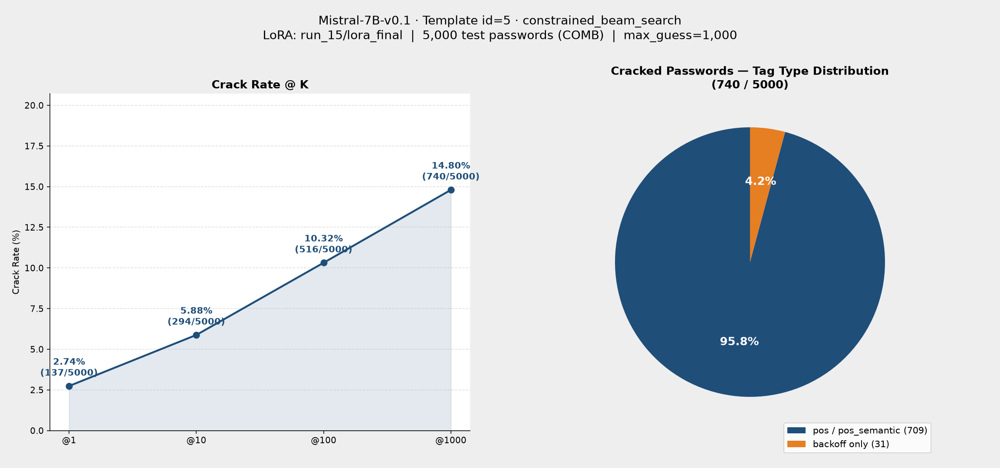

# 參數報告：Mistral-7B-v0.1 run_15（訓練 + 評估）

來源：`checkpoints/Mistral-7B-v0.1/run_15/checkpoint-650/trainer_state.json`、`gen/eval_results_id5_run_15_Mistral7B_id5_COMB.jsonl`
（本次訓練與評估均於本機執行，無 HPC job output 檔案；訓練超參數交叉比對 `checkpoints/Mistral-7B-v0.1/run_15/lora_final/adapter_config.json` 與 `config/train_config.yaml`）

---

## 一、訓練參數

| 項目 | 值 |
|---|---|
| 基底模型 | `models/Mistral-7B-v0.1` |
| LoRA 模式 | `lora`（標準 bf16 LoRA，**非** QLoRA／未做 4-bit 量化） |
| 訓練資料 | `datasets/processed/semanticPCFG/COMB/backoff/split/train_data.jsonl`（262,263 筆） |
| 驗證資料 | 同目錄 `test_data.jsonl`（13,513 筆） |
| Prompt Template ID | 5（inline `<tag>` placeholder，訓練/推論 prompt 相同） |
| 輸出目錄 | `checkpoints/Mistral-7B-v0.1/run_15` |

### Trainer 超參數

| 參數 | 值 |
|---|---|
| per_device_train_batch_size | 64 |
| gradient_accumulation_steps | 64（有效 batch = 4096） |
| per_device_eval_batch_size | 32 |
| num_train_epochs | 10 |
| total_steps / global_step（實際） | 640（估算）／650（trainer_state 實際 global_step） |
| warmup_ratio | 0.1（約 64 steps） |
| learning_rate | 5e-4 |
| weight_decay | 0.01 |
| optim | adamw_torch |
| label_smoothing_factor | 0 |
| bf16 | true |
| seed / data_seed | 42 / 42 |
| eval_strategy / eval_steps | steps / 20 |
| save_steps | 20 |
| logging_steps | 10 |
| eval_delay | 1 |

### LoRA 設定（adapter_config.json）

| 參數 | 值 |
|---|---|
| r | 32 |
| lora_alpha | 64 |
| lora_dropout | 0.2 |
| target_modules | `q_proj`, `k_proj`, `v_proj`, `o_proj`, `gate_proj` |
| bias | none |
| init_lora_weights | true |
| task_type | CAUSAL_LM |

### 訓練結果（trainer_state.json）

| 指標 | 值 |
|---|---|
| 最終 train loss（step 650，最後 batch） | 0.7499 |
| 最終 eval_loss（epoch 10，step 650） | 2.3271 |
| 初始 eval_loss（epoch 0.31，step 20） | 2.0128 |
| train_runtime | 不可取得（本機訓練，無 job output） |

> **注意：** eval_loss 自 step 20 的 2.013 上升至 step 650 的 2.327，全程呈上升趨勢，顯示學習率 5e-4 可能偏高，驗證集泛化能力隨訓練下降。與 run_10（eval_loss 最終 1.649）相比差異顯著。

---

## 二、評估參數

| 項目 | 值 |
|---|---|
| 基底模型 | `models/Mistral-7B-v0.1`（device=cuda, dtype=torch.float16） |
| LoRA adapter | `checkpoints/Mistral-7B-v0.1/run_15/lora_final` |
| 評估筆數 | 5,000 |
| 推論 Prompt Template ID | 5 |
| Max guess number | 1,000 |
| 測試集 | `datasets/processed/semanticPCFG/COMB/backoff/split/test_data.jsonl` |
| 輸出檔 | `gen/eval_results_id5_run_15_Mistral7B_id5_COMB.jsonl` |

### 搜尋法設定（`config/search.yaml`）

| 項目 | 值 |
|---|---|
| search_type（主） | `constrained_beam_search` |
| beam_width | 1000（單一 int，每步上限依字元類別大小自動計算） |
| search_width | 1000 |
| batch_size | 1000 |
| precision | half |
| fallback_to_dynamic | true（tags 含 pos/pos_semantic 時，退回 `dynamic_beam_search`） |
| 退回法 beam_width | `[95, 1000×15]`（16 層） |
| 退回法 batch_size | 1000 |
| 退回法 eos_threshold | 0.001 |
| 退回法 min_len | 7 |

### Crack Rate

| @K | Cracked | Rate |
|---|---|---|
| @1 | 137 / 5,000 | 2.74% |
| @10 | 294 / 5,000 | 5.88% |
| @100 | 516 / 5,000 | 10.32% |
| @1000 | 740 / 5,000 | 14.80% |

### 結果圖表

### Tag Type 分布（@1000）

| Tag Type | Cracked | Total | Rate |
|---|---|---|---|
| backoff | 31 | 1,773 | 1.75% |
| pos | 83 | 1,804 | 4.60% |
| pos_semantic | 626 | 1,423 | 43.99% |

---

## 三、與 run_10 比較

| 項目 | run_10 | run_15 |
|---|---|---|
| learning_rate | 2e-4 | 5e-4 |
| LoRA r / alpha | 16 / 32 | 32 / 64 |
| target_modules | q/k/v\_proj | +o\_proj, gate\_proj |
| 最終 eval_loss | 1.649 | 2.327（↑，泛化變差） |
| @1 | 3.10% | 2.74% |
| @10 | 7.20% | 5.88% |
| @100 | 11.56% | 10.32% |
| @1000 | 17.02% | **14.80%** |

> run_15 三項差異（LR 提高、LoRA 容量加倍、新增 target modules）均未帶來改善；eval_loss 上升趨勢與 crack rate 下降一致，主因推測為學習率過高導致過擬合。

---

## 四、已破解密碼（@1000，部分列舉）

| 密碼 | Tags | 猜測次數 |
|---|---|---|
| littlegirl | small.a.01\|girl.n.01 | 1 |
| questmagic | pursuit.n.02\|magic.n.01 | 1 |
| madness1! | lunacy.n.01\|number1\|special1 | 1 |
| sexymoney | sexy.a.01\|money.n.01 | 1 |
| moosedog | elk.n.01\|dog.n.01 | 1 |
| governor | governor.n.01 | 1 |
| vampires | vampire.n.01 | 1 |
| testing123 | testing.n.01\|number3 | 1 |
| killafly12 | kill.v.01\|at1\|fly.n.01\|number2 | 2 |
| Fighter1234 | combatant.n.01\|number4 | 2 |
| lovely12 | lovely.s.01\|number2 | 4 |
| Gangster1 | gangster.n.01\|number1 | 6 |
| deepforest78 | deep.a.01\|forest.n.01\|number2 | 21 |
| junk4sale | debris.n.01\|number1\|sale.n.01 | 23 |
| bossage123 | foreman.n.01\|age.n.01\|number3 | 12 |
| 8isgreat | number1\|be.v.01\|great.s.01 | 18 |
| fuckass77 | sleep_together.v.01\|char3\|number2 | 88 |
| rbhbkk1998 | char3\|char3\|number4 | 189 |
| edvaldo36 | char2\|mname\|make.v.01\|number2 | 334 |
| redfish110 | redfish.n.01\|number3 | 277 |
