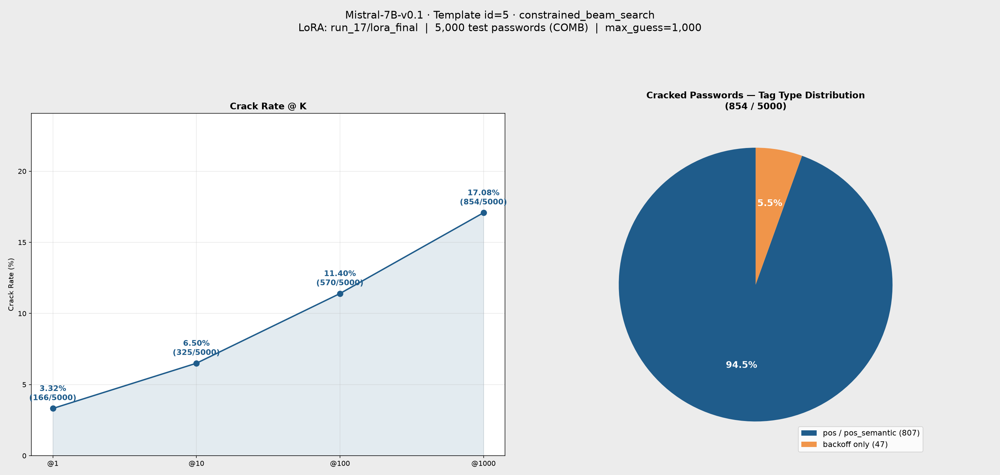

# 參數報告：Mistral-7B-v0.1 run_17

來源：[config/train_config.yaml](../../config/train_config.yaml)（現行版本，尚未 commit）
> 本報告於 run_17 訓練**開始前**寫入，僅含訓練參數（第一節）；`checkpoints/Mistral-7B-v0.1/run_17` 目錄已存在但尚無 checkpoint。待訓練與評估完成後再補上第二節評估參數與結果，比照 [id5_run15_Mistral-7B_id5_constrained_beam_search.md](id5_run15_Mistral-7B_id5_constrained_beam_search.md) 格式。
>
> **本次規劃與 run_14 草稿（[id5_run14_Mistral-7B_params.md](id5_run14_Mistral-7B_params.md)，當時未執行）參數完全相同**：`per_device_train_batch_size=4`、`learning_rate=5e-4`，其餘設定不變。

## 一、訓練參數（規劃值，尚未執行）

| 項目 | 值 |
|---|---|
| 基底模型 | `models/Mistral-7B-v0.1` |
| LoRA 模式 | `lora`（標準 bf16 LoRA，**非** QLoRA／未做 4-bit 量化） |
| 訓練資料 | `datasets/processed/semanticPCFG/COMB/backoff/split/train_data.jsonl`（262,263 筆） |
| 驗證資料 | 同目錄 `test_data.jsonl`（13,513 筆） |
| Prompt Template ID | 5（inline `<tag>` placeholder，訓練/推論 prompt 相同） |
| 輸出目錄 | `checkpoints/Mistral-7B-v0.1/run_17` |

### Trainer 超參數

| 參數 | 值 |
|---|---|
| per_device_train_batch_size | 4 |
| gradient_accumulation_steps | 64（有效 batch = 256） |
| per_device_eval_batch_size | 32 |
| num_train_epochs | 10 |
| total_steps（估算） | 約 10,240（`262,263 // 256 ≈ 1,024`／epoch × 10） |
| warmup_ratio | 0.1 |
| learning_rate | 5e-4 |
| weight_decay | 0.01 |
| optim | adamw_torch |
| label_smoothing_factor | 0 |
| bf16 | true |
| seed / data_seed | 42 / 42 |
| eval_strategy / eval_steps | steps / 20 |
| save_steps | 20 |
| logging_steps | 10 |
| eval_delay | 1 |

### LoRA 設定（`train_config.yaml` → `train.lora_config`）

| 參數 | 值 |
|---|---|
| r | 32 |
| lora_alpha | 64 |
| lora_dropout | 0.2 |
| target_modules | `q_proj`, `k_proj`, `v_proj`, `o_proj`, `gate_proj` |
| bias | none |
| init_lora_weights | true |

## 二、訓練狀況與 lora_final 來源

- 本次 run_17（job 268989）為 2026-07-20 刪除舊 run_17（發散於 step ~3420、crack rate 0%）後重跑的第二次訓練，沿用 `learning_rate=5e-4`
- `trainer_state.json` 顯示 eval_loss 在 step 3620 達最低點 1.6620（優於 run_16 最佳的 1.6733），之後 step 3620→3640 由 1.6620 瞬間跳到 7.1094，自此發散，與舊 run_17 相同模式重演，只是晚了約 200 step
- job 268989 已於 2026-07-21T12:00:41 在 step ~3966/10,250 被取消（訓練未正常結束，因此 `load_best_model_at_end` 的自動存檔邏輯未觸發）
- `lora_final` 由 `checkpoint-3620`（發散前最佳點）手動複製產生，即為本次評估實際使用的權重

## 三、評估結果

| 項目 | 值 |
|---|---|
| 基底模型 | `models/Mistral-7B-v0.1` |
| LoRA adapter | `checkpoints/Mistral-7B-v0.1/run_17/lora_final`（= checkpoint-3620） |
| 評估筆數 | 5,000 |
| 推論 Prompt Template ID | 5 |
| Max guess number | 1,000 |
| 測試集 | `datasets/processed/semanticPCFG/COMB/backoff/split/test_data.jsonl` |
| 輸出檔 | `gen/eval_results_id5_run_17_Mistral7B_id5_COMB.jsonl` |

### Crack Rate

| @K | Cracked | Rate |
|---|---|---|
| @1 | 166 / 5,000 | 3.32% |
| @10 | 325 / 5,000 | 6.50% |
| @100 | 570 / 5,000 | 11.40% |
| @1000 | 854 / 5,000 | 17.08% |

### 結果圖表

### Tag Type 分布（@1000）

| Tag Type | Cracked | Total | Rate |
|---|---|---|---|
| backoff | 47 | 1,773 | 2.65% |
| pos | 114 | 1,804 | 6.32% |
| pos_semantic | 693 | 1,423 | 48.70% |

> run_17（batch=4，最佳點 step 3620）@1000 crack rate 17.08%，優於 run_15（batch=64，同 lr=5e-4，@1000 14.80%）；三個 tag type 的破解率也全面領先（pos_semantic 48.70% vs 43.99%）。用最佳點權重取代發散後的最終權重，看起來確實比 run_15 當時直接用劣化的 `lora_final` 更能反映模型真實能力上限。
