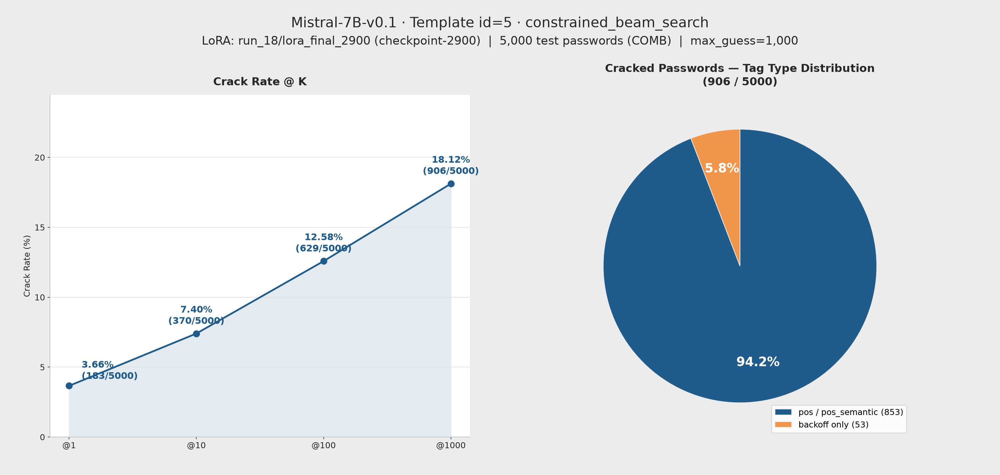

# 參數報告：Mistral-7B-v0.1 run_18

來源：`checkpoints/Mistral-7B-v0.1/run_18/checkpoint-2900/trainer_state.json`、`checkpoints/Mistral-7B-v0.1/run_18/train_config_snapshot.json`、`results/eval/job-270451.out`（訓練 log）、`results/eval/eval-271708.out`（評估 log）、`gen/eval_results_id5_run_18_Mistral7B_id5_COMB.jsonl`

> **注意：run_18 訓練截至本報告撰寫時尚未跑完排程**（`max_steps=10,250`，訓練 log 顯示已到 step ~4385，約 43%），本次評估是在訓練仍進行中時，針對 `load_best_model_at_end` 追蹤到的目前最佳 checkpoint（checkpoint-2900）手動截斷評估，並非等待完整 10 epoch 跑完。若之後訓練跑出更低的 eval_loss，本報告的 crack rate 需重新評估更新。

## 一、訓練參數

| 項目 | 值 |
|---|---|
| 基底模型 | `models/Mistral-7B-v0.1` |
| LoRA 模式 | `lora`（標準 bf16 LoRA，**非** QLoRA／未做 4-bit 量化） |
| 訓練資料 | `datasets/processed/semanticPCFG/COMB/backoff/split/train_data.jsonl`（262,263 筆） |
| 驗證資料 | 同目錄 `test_data.jsonl`（13,513 筆） |
| Prompt Template ID | 5（inline `<tag>` placeholder，訓練/推論 prompt 相同） |
| 輸出目錄 | `checkpoints/Mistral-7B-v0.1/run_18` |

### Trainer 超參數

| 參數 | 值 |
|---|---|
| per_device_train_batch_size | 4 |
| gradient_accumulation_steps | 64（有效 batch = 256） |
| per_device_eval_batch_size | 32 |
| num_train_epochs | 10 |
| max_steps（trainer_state 實際） | 10,250 |
| warmup_ratio | 0.1 |
| learning_rate | 2e-4 |
| weight_decay | 0.01 |
| optim | adamw_torch |
| label_smoothing_factor | 0 |
| bf16 | true |
| seed / data_seed | 42 / 42 |
| eval_strategy / eval_steps | steps / 20 |
| save_steps | 20 |
| logging_steps | 10 |
| eval_delay | 1 |

### LoRA 設定（`train_config_snapshot.json` → `train.lora_config`）

| 參數 | 值 |
|---|---|
| r | 32 |
| lora_alpha | 64 |
| lora_dropout | 0.2 |
| target_modules | `q_proj`, `k_proj`, `v_proj`, `o_proj`, `gate_proj` |
| bias | none |
| init_lora_weights | true |

## 二、訓練狀況與 lora_final 來源

- run_18 對應 `record.txt` 規劃的「biglora + lr=2e-4 + batch=4」，與 run_16（同配置、已於 step ~2980 發散）為重跑關係；訓練仍在背景進行中（job 270451），尚未到達 `max_steps=10,250`
- `trainer_state.json`（`best_model_checkpoint` 追蹤）顯示 eval_loss 在 **step 2900 達目前最低點 1.6005**；此後 step 3080 起 eval_loss 由 1.6489 跳升，一路在 1.63~1.66 之間震盪，未再刷新最佳點（截至 step 3760 皆是如此）
- `lora_final_2900` 由 `checkpoint-2900`（目前最佳點）手動複製 `adapter_config.json` + `adapter_model.safetensors` + `README.md` 產生，本次評估即使用此權重
- 對應 train loss（step 2900）：1.4077（尚在下降，訓練仍未收斂完全）

## 三、評估結果

| 項目 | 值 |
|---|---|
| 基底模型 | `models/Mistral-7B-v0.1`（device=cuda, dtype=torch.float16） |
| LoRA adapter | `checkpoints/Mistral-7B-v0.1/run_18/lora_final_2900`（= checkpoint-2900） |
| 評估筆數 | 5,000 |
| 推論 Prompt Template ID | 5 |
| Max guess number | 1,000 |
| 測試集 | `datasets/processed/semanticPCFG/COMB/backoff/split/test_data.jsonl` |
| 輸出檔 | `gen/eval_results_id5_run_18_Mistral7B_id5_COMB.jsonl` |
| 來源 log | `results/eval/eval-271708.out` |

### Crack Rate

| @K | Cracked | Rate |
|---|---|---|
| @1 | 183 / 5,000 | 3.66% |
| @10 | 370 / 5,000 | 7.40% |
| @100 | 629 / 5,000 | 12.58% |
| @1000 | 906 / 5,000 | 18.12% |

### 結果圖表

### Tag Type 分布（@1000）

| Tag Type | Cracked | Total | Rate |
|---|---|---|---|
| backoff | 53 | 1,773 | 2.99% |
| pos | 106 | 1,804 | 5.88% |
| pos_semantic | 747 | 1,423 | 52.49% |

## 四、與 run_10 / run_15 / run_17 比較（同 COMB 測試集）

| 項目 | run_10 | run_15 | run_17 | run_18 |
|---|---|---|---|---|
| learning_rate | 2e-4 | 5e-4 | 5e-4 | 2e-4 |
| 有效 batch | 4096（64×64） | 4096（64×64） | 256（4×64） | 256（4×64） |
| LoRA | r16/α32/qkv | r32/α64/+o+gate | r32/α64/+o+gate | r32/α64/+o+gate |
| 訓練狀態 | 完成 | 完成（10 epoch，已發散） | 手動截斷（發散前最佳點） | **訓練中**，手動截斷（目前最佳點） |
| @1000 | 17.02% | 14.80% | 17.08% | **18.12%** |

> run_18 目前（訓練約 43% 進度時）的 @1000 crack rate 已是四者中最高，略優於 run_17（同 LoRA、batch，僅 lr 不同：2e-4 vs 5e-4）。但要注意 run_18 尚未訓練完成，這個數字只反映目前最佳 checkpoint，並非最終結果；且與 run_17 的比較仍是 `param_compare.md` 標記過的非乾淨 learning-rate 對照（run_16 vs run_18 才是乾淨組，run_16 已發散未產出可用結果）。

## 五、已破解密碼（@1000，部分列舉）

| 密碼 | Tags | 猜測次數 |
|---|---|---|
| 123asd123asd | number3\|char3\|number3\|char3 | 1 |
| dumphead | shit.n.04\|head.n.01 | 1 |
| killergoman | killer.n.01\|travel.v.01\|man.n.01 | 1 |
| projectqwe | undertaking.n.01\|char1\|ppis2 | 1 |
| whitefrost | white.a.01\|frost.n.01 | 1 |
| martini_123 | martini.n.01\|special1\|number3 | 2 |
| shopathome | shop.n.01\|ii\|home.n.01 | 3 |
| picturem | picture.n.01\|char1 | 6 |
| gooses69 | goose.n.01\|number2 | 10 |
| vinotinto | mc\|xx\|ii | 13 |
| mikebull | mname\|bull.n.01 | 20 |
| hardik2001 | difficult.a.01\|char2\|number4 | 30 |
| kdragon13 | char1\|dragon.n.01\|number2 | 48 |
| anniesweets | fname\|sweet.n.01 | 75 |
| l@cherry | char1\|special1\|cherry.n.01 | 104 |
| user0011 | user.n.01\|number4 | 159 |
| kisa2010 | char4\|number4 | 229 |
| bexymyfu | be.v.01\|char2\|appge\|char2 | 318 |
| isabella3 | fname\|number1 | 464 |
| fbobh_iyb4 | char1\|mname\|char1\|special1\|ppis1\|char2\|number1 | 679 |
