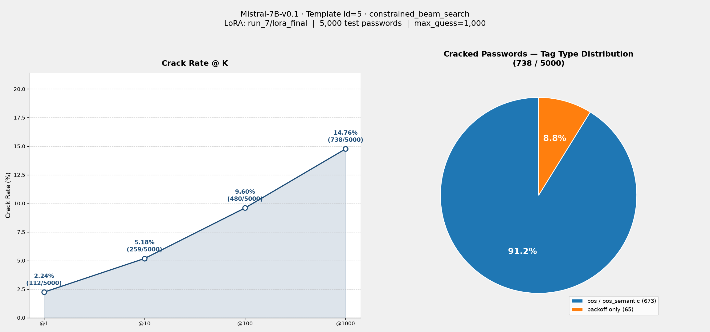

# Eval Report: Mistral-7B-v0.1 · Template id=5 · constrained_beam_search (run_7)

## 實驗設定

| 項目 | 值 |
|---|---|
| 模型 | Mistral-7B-v0.1 |
| LoRA | `checkpoints/Mistral-7B-v0.1/run_7/lora_final` |
| 訓練 Template ID | 5 |
| 推論 Template ID | 5 |
| 評估筆數 | 5,000 |
| Max guess | 1,000 |
| 搜尋法（primary） | `constrained_beam_search` |
| 搜尋法（fallback） | `dynamic_beam_search`（當 tags 含 pos/pos_semantic 時） |
| 測試集 | `datasets/processed/semanticPCFG/000webhost/backoff/split/test_data.jsonl` |
| 輸出檔 | `results/eval/eval-249332.out` |

> **注意：** 輸出 JSONL 原始檔名為 `gen/eval_results_id5_run_6_Mistral7B_id5.jsonl`（`config/search.yaml` 的 `eval_output_file_name` 欄位當時沿用 `run_6`，但 log 開頭確認實際載入的 LoRA 為 `run_7/lora_final`，屬命名 typo，不影響本報告數據正確性）。該 typo 已修正，檔案現已改名為 `gen/eval_results_id5_run_7_Mistral7B_id5.jsonl`，`config/search.yaml` 設定值同步更新。

## Crack Rate

| @K | Cracked | Rate |
|---|---|---|
| @1 | 112 / 5,000 | 2.24% |
| @10 | 259 / 5,000 | 5.18% |
| @100 | 480 / 5,000 | 9.60% |
| @1000 | 738 / 5,000 | 14.76% |

## 結果圖表



## 破解密碼的 Tag 類型分佈

| Tag 類型 | 筆數 | 比例 |
|---|---|---|
| 純 backoff tag | 65 | 8.8% |
| 含 pos / pos_semantic tag | 673 | 91.2% |

> **觀察：** run_7（@1000 = 14.76%）較 run_6（@1000 = 15.04%，見 [id5_run6 報告](id5_run6_Mistral-7B_id5_constrained_beam_search.md)）略低，兩者差距在抽樣誤差範圍內，整體破解能力相近。破解密碼同樣以含 pos/pos_semantic tag 為主（91.2%），純 backoff tag 僅佔 8.8%，constrained_beam_search 在純結構 tag 上的破解能力仍有限，與 run_6、Qwen3-4B run_8 結果一致的模式。

## 破解密碼列表

格式：`idx | pw | rank | has_pos_semantic | tags`

```
   10 | jimie123                       |    39 | True  | mname|char2|number3
   11 | itclub123456                   |     1 | True  | pph1|baseball_club.n.01|number6
   24 | greenday007                    |     2 | True  | green.s.01|day.n.01|number3
   25 | iseerainbows1                  |    11 | True  | ppis1|see.v.01|rainbow.n.01|number1
   27 | godspower4life                 |    14 | True  | god.n.01|power.n.01|number1|life.n.01
   36 | livetodie1                     |     1 | True  | populate.v.01|to|die.v.01|number1
   39 | 12apower                       |     1 | True  | number2|at1|power.n.01
   44 | welcome12                      |     1 | True  | welcome.v.01|number2
   49 | shitter12                      |     1 | True  | defecator.n.01|number2
   50 | asdwer123                      |    67 | False | char3|char3|number3
   57 | qazwsxedc15                    |   119 | False | char9|number2
   64 | completeman09                  |     2 | True  | complete.a.01|man.n.01|number2
   73 | takana11                       |     7 | True  | taka.n.01|to|number2
   81 | miserylovesme24                |   149 | True  | misery.n.01|love.v.01|ppio1|number2
   87 | 14789aaa                       |   173 | False | number5|char3
   88 | spider1S                       |   258 | True  | spider.n.01|number1|char1
   94 | godlike1                       |     1 | True  | divine.s.05|number1
  115 | speedy78                       |    39 | True  | rapid.s.02|number2
  116 | rob123456789                   |    39 | True  | mname|number9
  120 | wordup12                       |     1 | True  | word.n.01|up.r.01|number2
  123 | friday13                       |     2 | True  | friday.n.01|number2
  133 | 24info24                       |    21 | True  | number2|information.n.01|number2
  135 | malik123                       |   330 | True  | mname|number3
  147 | plita123                       |   177 | True  | char2|pph1|at1|number3
  154 | 123456789+                     |     4 | False | number9|special1
  156 | goodl1ke                       |   384 | True  | good.a.01|char1|number1|char2
  163 | zxcv1982                       |    24 | False | char2|char2|number4
  188 | lateloop123                    |     3 | True  | late.a.01|cringle.n.01|number3
  190 | imakeumoney123                 |   212 | True  | ppis1|make.v.01|char1|money.n.01|number3
  192 | timeshow12345                  |     1 | True  | time.n.01|show.n.01|number5
  194 | Deadforlife1992                |   741 | True  | dead.a.01|if|life.n.01|number4
  197 | rahadi17                       |   433 | True  | char2|have.v.01|ppis1|number2
  210 | fuckyou777                     |     5 | True  | sleep_together.v.01|ppy|number3
  228 | midgetmaster1                  |     8 | True  | dwarf.n.01|maestro.n.01|number1
  231 | burgerking2                    |     2 | True  | burger.n.01|king.n.01|number1
  245 | dietadiamour1                  |     5 | True  | diet.n.01|at1|diameter.n.01|appge|number1
  266 | pepperon_79                    |   435 | True  | pepper.n.01|ii|special1|number2
  267 | jacky123                       |   121 | True  | mname|number3
  273 | mailing1                       |     1 | True  | mailing.n.01|number1
  274 | peace12345                     |     1 | True  | peace.n.01|number5
  275 | night457                       |   325 | True  | night.n.01|number3
  279 | morosidad1234                  |   143 | True  | moro.n.01|ppis1|dad.n.01|number4
  281 | pulpet10                       |    11 | True  | pulp.n.01|fw|number2
  283 | forumbest55                    |    40 | True  | forum.n.01|best.r.01|number2
  284 | badboy75                       |    50 | True  | bad.a.01|male_child.n.01|number2
  292 | hp000webhost1                  |   123 | True  | char2|number3|web.n.01|host.n.01|number1
  313 | goodmiracle21                  |    15 | True  | good.a.01|miracle.n.01|number2
  318 | Peachapie15                    |   161 | True  | peach.n.01|at1|pie.n.01|number2
  319 | 741852963abc                   |     7 | True  | number9|np1
  323 | ahimsa13                       |     6 | True  | ahimsa.n.01|number2
  325 | 123456as123456                 |     5 | False | number6|char2|number6
  332 | anime1234                      |     1 | True  | zanzibar_copal.n.01|number4
  334 | flameng0                       |   214 | True  | fire.n.03|char2|number1
  338 | 01matrix1                      |    11 | True  | number2|matrix.n.01|number1
  344 | 1212money                      |    34 | True  | number4|money.n.01
  345 | darksky123                     |     1 | True  | dark.a.01|sky.n.01|number3
  350 | kazantip1234                   |   423 | True  | city|tip.n.01|number4
  368 | blind1234                      |     1 | True  | blind.a.01|number4
  371 | shedges99                      |    44 | True  | char1|hedge.n.01|number2
  377 | unavailable1                   |     1 | True  | unavailable.a.01|number1
  379 | silverschool163                |   128 | True  | silver.n.01|school.n.01|number3
  383 | bosco123                       |   293 | True  | surname|number3
  399 | 123456miro                     |   644 | True  | number6|np1
  401 | counter42                      |    84 | True  | counter.n.01|number2
  406 | limonada1                      |     1 | True  | limousine.n.01|nothing.n.01|number1
  407 | 0buster9                       |   480 | True  | number1|fellow.n.06|number1
  418 | jakejake1                      |   115 | True  | mname|mname|number1
  427 | 12345678ka                     |    34 | False | number8|char2
  429 | cherry1226                     |   296 | True  | cherry.n.01|number4
  430 | mcan2008                       |    35 | True  | char1|can.v.01|number4
  431 | keept4ever                     |     5 | True  | keep.v.01|char1|number1|ever.r.01
  451 | rider@5s                       |   341 | True  | rider.n.01|special1|number1|char1
  458 | anima420                       |    24 | True  | anima.n.01|number3
  460 | marlboro123456                 |   513 | True  | np1|number6
  466 | yoga99999999                   |    48 | True  | yoga.n.01|number8
  478 | freewild999                    |    10 | True  | free.a.01|wild.a.01|number3
  481 | werwer123                      |    40 | True  | ppis2|char2|char2|number3
  491 | worms-30                       |   491 | True  | worm.n.01|special1|number2
  504 | qwerty142536                   |   127 | True  | jj|number6
  520 | cupacups1                      |   176 | True  | cup.n.01|at1|cup.v.01|number1
  521 | 20-Nov-91                      |    99 | True  | number2|special1|november.n.01|special1|number2
  523 | andrew89                       |   614 | True  | mname|number2
  524 | asura123                       |     2 | True  | asura.n.01|number3
  526 | 29-Nov-85                      |   188 | True  | number2|special1|november.n.01|special1|number2
  535 | brave2008                      |     3 | True  | brave.a.01|number4
  537 | z1x1c1v1b1n1                   |   559 | False | char1|number1|char1|number1|char1|number1|char1|number1|char1|number1|char1|number1
  538 | online07                       |    30 | True  | on-line.a.01|number2
  563 | administrator001               |     5 | True  | administrator.n.01|number3
  582 | misterphd123                   |     1 | True  | mister.n.01|ph.d..n.01|number3
  591 | fury1234                       |     2 | True  | fury.n.01|number4
  593 | caokclan.1                     |     2 | True  | vm|very_well.r.02|kin.n.02|special1|number1
  595 | genocide1101                   |   303 | True  | genocide.n.01|number4
  600 | myown123                       |     1 | True  | appge|da|number3
  605 | jaguar2121                     |   514 | True  | jaguar.n.01|number4
  610 | mylove82                       |    44 | True  | appge|love.n.01|number2
  618 | 2iceberg14                     |   286 | True  | number1|iceberg.n.01|number2
  626 | group1021                      |   289 | True  | group.n.01|number4
  646 | enigma30                       |    88 | True  | mystery.n.01|number2
  649 | bedadung3                      |     7 | True  | bed.n.01|at1|droppings.n.01|number1
  653 | shahjo12                       |   561 | True  | shah.n.01|char2|number2
  655 | 123poi456                      |   323 | False | number3|char3|number3
  663 | arctic09                       |    43 | True  | north-polar.s.01|number2
  672 | 96supers                       |   862 | True  | number2|superintendent.n.02
  674 | flamelight007                  |     4 | True  | fire.n.03|light.n.01|number3
  676 | 123zxcvbn2                     |    22 | False | number3|char2|char3|char1|number1
  678 | spring2009                     |     1 | True  | spring.n.01|number4
  688 | ch1llout                       |   108 | True  | char2|number1|char2|out.r.01
  690 | hotsauce3                      |     6 | True  | hot.a.01|sauce.n.01|number1
  698 | aqualove1                      |   103 | True  | char4|love.n.01|number1
  702 | 1234567bb                      |    11 | False | number7|char2
  704 | passwords3                     |    39 | True  | password.n.01|number1
  709 | danlove23                      |   165 | True  | mname|love.n.01|number2
  711 | qweasdzxcvbn99999              |   334 | False | char12|number5
  734 | mustafa12                      |    32 | True  | mname|number2
  754 | energizer0                     |    10 | True  | energizer.n.01|number1
  784 | techno2344                     |   919 | True  | techno.n.01|number4
  789 | margonda1                      |   724 | True  | march.n.01|city|number1
  796 | butter10                       |     5 | True  | butter.n.01|number2
  798 | scorpions32                    |   488 | True  | scorpio.n.01|number2
  803 | down4you13                     |    10 | True  | down.r.01|number1|ppy|number2
  805 | idrawam1984                    |   146 | True  | ppis1|pull.v.01|be.v.01|number4
  808 | 0computer                      |     3 | True  | number1|computer.n.01
  814 | Polo1234                       |    45 | True  | polo.n.01|number4
  824 | gorilla123                     |     1 | True  | gorilla.n.01|number3
  832 | azerty25                       |    63 | False | char6|number2
  835 | cradle_66                      |    65 | True  | cradle.n.01|special1|number2
  838 | tomatito123                    |    98 | True  | ii|np1|to|number3
  840 | 20-Sep-95                      |   801 | False | number2|special1|char3|special1|number2
  846 | secret23                       |    12 | True  | secret.s.01|number2
  851 | sunset135                      |    56 | True  | sunset.n.01|number3
  853 | abhi1986                       |   278 | False | char4|number4
  857 | finland123                     |   541 | True  | country|number3
  867 | thedoors1                      |     4 | True  | at|door.n.01|number1
  889 | tunerillas3                    |     4 | True  | tuner.n.01|ill.a.01|csa|number1
  892 | asdf456852                     |    57 | False | char4|number6
  907 | bigbulldog0606                 |   332 | True  | large.a.01|bulldog.n.01|number4
  916 | grunge10                       |     6 | True  | dirt.n.02|number2
  938 | skither7                       |    14 | True  | skit.n.01|appge|number1
  944 | heyheynow1                     |    32 | True  | uh|uh|now.r.01|number1
  949 | virus123456                    |     1 | True  | virus.n.01|number6
  952 | bookmark1234                   |     3 | True  | bookmark.n.01|number4
  960 | admin_data                     |     2 | True  | nn1|special1|data.n.01
  966 | topspy9x                       |    35 | True  | top.n.01|spy.n.01|number1|char1
  970 | dubai123                       |    36 | True  | city|number3
  979 | vincent12                      |   408 | True  | mname|number2
  981 | dreama2004                     |    28 | True  | dream.n.01|at1|number4
 1013 | 234567asd                      |   492 | False | number6|char3
 1016 | 000Web78                       |   901 | True  | number3|web.n.01|number2
 1029 | tempo829                       |   786 | True  | tempo.n.01|number3
 1035 | halohalo3                      |     7 | True  | aura.n.02|aura.n.02|number1
 1040 | moonflower88                   |     5 | True  | moonflower.n.01|number2
 1045 | cater2009                      |     2 | True  | provide.v.02|number4
 1046 | passass1                       |     4 | True  | pass.v.01|char3|number1
 1047 | Shadow123456                   |     3 | True  | shadow.n.01|number6
 1053 | getlow123                      |     1 | True  | get.v.01|low.a.01|number3
 1056 | damageking12                   |     1 | True  | damage.n.01|king.n.01|number2
 1062 | atom2009                       |     3 | True  | atom.n.01|number4
 1066 | iamtheman1                     |     1 | True  | ppis1|be.v.01|at|man.n.01|number1
 1080 | mateus2008                     |   314 | True  | np1|number4
 1084 | celesse1                       |   161 | True  | char2|dar|char1|number1
 1093 | mydear1982                     |    15 | True  | appge|beloved.s.01|number4
 1103 | ngocthuy1                      |    45 | True  | np1|fname|number1
 1112 | qazwsx222                      |    30 | False | char1|char2|char3|number3
 1116 | admin1982                      |    28 | True  | nn1|number4
 1121 | 9-Sep-91                       |   187 | False | number1|special1|char3|special1|number2
 1122 | mumble723                      |   480 | True  | mumble.v.01|number3
 1134 | BASKETBALL81                   |   281 | True  | basketball.n.01|number2
 1136 | bolec100                       |   172 | True  | bole.n.01|char1|number3
 1138 | Bison2008                      |    37 | True  | bison.n.01|number4
 1140 | corndogs11                     |    97 | True  | corn.n.01|dog.n.01|number2
 1153 | saffron1                       |     1 | True  | saffron.n.01|number1
 1167 | rebirth3                       |   739 | True  | metempsychosis.n.01|number1
 1169 | 13miracles                     |    90 | True  | number2|miracle.n.01
 1171 | kokakola1                      |   230 | True  | np1|kola.n.01|number1
 1173 | clever0n                       |   211 | True  | cagey.s.01|number1|char1
 1176 | martina2008                    |    98 | True  | fname|number4
 1177 | 123456kwe                      |    59 | True  | number6|char1|ppis2
 1184 | SlipKnoT6                      |   168 | True  | slipknot.n.01|number1
 1185 | iamgenius786                   |    25 | True  | ppis1|be.v.01|genius.n.01|number3
 1190 | manxpower1                     |     1 | True  | manx.a.01|power.n.01|number1
 1210 | mianali123                     |     7 | True  | char2|anal.a.01|ppis1|number3
 1230 | confident09                    |    11 | True  | confident.a.01|number2
 1236 | angel_56                       |   254 | True  | angel.n.01|special1|number2
 1239 | mr.bushido                     |   126 | True  | char2|special1|bushido.n.01
 1240 | ccash123                       |     8 | True  | char1|cash.n.01|number3
 1241 | nopassword86                   |    75 | True  | at|password.n.01|number2
 1248 | imaginary12345                 |     1 | True  | fanciful.s.02|number5
 1259 | supermarket69                  |    12 | True  | supermarket.n.01|number2
 1268 | 3-Oct-89                       |    30 | True  | number1|special1|october.n.01|special1|number2
 1269 | recall123                      |     3 | True  | remember.v.01|number3
 1276 | talarong1                      |   226 | True  | tala.n.01|np1|number1
 1286 | sapito123                      |   348 | True  | jj|to|number3
 1299 | killer10                       |     7 | True  | killer.n.01|number2
 1303 | boones12                       |     1 | True  | boone.n.01|number2
 1304 | power1234                      |     1 | True  | power.n.01|number4
 1309 | freeagent0100                  |   436 | True  | free.a.01|agent.n.01|number4
 1319 | madk3r3n                       |   315 | True  | huffy.s.02|char1|number1|char1|number1|char1
 1320 | swat1lost2                     |     6 | True  | swat.n.01|number1|lose.v.01|number1
 1324 | protectpc1                     |   618 | True  | protect.v.01|char2|number1
 1333 | feras1991                      |   869 | True  | char3|csa|number4
 1339 | cyber007                       |    92 | True  | nn1|number3
 1342 | chips4pokerfan                 |     1 | True  | french_fries.n.01|number1|poker.n.01|fan.n.01
 1343 | fuckher86                      |    81 | True  | sleep_together.v.01|ppho1|number2
 1344 | rage2008                       |     3 | True  | fury.n.01|number4
 1347 | freeman88                      |    10 | True  | freeman.n.01|number2
 1357 | januari1980                    |   138 | False | char7|number4
 1361 | z0z0kill                       |    27 | True  | char1|number1|char1|number1|kill.v.01
 1362 | cocacola2006                   |    29 | True  | erythroxylon_coca.n.01|cola.n.01|number4
 1371 | fuckersucker123                |     1 | True  | fucker.n.01|chump.n.01|number3
 1373 | chinping77                     |    13 | True  | chin.n.01|ping.n.01|number2
 1389 | bartoman10                     |    38 | True  | barroom.n.01|ii|man.n.01|number2
 1395 | 26juni1992                     |   219 | True  | number2|surname|number4
 1400 | Just4you                       |     9 | True  | merely.r.01|number1|ppy
 1405 | camaleon2                      |    63 | True  | vm|male.a.01|ii|number1
 1407 | yellow21                       |    14 | True  | yellow.s.01|number2
 1409 | dustybottoms1                  |    27 | True  | dusty.s.01|bottom.n.01|number1
 1413 | answer123                      |     1 | True  | answer.n.01|number3
 1417 | 123456anil                     |   297 | True  | number6|mname
 1427 | drama123                       |     2 | True  | play.n.01|number3
 1436 | snooker22                      |    12 | True  | snooker.n.01|number2
 1452 | sport200                       |    34 | True  | sport.n.01|number3
 1454 | hooligans1                     |     8 | True  | bully.n.01|number1
 1456 | karate20                       |    18 | True  | karate.n.01|number2
 1459 | artist38                       |    95 | True  | artist.n.01|number2
 1464 | redhot78                       |    36 | True  | red.s.01|hot.a.01|number2
 1466 | redhotnet23                    |    12 | True  | red.s.01|hot.a.01|net.a.01|number2
 1480 | sparty1234                     |     3 | True  | char1|party.n.01|number4
 1481 | iamlegend12                    |     1 | True  | ppis1|be.v.01|legend.n.01|number2
 1482 | chilla68                       |    75 | True  | chill.n.01|at1|number2
 1489 | goodnice123                    |     1 | True  | good.a.01|nice.a.01|number3
 1497 | bentoinfo99                    |   452 | True  | mname|ii|information.n.01|number2
 1498 | qweasd11                       |     2 | True  | char1|ppis2|char3|number2
 1516 | avanko123456789                |    90 | True  | at1|mname|char2|number9
 1520 | blacks77                       |    11 | True  | black.n.01|number2
 1524 | webclass1                      |     1 | True  | web.n.01|class.n.01|number1
 1532 | access01                       |     2 | True  | entree.n.02|number2
 1536 | nether2121                     |   553 | True  | nether.s.01|number4
 1537 | wan08@web                      |   164 | True  | wan.v.01|number2|special1|web.n.01
 1539 | listenland1                    |     1 | True  | listen.v.01|land.n.01|number1
 1553 | strike123456                   |     1 | True  | strike.n.01|number6
 1577 | farida123                      |   669 | True  | np1|number3
 1584 | icemag123                      |   142 | True  | ice.n.01|char3|number3
 1597 | Balla101                       |   503 | True  | ball.n.01|at1|number3
 1612 | jefferson123                   |   337 | True  | mname|number3
 1620 | valed2009                      |   184 | True  | char2|lead.v.01|number4
 1623 | here589edge                    |   666 | True  | here.r.01|number3|edge.n.01
 1632 | flashdisk123456                |     1 | True  | flash.n.01|disk.n.01|number6
 1639 | legionchaos123                 |     2 | True  | host.n.05|chaos.n.01|number3
 1643 | rock1000                       |    70 | True  | rock.n.01|number4
 1648 | blackout10                     |     7 | True  | blackout.n.01|number2
 1655 | busuk123                       |     2 | True  | bus.n.01|char2|number3
 1660 | lasanha123                     |   170 | True  | char3|at1|uh|number3
 1665 | partner112                     |    26 | True  | spouse.n.01|number3
 1667 | Redtree1                       |    14 | True  | red.s.01|tree.n.01|number1
 1671 | blackmaster1                   |     1 | True  | black.a.01|maestro.n.01|number1
 1682 | jose2008                       |    22 | True  | mname|number4
 1692 | titano123                      |     3 | True  | colossus.n.02|char1|number3
 1695 | panda111                       |    10 | True  | giant_panda.n.01|number3
 1702 | strike88                       |    10 | True  | strike.n.01|number2
 1713 | genetic88                      |   508 | True  | familial.s.01|number2
 1719 | 234andri                       |   181 | True  | number3|cc|char2
 1721 | 123+123+                       |    17 | False | number3|special1|number3|special1
 1722 | 2004balsa                      |    38 | True  | number4|balsa.n.01
 1737 | latino23                       |     8 | True  | latin_american.n.01|number2
 1738 | gustavo7                       |   222 | True  | mname|number1
 1750 | lam123456                      |   103 | False | char3|number6
 1760 | Password6%                     |   471 | True  | password.n.01|number1|special1
 1766 | camscams94                     |    56 | True  | cam.n.01|cam.n.01|number2
 1779 | 123cancer                      |     1 | True  | number3|cancer.n.01
 1785 | lemonsink131                   |    48 | True  | lemon.n.01|sink.n.01|number3
 1794 | friday1956                     |   104 | True  | friday.n.01|number4
 1795 | flame1996                      |    54 | True  | fire.n.03|number4
 1797 | construction.28                |   270 | True  | construction.n.01|special1|number2
 1801 | pakistan.1                     |     1 | True  | country|special1|number1
 1802 | azigala1                       |    16 | True  | char2|ppis1|gala.n.01|number1
 1805 | triunfando1                    |    43 | True  | char3|fw|fan.n.01|make.v.01|number1
 1814 | slavisa79                      |    74 | True  | slav.a.01|be.v.01|at1|number2
 1819 | asdfgh123456                   |     1 | False | char4|char2|number6
 1820 | evear_baby                     |   244 | True  | eve.n.01|char2|special1|baby.n.01
 1823 | huangyu123                     |    73 | True  | surname|char2|number3
 1825 | annie123                       |    85 | True  | fname|number3
 1843 | binary_pass                    |     1 | True  | binary.a.01|special1|pass.v.01
 1850 | golfinho123                    |     1 | True  | golf.n.01|ii|char2|number3
 1862 | iluvher2                       |    45 | True  | ppis1|char3|appge|number1
 1873 | myowncar323                    |   226 | True  | appge|da|car.n.01|number3
 1874 | 1qw23er4                       |     2 | False | number1|char2|number2|char2|number1
 1881 | password91                     |    37 | True  | password.n.01|number2
 1886 | ancient13                      |     5 | True  | ancient.s.01|number2
 1891 | munita12                       |     7 | True  | char1|unit_of_measurement.n.01|at1|number2
 1898 | prosperity1                    |     1 | True  | prosperity.n.01|number1
 1915 | nutshe11                       |     3 | True  | nut.n.01|pphs1|number2
 1916 | ofchai91                       |   279 | True  | io|nn1|number2
 1923 | rockband40                     |   108 | True  | rock.n.01|set.n.05|number2
 1930 | some1one                       |     1 | True  | dd|number1|mc1
 1932 | halo3rocks                     |    14 | True  | aura.n.02|number1|rock.n.01
 1935 | ezdrum123                      |   323 | True  | char2|drum.n.01|number3
 1940 | none123456                     |     1 | True  | pn|number6
 1941 | parth123                       |     5 | True  | part.n.01|char1|number3
 1942 | master2master                  |     2 | True  | maestro.n.01|number1|maestro.n.01
 1949 | 061185orange                   |   736 | True  | number6|orange.s.01
 1959 | anand123456#                   |     7 | True  | at1|cc|number6|special1
 1962 | indra2009                      |   116 | True  | np1|number4
 1972 | online321                      |    14 | True  | on-line.a.01|number3
 1973 | orange898                      |   674 | True  | orange.s.01|number3
 1980 | startimes123                   |   349 | True  | star.n.01|ii|number3
 1982 | 26juli1991                     |   155 | True  | number2|fname|number4
 1991 | school122                      |    59 | True  | school.n.01|number3
 1996 | paradise21                     |    22 | True  | eden.n.01|number2
 2019 | joseluis666                    |   573 | True  | mname|mname|number3
 2020 | nipster123                     |   629 | True  | nip.n.01|char3|number3
 2033 | sistema777                     |   771 | True  | nn1|number3
 2034 | 12-May-87                      |    18 | True  | number2|special1|vm|special1|number2
 2041 | mystic1sm                      |   252 | True  | mysterious.s.02|number1|char2
 2042 | panzer89                       |    23 | True  | panzer.n.01|number2
 2044 | sport4good                     |     1 | True  | sport.n.01|number1|good.a.01
 2045 | oldsink5                       |     8 | True  | old.a.01|sink.n.01|number1
 2068 | 1z2z3z4z5z                     |    36 | False | number1|char1|number1|char1|number1|char1|number1|char1|number1|char1
 2082 | botigasa1                      |   513 | True  | char3|ppis1|gas.n.01|at1|number1
 2093 | myweb4free                     |     2 | True  | appge|web.n.01|number1|free.a.01
 2098 | qwerty19                       |    30 | True  | jj|number2
 2111 | futbol12                       |    73 | True  | nn1|number2
 2115 | supermom1                      |     1 | True  | supermom.n.01|number1
 2117 | a5211314                       |   274 | False | char1|number7
 2121 | masterspet1                    |   341 | True  | masters.n.01|char3|number1
 2123 | bigbrother1                    |     1 | True  | large.a.01|brother.n.01|number1
 2134 | acidfinest1                    |   491 | True  | acid.n.01|all_right.s.01|number1
 2138 | blackdance89                   |    27 | True  | black.a.01|dance.n.01|number2
 2143 | office123                      |     1 | True  | office.n.01|number3
 2162 | zhangfan1981                   |   107 | True  | surname|fan.n.01|number4
 2163 | ironlady2                      |     2 | True  | iron.n.01|lady.n.01|number1
 2169 | aqwzsx123456                   |    62 | False | char6|number6
 2185 | susanita123                    |    24 | True  | fname|pph1|at1|number3
 2200 | hotmail00                      |   594 | True  | nn1|number2
 2207 | woofwoof1234                   |     2 | True  | woof.n.01|woof.n.01|number4
 2210 | sweetie1                       |     4 | True  | sweetheart.n.01|number1
 2216 | aqwe12345                      |   115 | True  | char2|ppis2|number5
 2219 | alphabet1                      |     1 | True  | alphabet.n.01|number1
 2222 | nomires23                      |   390 | True  | at|mire.n.01|number2
 2223 | bigfish111                     |    10 | True  | large.a.01|fish.n.01|number3
 2228 | qwer321ty                      |   274 | False | char1|char3|number3|char2
 2246 | 1angelina2                     |   441 | True  | number1|fname|number1
 2258 | pr0street                      |    34 | True  | char2|number1|street.n.01
 2262 | server2009                     |     1 | True  | waiter.n.01|number4
 2286 | infonext12                     |   142 | True  | information.n.01|md|number2
 2287 | cleverson1425                  |   557 | True  | cagey.s.01|son.n.01|number4
 2291 | packers12                      |   116 | True  | packer.n.01|number2
 2292 | sayang84                       |   198 | False | char6|number2
 2297 | judomaster1                    |     1 | True  | judo.n.01|maestro.n.01|number1
 2304 | overkill17                     |    24 | True  | overkill.n.01|number2
 2306 | slangcell123                   |     1 | True  | slang.n.01|cell.n.01|number3
 2308 | zxcvbn159357                   |    36 | False | char2|char3|char1|number6
 2310 | studio123                      |     1 | True  | studio.n.01|number3
 2315 | 123456toast                    |     1 | True  | number6|toast.n.01
 2332 | superman2000                   |   345 | True  | np1|number4
 2333 | milksoap23                     |    10 | True  | milk.n.01|soap.n.01|number2
 2335 | solder123                      |     1 | True  | solder.n.01|number3
 2342 | 12345678asdf                   |     1 | False | number8|char4
 2345 | 123456987a                     |    81 | False | number9|char1
 2350 | greenandgold123                |     1 | True  | green.s.01|cc|gold.n.01|number3
 2354 | newfuture@09                   |     2 | True  | new.a.01|future.n.01|special1|number2
 2355 | devilmaycry46                  |    78 | True  | satan.n.01|vm|shout.v.02|number2
 2361 | angels2009                     |    20 | True  | angel.n.01|number4
 2364 | indirect476                    |   837 | True  | indirect.s.01|number3
 2368 | jasmine2                       |     2 | True  | jasmine.n.01|number1
 2376 | fuckoff00                      |    10 | True  | sleep_together.v.01|away.r.01|number2
 2380 | 1992friendship                 |    13 | True  | number4|friendship.n.01
 2382 | german22                       |    10 | True  | german.a.01|number2
 2392 | missyou55                      |    27 | True  | miss.v.01|ppy|number2
 2396 | ozancan30                      |   129 | True  | nnu|at1|can.n.01|number2
 2400 | pioneer2306                    |   544 | True  | pioneer.n.01|number4
 2407 | malimass123                    |   396 | True  | country|aggregate.s.01|number3
 2417 | realbeing2                     |     3 | True  | real.a.01|being.n.01|number1
 2418 | missled10                      |    13 | True  | miss.v.01|lead.v.01|number2
 2420 | siteadmin1                     |     1 | True  | site.n.01|nn1|number1
 2425 | womanology2                    |     3 | True  | woman.n.01|ology.n.01|number1
 2427 | bajingan01                     |   175 | True  | char2|np1|at1|number2
 2428 | makan12345                     |    25 | False | char5|number5
 2431 | mehmet1979                     |   700 | True  | np1|number4
 2440 | justhack1                      |     1 | True  | merely.r.01|hack.n.01|number1
 2442 | hamburger1                     |     1 | True  | hamburger.n.01|number1
 2452 | kindrat123                     |     1 | True  | kind.n.01|rat.n.01|number3
 2469 | teen12a1                       |     3 | True  | adolescent.n.01|number2|char1|number1
 2474 | google001                      |     8 | True  | np|number3
 2477 | spank_123                      |     2 | True  | spank.v.01|special1|number3
 2492 | backinblack70                  |   101 | True  | back.r.01|ii|black.a.01|number2
 2509 | hackerzz8                      |   605 | True  | hacker.n.01|char2|number1
 2511 | 169forum                       |   455 | True  | number3|forum.n.01
 2513 | alia2004                       |   123 | True  | rr22|number4
 2521 | hackedby49                     |   276 | True  | chop.v.05|ii|number2
 2523 | slavco2009                     |   577 | True  | slav.a.01|char2|number4
 2529 | 123qatar                       |   137 | True  | number3|country
 2531 | avatar88                       |     2 | True  | embodiment.n.01|number2
 2536 | paris123                       |    87 | True  | fname|number3
 2544 | mohamed1993                    |   866 | True  | mname|number4
 2546 | 15juli89                       |    71 | True  | number2|fname|number2
 2549 | f1rewall                       |   275 | True  | char1|number1|ii|wall.n.01
 2553 | poop_stain8                    |   391 | True  | crap.n.01|special1|stain.n.01|number1
 2555 | 26-Nov-09                      |   287 | True  | number2|special1|november.n.01|special1|number2
 2564 | vampirelas.com                 |   116 | True  | vampire.n.01|char3|special1|char3
 2569 | gateway4                       |     6 | True  | gateway.n.01|number1
 2570 | jiyofang1                      |   166 | True  | char2|uh|fang.n.01|number1
 2572 | pretender4u                    |     1 | True  | pretender.n.01|number1|char1
 2577 | carlos27                       |   520 | True  | mname|number2
 2590 | 123ooord                       |   154 | True  | number3|char3|nnl1
 2599 | angel110                       |    55 | True  | angel.n.01|number3
 2602 | papamama1                      |     1 | True  | dad.n.01|ma.n.01|number1
 2607 | master1984                     |     8 | True  | maestro.n.01|number4
 2609 | agarwaen1                      |    60 | True  | agar.n.01|char2|rr21|number1
 2610 | america123                     |    59 | True  | surname|number3
 2626 | a101010a                       |    45 | False | char1|number6|char1
 2639 | t0psecret                      |    36 | True  | char1|number1|char1|secret.s.01
 2641 | ironcouch50                    |   174 | True  | iron.n.01|sofa.n.01|number2
 2648 | computer33                     |    60 | True  | computer.n.01|number2
 2650 | immortal1knight                |   155 | True  | immortal.a.01|number1|surname
 2656 | nonsense.                      |    10 | True  | nonsense.n.01|special1
 2658 | viruschat2                     |     2 | True  | virus.n.01|chat.n.01|number1
 2664 | genie111                       |    17 | True  | genie.n.01|number3
 2693 | thai1992                       |    14 | True  | thai.a.01|number4
 2703 | realmadrid90                   |    26 | True  | real.a.01|city|number2
 2705 | gogreen1                       |     1 | True  | travel.v.01|green.s.01|number1
 2710 | housesink40                    |   101 | True  | house.n.01|sink.n.01|number2
 2716 | bubbles123                     |     2 | True  | bubble.n.01|number3
 2745 | legionas20                     |    19 | True  | host.n.05|csa|number2
 2756 | 6starfoods                     |    29 | True  | number1|star.n.01|food.n.01
 2758 | qazplm12                       |    29 | False | char1|char2|char3|number2
 2767 | videoline2009                  |     1 | True  | video.n.01|line.n.01|number4
 2768 | mataram2008                    |   923 | True  | city|number4
 2773 | protect12                      |     1 | True  | protect.v.01|number2
 2776 | armagedon_41                   |   958 | True  | arm.n.01|aged.s.01|ii|special1|number2
 2784 | foundation0                    |     3 | True  | foundation.n.01|number1
 2788 | nothing143                     |    13 | True  | pn1|number3
 2792 | ison1234                       |    48 | True  | be.v.01|ii|number4
 2812 | 2002jeep                       |    39 | True  | number4|jeep.n.01
 2827 | freeme765                      |   262 | True  | free.a.01|ppio1|number3
 2833 | radio4forlife                  |     1 | True  | radio.n.01|number1|if|life.n.01
 2836 | 123456fer                      |    31 | False | number6|char3
 2845 | slayer31                       |   170 | True  | killer.n.01|number2
 2856 | nuttapong123                   |    42 | True  | surname|at1|niff.n.01|number3
 2860 | zaenal84                       |   783 | True  | char2|rr21|ra22|number2
 2862 | goodnews9                      |     6 | True  | good.a.01|news.n.01|number1
 2865 | 123123123A                     |   215 | False | number9|char1
 2876 | whatthefuck0                   |     6 | True  | ddq|at|sleep_together.v.01|number1
 2879 | arsenal4                       |     8 | True  | arsenal.n.01|number1
 2904 | apple123456789                 |     1 | True  | apple.n.01|number9
 2915 | thanhtuan87                    |    16 | True  | np1|mname|number2
 2924 | manman521                      |    39 | True  | man.n.01|man.n.01|number3
 2928 | rana0011                       |   621 | True  | run.v.01|at1|number4
 2934 | muevasion123                   |    12 | True  | char2|evasion.n.01|number3
 2935 | naruto55                       |    44 | True  | nn1|number2
 2945 | loveu123                       |     5 | True  | love.n.01|char1|number3
 2958 | growing1                       |     1 | True  | growing.a.01|number1
 2969 | 102030.a                       |   204 | False | number6|special1|char1
 2987 | genius_90                      |    51 | True  | genius.n.01|special1|number2
 2997 | 1900lickme                     |   660 | True  | number4|cream.v.02|ppio1
 2998 | piano123                       |     1 | True  | piano.n.01|number3
 3025 | 11qq11qq                       |    48 | False | number2|char2|number2|char2
 3052 | 0.123456+                      |   884 | False | number1|special1|number6|special1
 3056 | ERROR_KILLERS                  |   372 | True  | mistake.n.01|special1|killer.n.01
 3058 | angels1964                     |   942 | True  | angel.n.01|number4
 3060 | iwillhackthis1                 |     1 | True  | ppis1|will.v.01|hack.n.01|dd1|number1
 3072 | 4notrust                       |    16 | True  | number1|at|trust.n.01
 3073 | pissoff7                       |   276 | True  | urine.n.01|ii|number1
 3075 | coldspy123                     |     1 | True  | cold.a.01|spy.n.01|number3
 3078 | 1234genti                      |     1 | True  | number4|gent.n.01|ppis1
 3081 | speedconvodka7j                |   281 | True  | speed.n.01|con.n.01|vodka.n.01|number1|char1
 3087 | online007                      |     2 | True  | on-line.a.01|number3
 3096 | Longcoffee95                   |   233 | True  | long.a.01|coffee.n.01|number2
 3099 | weed1234                       |     1 | True  | weed.n.01|number4
 3101 | notleftyet1                    |     6 | True  | xx|leave.v.01|yet.r.01|number1
 3104 | epsilon25                      |    22 | True  | epsilon.n.01|number2
 3110 | hummerh2h1                     |   348 | True  | hummer.n.01|char1|number1|char1|number1
 3118 | ha123456                       |   162 | False | char2|number6
 3120 | incognito2008                  |     2 | True  | incognito.r.01|number4
 3124 | darkd3mon                      |    98 | True  | dark.a.01|char1|number1|monday.n.01
 3127 | nemesis75                      |    65 | True  | nemesis.n.01|number2
 3146 | vale1231                       |   127 | True  | valley.n.01|number4
 3149 | nostalerun95                   |   157 | True  | at|stale.a.01|run.n.01|number2
 3150 | cool1111                       |    22 | True  | cool.a.01|number4
 3155 | 123newkidss                    |    64 | True  | number3|new.a.01|child.n.01|char1
 3162 | hummingbirds1                  |    12 | True  | hummingbird.n.01|number1
 3167 | 123456789paulo                 |    64 | True  | number9|mname
 3173 | starwars29                     |    62 | True  | star.n.01|war.n.01|number2
 3176 | motorola09                     |   250 | True  | np1|number2
 3188 | Triple6s                       |   839 | True  | ternary.s.01|number1|char1
 3196 | slimshady1                     |     1 | True  | slender.s.01|fly-by-night.s.01|number1
 3200 | homesweethome99                |    13 | True  | home.n.01|sweet.n.01|home.r.01|number2
 3232 | symbol33                       |    29 | True  | symbol.n.01|number2
 3256 | webhost67                      |    75 | True  | web.n.01|host.n.01|number2
 3259 | speedjaya2008                  |    40 | True  | speed.n.01|fname|number4
 3262 | designer456                    |    20 | True  | interior_designer.n.01|number3
 3269 | pebbles7                       |     3 | True  | pebble.n.01|number1
 3274 | exitwow7                       |   386 | True  | exit.n.01|uh|number1
 3278 | faithnomore82                  |    48 | True  | religion.n.01|uh|dar|number2
 3282 | anous11111                     |     4 | True  | at1|nous.n.01|number5
 3283 | aisiteru88                     |    43 | True  | at1|ppis1|site.n.01|char2|number2
 3284 | ahm12345                       |    86 | False | char3|number5
 3285 | sarajevo2008                   |   239 | True  | city|number4
 3286 | cristian5                      |   973 | True  | jj|number1
 3287 | torpedo14                      |   191 | True  | gunman.n.01|number2
 3289 | delta1994                      |    26 | True  | delta.n.01|number4
 3301 | halflife129                    |   206 | True  | db|life.n.01|number3
 3303 | loopy775                       |   621 | True  | loopy.a.01|number3
 3316 | truster08                      |     5 | True  | trust.n.01|char2|number2
 3317 | 123454321a                     |   497 | False | number9|char1
 3318 | 12_mulawin                     |   456 | True  | number2|special1|char2|law.n.01|ii
 3320 | iloveyou30                     |    51 | True  | ppis1|love.v.01|ppy|number2
 3323 | 1q.1q.1q.                      |    42 | False | number1|char1|special1|number1|char1|special1|number1|char1|special1
 3325 | smartguy123                    |     1 | True  | smart.a.01|guy.n.01|number3
 3333 | canallita12                    |     2 | True  | can.v.01|db|pph1|at1|number2
 3336 | carlosm123                     |   269 | True  | mname|char1|number3
 3340 | helpme09                       |     4 | True  | help.v.01|ppio1|number2
 3345 | rich9999                       |    42 | True  | rich.a.01|number4
 3346 | hsharsh89                      |   126 | True  | np2|harsh.s.01|number2
 3349 | linuxwin77                     |    16 | True  | linux.n.01|win.n.01|number2
 3362 | abc123...                      |     3 | True  | np1|number3|special3
 3365 | airfile*1                      |    20 | True  | air.n.01|file.n.01|special1|number1
 3371 | cocoapuff1                     |     4 | True  | cocoa.n.01|puff.n.01|number1
 3377 | creator2                       |   229 | True  | godhead.n.01|number1
 3388 | fake2000                       |     4 | True  | bogus.s.01|number4
 3399 | deadlove3                      |     4 | True  | dead.a.01|love.n.01|number1
 3405 | majubung2009                   |   144 | True  | char4|tip.v.03|number4
 3419 | asdfghjkl123456789             |     1 | False | char4|char2|char3|number9
 3428 | idream79                       |    49 | True  | ppis1|dream.n.01|number2
 3439 | godhand99                      |    24 | True  | np1|hand.n.01|number2
 3446 | pornsite1                      |     1 | True  | pornography.n.01|site.n.01|number1
 3453 | tinhvan123                     |    11 | True  | np1|mname|number3
 3466 | pr4yitno                       |   425 | True  | char2|number1|char1|pph1|no.r.01
 3467 | customs_uk                     |   465 | True  | customs.n.01|special1|char2
 3472 | meandyou1                      |     1 | True  | ppio1|cc|ppy|number1
 3483 | psychic1                       |     1 | True  | psychic.s.01|number1
 3486 | aitor105                       |   148 | True  | at1|pph1|cc|number3
 3489 | 123456hobby                    |     1 | True  | number6|avocation.n.01
 3491 | tan123456                      |     1 | True  | tan.s.01|number6
 3496 | jajanbatik11                   |   365 | True  | char2|january.n.01|batik.n.01|number2
 3508 | emailbomb489                   |   785 | True  | electronic_mail.n.01|bomb.n.01|number3
 3514 | comics2008                     |     2 | True  | comic_strip.n.01|number4
 3519 | joeissexy1                     |    61 | True  | mname|be.v.01|sexy.a.01|number1
 3526 | sansara123                     |    73 | True  | np1|fname|number3
 3531 | webhost1416                    |   906 | True  | web.n.01|host.n.01|number4
 3536 | neverd0that                    |    42 | True  | never.r.01|char1|number1|cst
 3547 | november.3                     |    20 | True  | november.n.01|special1|number1
 3548 | deadmeat8                      |    11 | True  | dead.a.01|meat.n.01|number1
 3556 | neverlose777                   |     8 | True  | never.r.01|lose.v.01|number3
 3559 | zhang1983                      |   195 | True  | surname|number4
 3562 | jazz1234                       |     1 | True  | wind.n.04|number4
 3566 | papasa12                       |    83 | True  | dad.n.01|at1|number2
 3568 | barokah22                      |     8 | True  | barroom.n.01|very_well.r.02|uh|number2
 3570 | fuckme1605                     |   666 | True  | sleep_together.v.01|ppio1|number4
 3583 | braves10                       |     4 | True  | brave.n.01|number2
 3590 | redgin00                       |    17 | True  | red.s.01|gin.n.01|number2
 3592 | rahasia102030                  |    27 | True  | char3|fname|number6
 3610 | aaa1234+                       |   109 | False | char3|number4|special1
 3611 | tah123456                      |   450 | False | char3|number6
 3614 | 123456angel                    |     1 | True  | number6|angel.n.01
 3621 | esteban123                     |   204 | True  | mname|number3
 3640 | mmmm9999                       |   668 | True  | uh|number4
 3648 | maharun123                     |   121 | True  | fname|run.n.01|number3
 3652 | linkissocute1                  |     1 | True  | link.n.01|be.v.01|so.r.01|cunning.s.01|number1
 3658 | w00dyw00dy                     |    39 | False | char1|number2|char2|char1|number2|char2
 3664 | veal12he                       |   918 | True  | veal.n.01|number2|char2
 3666 | 0passpass                      |     5 | True  | number1|pass.v.01|base_on_balls.n.01
 3667 | memorysafe2                    |     2 | True  | memory.n.01|safe.n.01|number1
 3668 | vantoan2008                    |   245 | True  | mname|ii|at1|number4
 3674 | 000webhost.comku               |   208 | True  | number3|web.n.01|host.n.01|special1|char3|char2
 3688 | 26-Nov-85                      |   240 | True  | number2|special1|november.n.01|special1|number2
 3689 | server09                       |    12 | True  | waiter.n.01|number2
 3697 | cansu123456                    |    75 | True  | can.v.01|char2|number6
 3698 | nocrypass1                     |     2 | True  | at|cry.n.01|base_on_balls.n.01|number1
 3702 | Sontoloyo123                   |   575 | True  | son.n.01|ii|uh|uh|number3
 3708 | keep3210                       |   630 | True  | keep.v.01|number4
 3713 | 100mychemical                  |     4 | True  | number3|appge|chemical.a.01
 3722 | 1.2.3.4.5.6                    |     1 | False | number1|special1|number1|special1|number1|special1|number1|special1|number1|special1|number1
 3723 | wildan99                       |    10 | True  | wild.a.01|at1|number2
 3727 | Killer123                      |    16 | True  | killer.n.01|number3
 3728 | a9b8c7d6                       |   266 | False | char1|number1|char1|number1|char1|number1|char1|number1
 3736 | vegeta01                       |   490 | False | char6|number2
 3743 | pedro1234                      |    31 | True  | mname|number4
 3748 | love4metal                     |     1 | True  | love.n.01|number1|metallic_element.n.01
 3754 | halo2war                       |     3 | True  | aura.n.02|number1|war.n.01
 3761 | windows40                      |   100 | True  | windows.n.01|number2
 3772 | jobita48                       |    98 | True  | occupation.n.01|pph1|at1|number2
 3775 | 2buddydog2                     |   563 | True  | number1|mname|dog.n.01|number1
 3802 | nextfuel2008                   |    27 | True  | md|fuel.n.01|number4
 3823 | 147a258b                       |   914 | False | number3|char1|number3|char1
 3827 | cyberthink8                    |   528 | True  | nn1|think.v.01|number1
 3830 | muslim1984                     |    69 | True  | muslim.a.01|number4
 3832 | loveran123                     |     5 | True  | lover.n.01|at1|number3
 3844 | explorer3                      |    10 | True  | explorer.n.01|number1
 3847 | foci2009                       |   707 | True  | focus.n.01|number4
 3850 | aaaaaaaaaa12                   |     4 | True  | at1|np1|np1|at1|number2
 3854 | cornet**                       |     2 | True  | cornet.n.01|special2
 3863 | asad123456                     |     1 | True  | at1|sad.a.01|number6
 3866 | tommyboy99                     |   477 | True  | mname|male_child.n.01|number2
 3872 | webhost9                       |     5 | True  | web.n.01|host.n.01|number1
 3879 | freemoney10                    |     5 | True  | free.a.01|money.n.01|number2
 3881 | 123456abcdefg                  |     1 | False | number6|char7
 3893 | handsome123                    |     1 | True  | fine-looking.s.01|number3
 3906 | jang123456                     |    67 | True  | surname|number6
 3909 | arsenal09                      |     4 | True  | arsenal.n.01|number2
 3915 | godsown99                      |   306 | True  | god.n.01|da|number2
 3926 | mimouteamo12345                |   391 | True  | np1|char1|team.n.01|char1|number5
 3934 | 15maret08                      |   262 | True  | number2|surname|number2
 3939 | dairyman88                     |   131 | True  | dairyman.n.01|number2
 3945 | mindBend1                      |    86 | True  | mind.n.01|bend.v.01|number1
 3947 | a4564564                       |   435 | False | char1|number7
 3953 | webcam1!                       |     8 | True  | webcam.n.01|number1|special1
 3956 | komit123                       |   174 | True  | char3|pph1|number3
 3957 | mymaster24                     |    22 | True  | appge|maestro.n.01|number2
 3961 | pulpufiction2                  |    51 | True  | pulp.n.01|char1|fiction.n.01|number1
 3970 | viper0215                      |   980 | True  | viper.n.01|number4
 3978 | 28marketing                    |    20 | True  | number2|selling.n.01
 3981 | bismillah99                    |    10 | False | char9|number2
 3993 | pass4sure                      |     1 | True  | pass.v.01|number1|certain.a.02
 4012 | gravity82                      |    36 | True  | gravity.n.01|number2
 4014 | listap08                       |   617 | True  | list.n.01|char2|number2
 4018 | junkies1975                    |   718 | True  | drug_addict.n.01|number4
 4021 | 786editorial                   |     9 | True  | number3|editorial.a.01
 4026 | junior88                       |     7 | True  | junior.a.01|number2
 4037 | 26juni1993                     |   364 | True  | number2|surname|number4
 4050 | qwerty2k                       |    10 | True  | jj|number1|char1
 4052 | 123456789asdf                  |     1 | False | number9|char4
 4056 | burrows33                      |   149 | True  | burrow.n.01|number2
 4059 | brave999                       |    10 | True  | brave.a.01|number3
 4079 | landers9                       |     5 | True  | lander.n.01|number1
 4080 | lumberjack1                    |     1 | True  | lumberman.n.01|number1
 4083 | amstaff1                       |     3 | True  | be.v.01|staff.n.01|number1
 4084 | memet123                       |     1 | True  | ppio1|meet.v.01|number3
 4087 | formula_1                      |     2 | True  | formula.n.01|special1|number1
 4091 | beat1009                       |   419 | True  | beat.n.01|number4
 4097 | sopoli2008                     |    58 | True  | so.r.01|np1|number4
 4098 | edge020202                     |    85 | True  | edge.n.01|number6
 4099 | airjordan123                   |   336 | True  | air.n.01|mname|number3
 4105 | hoteyes21                      |    15 | True  | hot.a.01|eyes.n.01|number2
 4111 | onepiece12                     |     1 | True  | mc1|piece.n.01|number2
 4115 | 456456ab                       |   954 | False | number6|char2
 4132 | medousa1971                    |   213 | True  | ppio1|make.v.01|country|number4
 4133 | karthik12345                   |    50 | False | char7|number5
 4140 | angelica6                      |   647 | True  | fname|number1
 4142 | classic25                      |    16 | True  | authoritative.s.02|number2
 4153 | timepolice2009                 |     1 | True  | time.n.01|police.n.01|number4
 4155 | idream56                       |    68 | True  | ppis1|dream.n.01|number2
 4183 | panchita1                      |     4 | True  | pan.n.01|city|number1
 4188 | casanador2009                  |   497 | True  | char1|csa|at1|jj21|cc|number4
 4209 | greendragon717                 |   270 | True  | green.s.01|dragon.n.01|number3
 4211 | ahmed12345                     |     3 | True  | mname|number5
 4223 | bijounasset1                   |    19 | True  | bijou.n.01|char1|asset.n.01|number1
 4227 | blowme69                       |     7 | True  | blow.n.01|ppio1|number2
 4229 | raiderz1                       |     1 | True  | plunderer.n.01|char1|number1
 4234 | wall-eyeva                     |   810 | True  | wall.n.01|special1|eye.n.01|char2
 4237 | gatelband123                   |    91 | True  | gate.n.01|nnu|cc|number3
 4252 | gshop2008                      |    90 | True  | char1|shop.n.01|number4
 4264 | oceanocean2                    |     2 | True  | ocean.n.01|ocean.n.01|number1
 4265 | Aspire83                       |   162 | True  | draw_a_bead_on.v.02|number2
 4269 | art4u123                       |     1 | True  | art.n.01|number1|char1|number3
 4270 | perufuck00                     |   163 | True  | country|sleep_together.v.01|number2
 4271 | cristian19                     |   795 | True  | jj|number2
 4283 | sistemas4                      |   166 | True  | nn2|number1
 4287 | jason2009                      |   295 | True  | mname|number4
 4295 | windows101                     |     5 | True  | windows.n.01|number3
 4296 | games4free                     |     1 | True  | game.n.01|number1|free.a.01
 4299 | option2009                     |     1 | True  | option.n.01|number4
 4306 | resbox123                      |   542 | True  | char3|box.n.01|number3
 4307 | innocent123                    |     1 | True  | innocent.a.01|number3
 4311 | nmedia09                       |   134 | True  | char1|medium.n.01|number2
 4319 | 3comhome                       |    88 | True  | number1|char3|home.n.01
 4331 | manchester7                    |    98 | True  | city|number1
 4336 | changed911                     |    59 | True  | change.v.01|number3
 4361 | playnet01                      |     2 | True  | play.v.01|net.a.01|number2
 4365 | hackmsn1                       |   431 | True  | hack.n.01|char3|number1
 4386 | thejack2009                    |   197 | True  | at|mname|number4
 4387 | ramram2009                     |   446 | False | char3|char3|number4
 4395 | pasha939                       |   350 | True  | pasha.n.01|number3
 4402 | Herb3Shy                       |    43 | True  | herb.n.01|number1|diffident.a.02
 4406 | ibanez2009                     |    85 | True  | np1|number4
 4419 | flatron123                     |   299 | False | char7|number3
 4428 | xoxolacy1                      |   404 | True  | np1|lacy.s.01|number1
 4434 | qazwsx369                      |    48 | False | char1|char2|char3|number3
 4450 | shift159357                    |     4 | True  | shift.n.01|number6
 4453 | qazsw123                       |    26 | False | char1|char2|char2|number3
 4463 | pemenang123                    |    19 | True  | char2|work_force.n.01|char3|number3
 4475 | lovemom9                       |    10 | True  | love.n.01|ma.n.01|number1
 4478 | bandung2000                    |    39 | True  | city|number4
 4480 | nada1234                       |     1 | True  | nothing.n.01|number4
 4483 | wysiwyg27                      |    41 | True  | wysiwyg.a.01|number2
 4490 | tennis123                      |     1 | True  | tennis.n.01|number3
 4510 | pinku1976                      |   372 | True  | pink.s.01|char1|number4
 4514 | realist67                      |    66 | True  | realist.n.01|number2
 4523 | yaallah2                       |   736 | True  | ppy|np1|number1
 4537 | superman19                     |   147 | True  | np1|number2
 4557 | Legend888                      |   342 | True  | legend.n.01|number3
 4560 | hackernigga007                 |    14 | True  | hacker.n.01|nigger.n.01|number3
 4577 | tian1991                       |   575 | True  | jj|number4
 4581 | romania12                      |    40 | True  | country|number2
 4602 | alienchat88                    |     9 | True  | alien.s.01|chat.n.01|number2
 4606 | mystery29                      |   149 | True  | mystery.n.01|number2
 4623 | zigzag08                       |     8 | True  | zigzag.n.01|number2
 4654 | daniel_123456                  |    11 | True  | mname|special1|number6
 4655 | adminwarrior1                  |     1 | True  | nn1|warrior.n.01|number1
 4675 | unanime09                      |     2 | True  | fw|zanzibar_copal.n.01|number2
 4680 | humpster123                    |    15 | True  | bulge.n.01|char3|number3
 4687 | breakit1                       |     1 | True  | interruption.n.02|pph1|number1
 4689 | predate3                       |     7 | True  | predate.v.01|number1
 4707 | david2009                      |    41 | True  | mname|number4
 4709 | good9874                       |   651 | True  | good.a.01|number4
 4710 | AB1234cd                       |   625 | False | char2|number4|char2
 4718 | cachudo666                     |   831 | True  | vm|char3|make.v.01|number3
 4748 | mypassword5                    |    10 | True  | appge|password.n.01|number1
 4756 | revival1                       |     1 | True  | revival.n.01|number1
 4761 | advocate9                      |    10 | True  | advocate.n.01|number1
 4766 | moreniko88                     |   627 | True  | more.r.01|mname|number2
 4768 | web654321                      |     2 | True  | web.n.01|number6
 4779 | batusangkar1                   |   843 | True  | np1|sing.v.01|char3|number1
 4784 | road2hell                      |     3 | True  | road.n.01|number1|hell.n.01
 4805 | penisface1                     |     1 | True  | penis.n.01|face.n.01|number1
 4811 | 123456/*-                      |     5 | False | number6|special3
 4816 | hamster29                      |    53 | True  | hamster.n.01|number2
 4819 | polarbear1                     |     1 | True  | polar.s.01|bear.n.01|number1
 4826 | kuran123                       |   149 | False | char5|number3
 4829 | verify84                       |    45 | True  | verify.v.01|number2
 4840 | cameraman22                    |    11 | True  | cameraman.n.01|number2
 4841 | webhost1310                    |   546 | True  | web.n.01|host.n.01|number4
 4853 | rollerblades2009               |    11 | True  | rollerblade.n.01|number4
 4864 | cereixa2008                    |    26 | True  | cere.n.01|mc|at1|number4
 4869 | beto1959                       |   699 | True  | be.v.01|to|number4
 4872 | skylines911                    |   974 | True  | skyline.n.01|number3
 4875 | samasaja1234                   |    56 | True  | mname|csa|at1|char2|number4
 4880 | nomad2025                      |   604 | True  | nomad.n.01|number4
 4881 | dog4Good                       |    26 | True  | dog.n.01|number1|good.a.01
 4882 | stupidhacker123                |     1 | True  | stupid.a.01|hacker.n.01|number3
 4888 | kiwie_29                       |   389 | True  | chinese_gooseberry.n.01|char1|special1|number2
 4890 | libido123                      |     1 | True  | libido.n.01|number3
 4898 | magentaboy55                   |    31 | True  | magenta.n.01|male_child.n.01|number2
 4938 | twclaim1                       |   250 | True  | char2|claim.n.01|number1
 4972 | hellb00t                       |   135 | True  | hell.n.01|char1|number2|char1
 4973 | hakear12                       |   453 | True  | hake.n.01|char2|number2
 4987 | xiyou123                       |    96 | True  | char2|ppy|number3
 4991 | samurai185                     |   325 | True  | samurai.n.01|number3
 4993 | icecurtain02                   |    72 | True  | ice.n.01|curtain.n.01|number2
```
