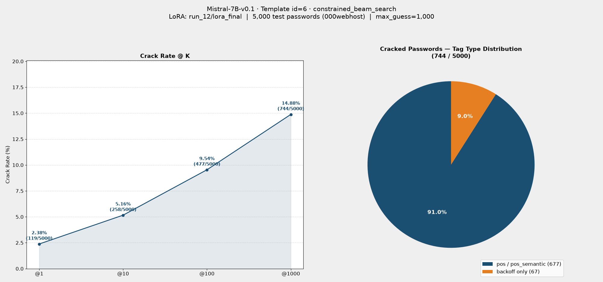

# Eval Report: Mistral-7B-v0.1 · Template id=6 · constrained_beam_search

## 實驗設定

| 項目 | 值 |
|---|---|
| 模型 | Mistral-7B-v0.1 |
| LoRA | `checkpoints/Mistral-7B-v0.1/run_12/lora_final` |
| LoRA rank / alpha / target_modules | r=16, alpha=32, [q_proj, k_proj, v_proj]（`train_config.yaml` 預設值） |
| 訓練 Template ID | 6 |
| 推論 Template ID | 6 |
| 評估筆數 | 5,000 |
| Max guess | 1,000 |
| 搜尋法（primary） | `constrained_beam_search` |
| 搜尋法（fallback） | `dynamic_beam_search`（當 tags 含 pos/pos_semantic 時） |
| 測試集 | `datasets/processed/semanticPCFG/000webhost/backoff/split/test_data.jsonl` |
| 來源 log | `results/eval/eval-260704.out` |

## Crack Rate

| @K | Cracked | Rate |
|---|---|---|
| @1 | 119 / 5,000 | 2.38% |
| @10 | 258 / 5,000 | 5.16% |
| @100 | 477 / 5,000 | 9.54% |
| @1000 | 744 / 5,000 | 14.88% |

## 結果圖表

## 破解密碼的 Tag 類型分佈

| Tag 類型 | 筆數 | 比例 |
|---|---|---|
| 純 backoff tag | 67 | 9.0% |
| 含 pos / pos_semantic tag | 677 | 91.0% |

> **觀察：** 與 id=5（run_7，同樣 r=16/alpha=32 LoRA、同測試集）相比，@1000 破解率幾乎相同（14.88% vs 14.76%），詳細對照見 [comparison_id5run7_vs_id6run12_Mistral-7B_constrained_beam_search.md](comparison_id5run7_vs_id6run12_Mistral-7B_constrained_beam_search.md)。絕大多數破解的密碼（91.0%）需透過 fallback 到 `dynamic_beam_search` 才能命中，純 backoff 結構的破解能力仍有限。
