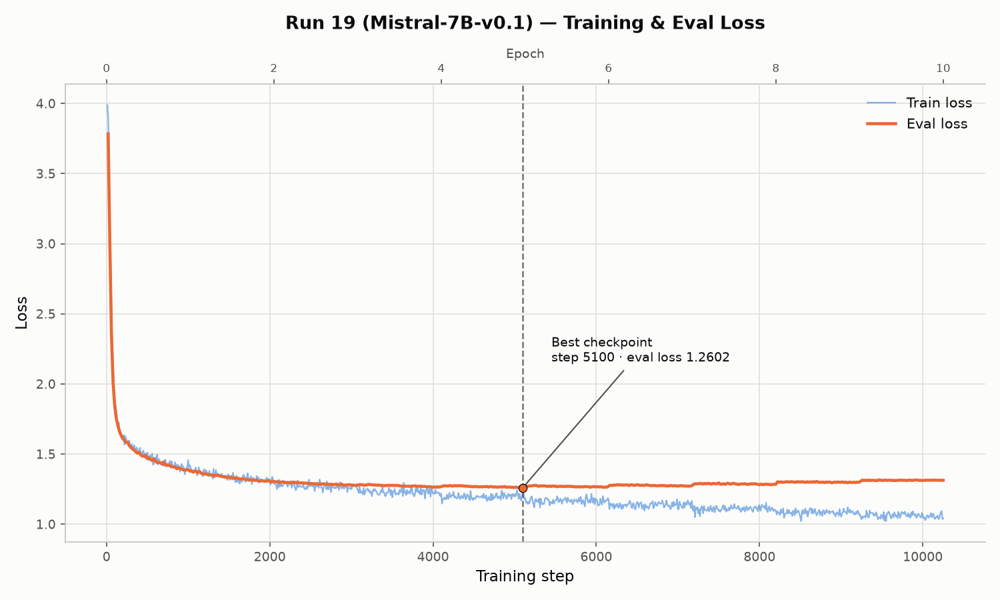
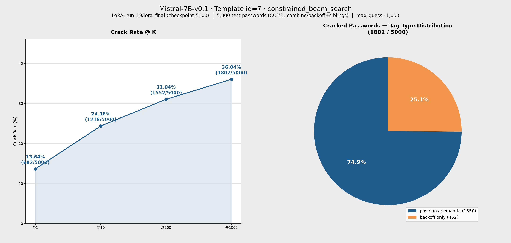

# 參數報告：Mistral-7B-v0.1 run_19

來源：`checkpoints/Mistral-7B-v0.1/run_19/checkpoint-5100/trainer_state.json`、`checkpoints/Mistral-7B-v0.1/run_19/train_config_snapshot.json`、`results/train/job-277568.out`（訓練 log）、`results/eval/eval-281367.out`（評估 log）、`gen/eval_results_id7_run_19_Mistral7B_id7_COMB.jsonl`、`datasets/processed/semanticPCFG/combine/backoff/split/test_data.jsonl`

> run_19 是第一個使用 **prompt template id=7**（`<tag>` structure + sibling passwords）訓練/評估的 run，資料集為 `combine/backoff`（`run_pcfg_combine_sibling.py` 在既有 COMB backoff 標記資料上加入 `Siblings` 欄位）。訓練已完整跑滿 10 epoch（`max_steps=10,250`），非中途截斷。

## 一、訓練參數

| 項目 | 值 |
|---|---|
| 基底模型 | `models/Mistral-7B-v0.1` |
| LoRA 模式 | `lora`（標準 bf16 LoRA，**非** QLoRA／未做 4-bit 量化） |
| 訓練資料 | `datasets/processed/semanticPCFG/combine/backoff/split/train_data.jsonl`（262,263 筆） |
| 驗證資料 | 同目錄 `test_data.jsonl`（13,513 筆） |
| Prompt Template ID | 7（`<tag>` placeholder structure + sibling passwords JSON 陣列，訓練/推論 prompt 相同） |
| 輸出目錄 | `checkpoints/Mistral-7B-v0.1/run_19` |

### Trainer 超參數

| 參數 | 值 |
|---|---|
| per_device_train_batch_size | 4 |
| gradient_accumulation_steps | 64（有效 batch = 256） |
| per_device_eval_batch_size | 32 |
| num_train_epochs | 10 |
| max_steps（trainer_state 實際） | 10,250 |
| warmup_ratio | 0.1 |
| learning_rate | 2e-4 |
| weight_decay | 0.01 |
| optim | adamw_torch |
| label_smoothing_factor | 0 |
| bf16 | true |
| seed / data_seed | 42 / 42 |
| eval_strategy / eval_steps | steps / 20 |
| save_steps | 20 |
| logging_steps | 10 |
| eval_delay | 1 |

### LoRA 設定（`train_config_snapshot.json` → `train.lora_config`）

| 參數 | 值 |
|---|---|
| r | 16 |
| lora_alpha | 32 |
| lora_dropout | 0.2 |
| target_modules | `q_proj`, `k_proj`, `v_proj` |
| bias | none |
| init_lora_weights | true |

## 二、訓練狀況與 lora_final 來源

- 訓練已完整跑完 10 epoch / 10,250 steps（job 277568），非中途手動截斷
- `trainer_state.json`（`best_model_checkpoint` 追蹤）顯示 eval_loss 在 **step 5100 達最低點 1.2602**（epoch ≈ 4.98）；此後持續在 1.31 附近微幅震盪並緩慢上升（step 10250 時 eval_loss = 1.3131），train loss 則持續下降至 1.04，顯示 step 5100 之後模型已進入輕度過擬合階段
- `lora_final`（`checkpoints/Mistral-7B-v0.1/run_19/lora_final`）已用 md5sum 核對，權重與 `checkpoint-5100` 完全一致（`load_best_model_at_end` 自動保存最佳點），本次評估即使用此權重
- 對應 train loss（step 5100）：1.1695

### 訓練 / 驗證 Loss 曲線

## 三、評估結果

| 項目 | 值 |
|---|---|
| 基底模型 | `models/Mistral-7B-v0.1`（device=cuda, dtype=torch.float16） |
| LoRA adapter | `checkpoints/Mistral-7B-v0.1/run_19/lora_final`（= checkpoint-5100，最佳點） |
| 評估筆數 | 5,000 |
| 推論 Prompt Template ID | 7 |
| Max guess number | 1,000 |
| 測試集 | `datasets/processed/semanticPCFG/combine/backoff/split/test_data.jsonl`（前 5,000 筆，依序評估） |
| 輸出檔 | `gen/eval_results_id7_run_19_Mistral7B_id7_COMB.jsonl` |
| 來源 log | `results/eval/eval-281367.out` |

### Crack Rate

| @K | Cracked | Rate |
|---|---|---|
| @1 | 682 / 5,000 | 13.64% |
| @10 | 1,218 / 5,000 | 24.36% |
| @100 | 1,552 / 5,000 | 31.04% |
| @1000 | 1,802 / 5,000 | 36.04% |

### 結果圖表

### Tag Type 分布（@1000）

分類規則同 `docs/logs/20260722_modify.md` 所載（`pcfg_tags.py` 結構化 pattern → backoff；具名實體與 CLAWS7 標籤 → pos；WordNet synset → pos_semantic；密碼多個 segment 取「有 pos_semantic 就算 pos_semantic，否則有 pos 就算 pos，否則 backoff」），與 run_18 報告用同一組 total 數字（backoff=1,773 / pos=1,804 / pos_semantic=1,423）核對一致。

| Tag Type | Cracked | Total | Rate |
|---|---|---|---|
| backoff | 452 | 1,773 | 25.49% |
| pos | 461 | 1,804 | 25.55% |
| pos_semantic | 889 | 1,423 | 62.47% |

## 四、Sibling Password 效果分析（id=7 核心變數）

id=7 相對 id=5 唯一的差異是 prompt 多帶入 `sibling passwords`（同帳號歷史密碼，最多 5 筆，無則為 `[]`）。以測試集實際的 `Siblings` 欄位切分後：

| 分組 | 筆數 | 佔比 |
|---|---|---|
| 有 sibling password | 2,895 | 57.9% |
| 無 sibling password（`[]`） | 2,105 | 42.1% |

| @K | 有 sibling（cracked/total） | 有 sibling rate | 無 sibling（cracked/total） | 無 sibling rate |
|---|---|---|---|---|
| @1 | 603 / 2,895 | 20.83% | 79 / 2,105 | 3.75% |
| @10 | 1,049 / 2,895 | 36.23% | 169 / 2,105 | 8.03% |
| @100 | 1,290 / 2,895 | 44.56% | 262 / 2,105 | 12.45% |
| @1000 | 1,423 / 2,895 | 49.15% | 379 / 2,105 | 18.00% |

> 「無 sibling」子集的 @1000 crack rate（18.00%）幾乎等同 run_18（無 sibling 資訊的 id=5 baseline，18.12%），而「有 sibling」子集達 49.15% ——顯示 run_19 整體 crack rate 從 18.12%（run_18）跳升到 36.04% 幾乎完全是 sibling password 資訊帶來的增益，而非模型或 LoRA 設定本身的差異（run_18/run_19 的 LoRA 設定其實不同，見下節，但無 sibling 子集的表現顯示這個差異影響很小）。

## 五、與 run_18（id=5，無 sibling）比較（同 COMB 測試集，密碼完全相同）

| 項目 | run_18（id=5） | run_19（id=7） |
|---|---|---|
| Prompt Template | id=5（inline `<tag>`，無 sibling） | id=7（inline `<tag>` + sibling passwords） |
| learning_rate | 2e-4 | 2e-4 |
| 有效 batch | 256（4×64） | 256（4×64） |
| LoRA | r32/α64/dropout0.2/+o+gate | r16/α32/dropout0.2/qkv only |
| 訓練狀態 | **訓練中**，手動截斷（目前最佳點，約 43% 進度） | 完整跑完 10 epoch，自動選最佳點（step 5100） |
| @1 | 3.66% | **13.64%** |
| @1000 | 18.12% | **36.04%** |

> 兩者除了 prompt template（sibling 資訊）不同外，LoRA 目標模組與 rank 也不同（run_18 用較大的 r32/+o+gate，run_19 用較小的 r16/qkv-only），且 run_18 是訓練未完成時的中途截斷結果，因此本比較並非乾淨的單一變數對照。但第四節「無 sibling 子集」的結果（18.00%，幾乎等於 run_18 的 18.12%）強烈支持 crack rate 提升主要來自 sibling password 資訊，而非 LoRA 設定差異。

## 六、與 PassLLM 對照（同一組 5,000 筆測試密碼）

`docs/reports/comparison_PassLLM_vs_PCFG-LLM_COMB.md` 記錄 PassLLM（targeted 模式，prompt 亦含 `"Old password"` sibling 資訊）在同一組 COMB 測試集的結果：@1000 = 1,054 / 5,000（21.08%）。run_19（id=7，同樣帶 sibling 資訊）@1000 = 1,802 / 5,000（36.04%），全面超越 PassLLM：

| @K | PassLLM | run_19（id=7） |
|---|---|---|
| @1 | 0 / 5,000（0.00%） | 682 / 5,000（13.64%） |
| @10 | 425 / 5,000（8.50%） | 1,218 / 5,000（24.36%） |
| @100 | 914 / 5,000（18.28%） | 1,552 / 5,000（31.04%） |
| @1000 | 1,054 / 5,000（21.08%） | 1,802 / 5,000（36.04%） |

## 七、已破解密碼（@1000，部分列舉，依猜測次數排序）

| 密碼 | Tags | 猜測次數 |
|---|---|---|
| 6791crbyj | number4\|char2\|ii\|char1 | 1 |
| 54383502 | number8 | 1 |
| ira_irinka_19 | mname\|special1\|ppis1\|rink.n.01\|at1\|special1\|number2 | 1 |
| asika123 | at1\|japanese_deer.n.01\|number3 | 1 |
| littlegirl | small.a.01\|girl.n.01 | 1 |
| 36e96198 | number2\|char1\|number5 | 1 |
| fktrcttdyf | char10 | 1 |
| Lilsis12 | char3\|char3\|number2 | 1 |
| 224466ks | number6\|char2 | 1 |
| gctdljubufyn | char12 | 1 |
| toastbakeroa | toast.n.01\|baker.n.01\|char2 | 1 |
| Lolipopz12323 | char7\|char1\|number5 | 1 |
| 19820507 | number8 | 1 |
| pine123wood | pine.n.01\|number3\|wood.n.01 | 1 |
| de56524_ | char2\|number5\|special1 | 2 |
| sm3llybum | char2\|number1\|char3\|char3 | 10 |
| stephanie23 | fname\|number2 | 147 |
| D12072002B | char1\|number8\|char1 | 1000 |
