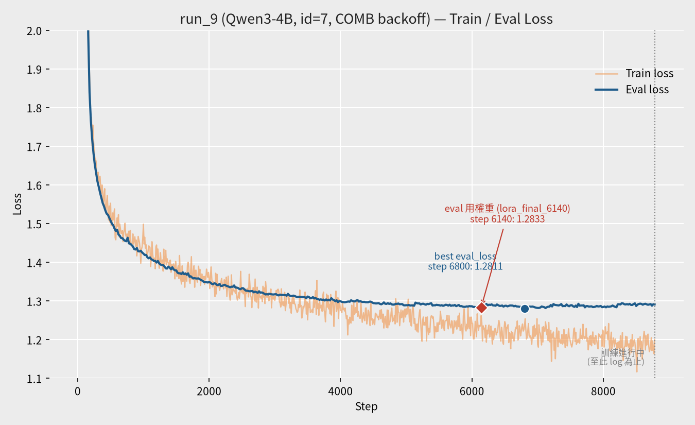
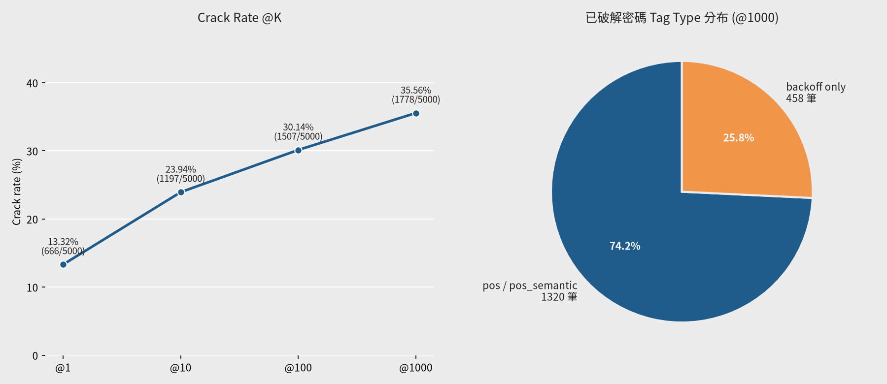

# 參數報告：Qwen3-4B run_9

來源：`checkpoints/Qwen3-4B/run_9/checkpoint-6800/trainer_state.json`（最佳點）、`checkpoints/Qwen3-4B/run_9/checkpoint-8780/trainer_state.json`（訓練至今最新 log_history）、`checkpoints/Qwen3-4B/run_9/train_config_snapshot.json`、`config/search.yaml`（eval 區塊）、`eval-285824.out`（評估 log）、`gen/eval_results_id7_run_9_Qwen4B_id7_COMB.jsonl`、`datasets/processed/semanticPCFG/combine/backoff/split/test_data.jsonl`

> run_9 是 Qwen3-4B 第一個使用 **prompt template id=7**（`<tag>` structure + sibling passwords）訓練/評估的 run，資料集為 `combine/backoff`（COMB，與 Mistral-7B `run_19` 使用完全相同的訓練/測試集）。**訓練截至本報告撰寫時尚未跑完**（`max_steps=10,250`，目前進度到 step ~8,780，約 86%），本次評估使用的是訓練中途另存的 `lora_final_6140`（step 6,140），並非目前已知的最佳點（step 6,800）或最終權重，數字會隨訓練結束後重新評估而更新。

## 一、訓練參數

| 項目 | 值 |
|---|---|
| 基底模型 | `models/Qwen3-4B` |
| LoRA 模式 | `lora`（標準 bf16 LoRA，**非** QLoRA／未做 4-bit 量化） |
| 訓練資料 | `datasets/processed/semanticPCFG/combine/backoff/split/train_data.jsonl`（262,263 筆） |
| 驗證資料 | 同目錄 `test_data.jsonl`（13,513 筆） |
| Prompt Template ID | 7（`<tag>` placeholder structure + sibling passwords JSON 陣列，訓練/推論 prompt 相同） |
| 輸出目錄 | `checkpoints/Qwen3-4B/run_9` |

### Trainer 超參數

| 參數 | 值 |
|---|---|
| per_device_train_batch_size | 4 |
| gradient_accumulation_steps | 64（有效 batch = 256） |
| per_device_eval_batch_size | 32 |
| num_train_epochs | 10 |
| max_steps（trainer_state） | 10,250 |
| warmup_ratio | 0.1 |
| learning_rate | 2e-4 |
| weight_decay | 0.01 |
| optim | adamw_torch |
| label_smoothing_factor | 0 |
| bf16 | true |
| seed / data_seed | 42 / 42 |
| eval_strategy / eval_steps | steps / 20 |
| save_steps | 20 |
| logging_steps | 10 |
| eval_delay | 1 |

### LoRA 設定（`train_config_snapshot.json` → `train.lora_config`）

| 參數 | 值 |
|---|---|
| r | 16 |
| lora_alpha | 32 |
| lora_dropout | 0.2 |
| target_modules | `q_proj`, `k_proj`, `v_proj` |
| bias | none |
| init_lora_weights | true |

（與 `run_19` 的 LoRA 設定完全相同，可視為同一組超參數在不同底模上的對照。）

## 二、訓練狀況與 lora_final_6140 來源

- 訓練**尚未完成**：目前（撰寫本報告時）最新 checkpoint 進度到約 step 8,780（epoch ≈ 8.57），仍在往 10,250 步（10 epoch）推進
- `trainer_state.json` 目前追蹤到的 `best_model_checkpoint` 是 **step 6,800**（eval_loss = 1.28106），為訓練至今的最低點；此後 eval_loss 在 1.29 附近微幅震盪未再刷新，train loss 則持續下降到 1.15 左右，顯示模型可能已進入輕度過擬合區間，但尚待訓練跑完後才能確認最終最佳點
- 本次評估用的 `lora_final_6140` 是訓練「中途」另存的一份權重（step 6,140，eval_loss = 1.28330），**不是**目前已知的最佳點（step 6,800），兩者 eval_loss 差異很小（1.2833 vs 1.2811），但嚴格來說本報告數字並非最優 checkpoint 的結果
- 對應 train loss（step 6,140）：1.2621

### 訓練 / 驗證 Loss 曲線

> 圖中紅色菱形標記為本次評估實際使用的權重（step 6,140），藍色圓點為目前追蹤到的最佳點（step 6,800）；灰色虛線右側為 log 尚未涵蓋、訓練仍在進行的區間。

## 三、評估結果

| 項目 | 值 |
|---|---|
| 基底模型 | `models/Qwen3-4B`（device=cuda, dtype=torch.float16） |
| LoRA adapter | `checkpoints/Qwen3-4B/run_9/lora_final_6140`（訓練中途權重，非最佳點） |
| 評估筆數 | 5,000 |
| 推論 Prompt Template ID | 7 |
| Max guess number | 1,000 |
| 測試集 | `datasets/processed/semanticPCFG/combine/backoff/split/test_data.jsonl`（前 5,000 筆，依序評估） |
| 輸出檔 | `gen/eval_results_id7_run_9_Qwen4B_id7_COMB.jsonl` |
| 來源 log | `eval-285824.out` |

### Crack Rate

| @K | Cracked | Rate |
|---|---|---|
| @1 | 666 / 5,000 | 13.32% |
| @10 | 1,197 / 5,000 | 23.94% |
| @100 | 1,507 / 5,000 | 30.14% |
| @1000 | 1,778 / 5,000 | 35.56% |

### 結果圖表

### Tag Type 分布（@1000）

分類規則同 `docs/reports/id7_run19_Mistral-7B_id7_constrained_beam_search.md`（`pcfg_tags.py` 結構化 pattern → backoff；具名實體與 CLAWS7 標籤 → pos；WordNet synset → pos_semantic；多 segment 密碼取「有 pos_semantic 就算 pos_semantic，否則有 pos 就算 pos，否則 backoff」）。測試集 tag type 總數與 run_19 報告一致（backoff=1,773 / pos=1,804 / pos_semantic=1,423），因為兩者用的是完全相同的 COMB backoff 測試集。

| Tag Type | Cracked | Total | Rate |
|---|---|---|---|
| backoff | 458 | 1,773 | 25.83% |
| pos | 454 | 1,804 | 25.17% |
| pos_semantic | 866 | 1,423 | 60.86% |

## 四、Sibling Password 效果分析

id=7 相對純 tag structure prompt 唯一的差異是多帶入 `sibling passwords`（同帳號歷史密碼，最多 5 筆，無則為 `[]`）。以測試集實際的 `sibling passwords` 欄位切分後：

| 分組 | 筆數 | 佔比 |
|---|---|---|
| 有 sibling password | 2,895 | 57.9% |
| 無 sibling password（`[]`） | 2,105 | 42.1% |

| @K | 有 sibling（cracked/total） | 有 sibling rate | 無 sibling（cracked/total） | 無 sibling rate |
|---|---|---|---|---|
| @1 | 592 / 2,895 | 20.45% | 74 / 2,105 | 3.52% |
| @10 | 1,037 / 2,895 | 35.82% | 160 / 2,105 | 7.60% |
| @100 | 1,259 / 2,895 | 43.49% | 248 / 2,105 | 11.78% |
| @1000 | 1,411 / 2,895 | 48.74% | 367 / 2,105 | 17.43% |

> 與 `run_19`（Mistral-7B，同一測試集）的「有 sibling / 無 sibling」子集切分（2,895 / 2,105 筆，完全一致，因為切分依據是測試集本身而非模型）相比，run_9 兩個子集的 rate 都略低於 run_19（有 sibling @1000：48.74% vs 49.15%；無 sibling @1000：17.43% vs 18.00%），與整體 @1000（35.56% vs 36.04%）的差距幅度相近。由於本次 run_9 評估用的並非最終權重，這個小幅落後暫不能解讀為「Qwen3-4B 本質上弱於 Mistral-7B」。

## 五、與 run_19（Mistral-7B，同一 id=7 設定）比較

同一 COMB 測試集、完全相同的 prompt template（id=7）與 LoRA 設定（r16/α32/dropout0.2/qkv-only、lr=2e-4、有效 batch 256），差異僅在底模與訓練完成度：

| 項目 | run_19（Mistral-7B） | run_9（Qwen3-4B） |
|---|---|---|
| 訓練狀態 | 完整跑完 10 epoch（10,250 steps），`load_best_model_at_end` 自動選最佳點（step 5,100） | **訓練中**，約 86% 進度，本次評估用中途權重（step 6,140），非最佳點 |
| eval_loss（評估用權重） | 1.2602 | 1.2833 |
| @1 | 13.64% | 13.32% |
| @10 | 24.36% | 23.94% |
| @100 | 31.04% | 30.14% |
| @1000 | 36.04% | 35.56% |

> 兩者 crack rate 非常接近（@1000 差距僅 0.48 個百分點），但 run_9 訓練尚未完成、且評估用的並非目前最佳 checkpoint，因此本比較僅供參考，待 run_9 訓練跑完並用最佳/最終權重重新評估後應再更新此表。

## 六、已破解密碼（@1000，部分列舉，依猜測次數排序）

| 密碼 | Tags | 猜測次數 |
|---|---|---|
| 54383502 | number8 | 1 |
| ira_irinka_19 | mname\|special1\|ppis1\|rink.n.01\|at1\|special1\|number2 | 1 |
| 51386263291 | number11 | 1 |
| littlegirl | small.a.01\|girl.n.01 | 1 |
| questmagic | pursuit.n.02\|magic.n.01 | 1 |
| asia990123! | fname\|number6\|special1 | 1 |
| 36e96198 | number2\|char1\|number5 | 1 |
| lovely12 | lovely.s.01\|number2 | 1 |
| agub551irotas | at1\|char3\|number3\|ppis1\|rota.n.01 | 953 |
| michelle22 | fname\|number2 | 955 |
| lemonmilo | lemon.n.01\|mname | 962 |
| pepper0228 | pepper.n.01\|number4 | 970 |
| st34lth* | char2\|number2\|char3\|special1 | 978 |

## 待辦

- run_9 訓練跑滿 10,250 steps 後，需確認最終 `best_model_checkpoint`，並用該權重重新跑一次評估，更新本報告第三～六節數字
- 屆時可將「訓練完整跑完」版本的 run_9 與 run_19 做乾淨的同設定跨底模對照（目前第五節的比較因訓練完成度不同而不完全公平）
