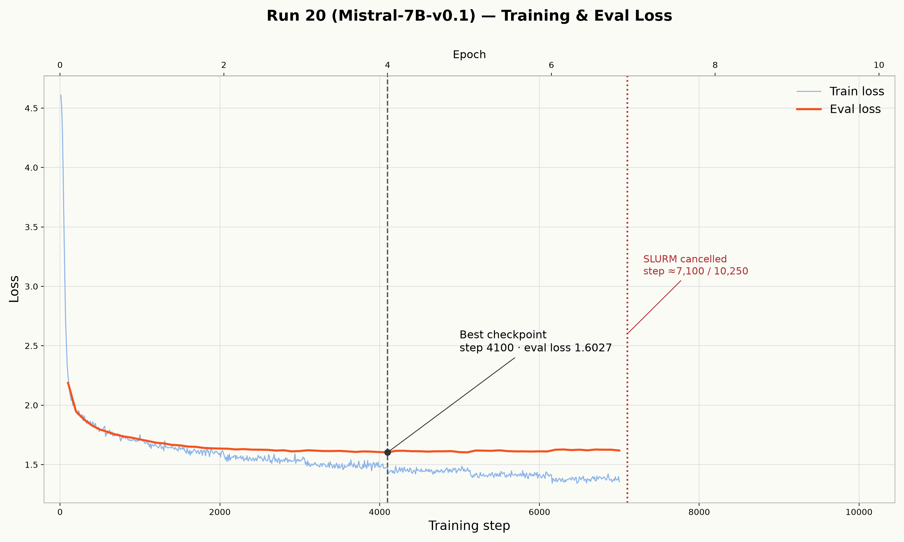
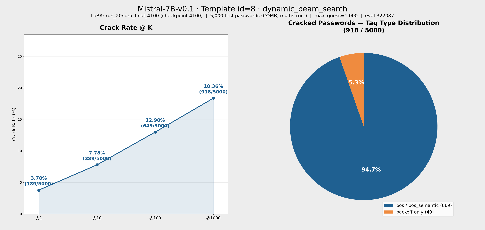
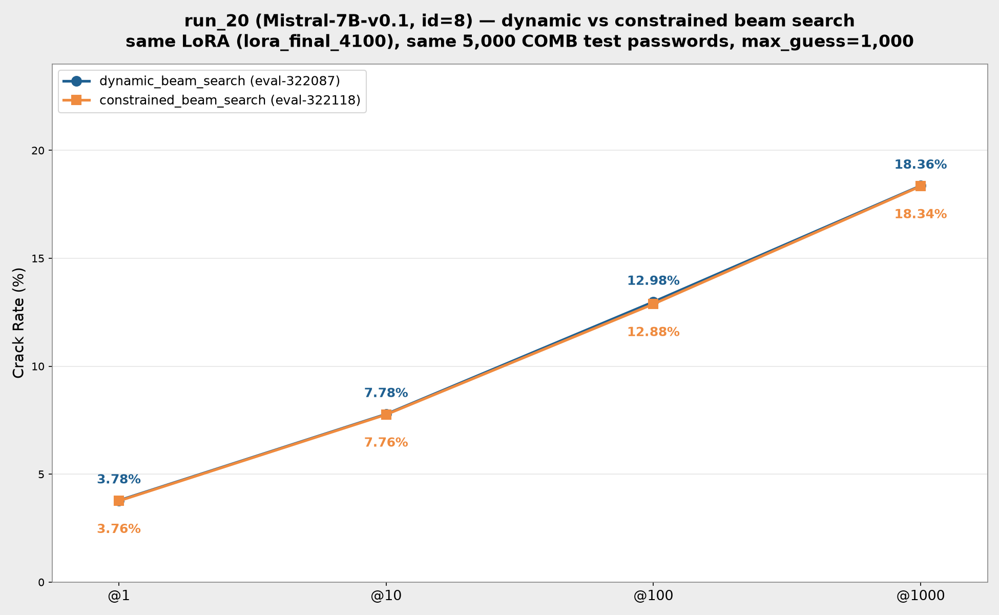

# 訓練報告：Mistral-7B-v0.1 run_20（id=8, multi-structcand）

來源：`checkpoints/Mistral-7B-v0.1/run_20/train_config_snapshot.json`、`checkpoints/Mistral-7B-v0.1/run_20/checkpoint-7000/trainer_state.json`、`results/train/job-321018.out`（訓練 log）、`results/eval/eval-322087.out`（dynamic 評估 log）、`results/eval/eval-322118.out`（constrained 評估 log）、`gen/eval_results_id8_run_20_Mist7B_id8_COMB_dynamic.jsonl`、`gen/eval_results_id8_run_20_Mist7B_id8_COMB_constrain.jsonl`、`datasets/processed/semanticPCFG/COMB/multistruct/split/test_data.jsonl`

> run_20 是第一個使用 **prompt template id=8（multi-structcand）** 訓練/評估的 run。id=8 沿用 id=5 的 system prompt，差異在 JSON payload 除了主結構（`Tags`，backoff 標記）外，另附上同一組密碼的 **candidate structures**（其他 tag-type 如 pos / pos_semantic 的 `<tag>` 結構列表，來源為 `CandTags` 欄位）。資料集為 `COMB/multistruct`（train 262,263 筆 / test 13,513 筆）。**訓練未跑完**：SLURM 於 2026-08-31 10:52 手動取消（job 321018），約在 step 7,100 / 10,250。本次評估使用 `load_best_model_at_end` 自動選出的最佳點 **lora_final_4100（= checkpoint-4100，step 4,100）**。

---

## 一、訓練參數

| 項目 | 值 |
|---|---|
| 基底模型 | `models/Mistral-7B-v0.1`（bf16 載入） |
| LoRA 模式 | `lora`（標準 bf16 LoRA，**非** QLoRA／未做 4-bit 量化） |
| 訓練資料 | `datasets/processed/semanticPCFG/COMB/multistruct/split/train_data.jsonl`（262,263 筆） |
| 驗證資料 | 同目錄 `test_data.jsonl`（13,513 筆） |
| Prompt Template ID | 8（multi-structcand：id=5 inline `<tag>` 主結構 + candidate structures 列表，訓練/推論 prompt 相同） |
| 資料欄位 | `Password` / `Tokens` / `Tags`（backoff 主結構） / `CandTags`（其他 tag-type 候選結構，JSON 陣列） / `source` |
| 輸出目錄 | `checkpoints/Mistral-7B-v0.1/run_20` |

### Trainer 超參數（`train_config_snapshot.json` → `train.train_config`）

| 參數 | 值 |
|---|---|
| per_device_train_batch_size | 4 |
| gradient_accumulation_steps | 64（有效 batch = 256） |
| per_device_eval_batch_size | 32 |
| num_train_epochs | 10 |
| max_steps（trainer_state 實際） | 10,250 |
| warmup_ratio | 0.1（warmup_steps = 1,024） |
| learning_rate | 2e-4 |
| weight_decay | 0.01 |
| optim | adamw_torch |
| label_smoothing_factor | 0 |
| bf16 | true |
| seed / data_seed | 42 / 42 |
| eval_strategy / eval_steps | steps / 100 |
| save_steps | 100 |
| logging_steps | 10 |
| eval_delay | 1 |

### LoRA 設定（`train_config_snapshot.json` → `train.lora_config`）

| 參數 | 值 |
|---|---|
| r | 16 |
| lora_alpha | 32 |
| lora_dropout | 0.2 |
| target_modules | `q_proj`, `k_proj`, `v_proj` |
| bias | none |
| init_lora_weights | true |

---

## 二、訓練停止節點與 lora_final 來源

- 訓練 **未跑滿** 10 epoch / 10,250 steps。訓練 log（`results/train/job-321018.out`）末尾為：
  `slurmstepd-hgpn39: error: *** JOB 321018 ON hgpn39 CANCELLED AT 2026-08-31T10:52:49 ***`
  取消發生於一次 eval（step 7,000 後）進行中，實際訓練進度約 **step 7,100 / 10,250（epoch ≈ 6.9，約 69%）**。
- `checkpoint-7000/trainer_state.json`（`best_model_checkpoint` 追蹤）顯示：eval_loss 在 **step 4,100 達最低點 1.6027**（epoch = 4.0），此後在 1.60–1.63 區間震盪並略為上升（step 7,000 時 eval_loss = 1.6182），而 train loss 持續下降（step 7,000 時 ≈ 1.35），顯示 step 4,100 之後模型已進入輕度過擬合階段。
- 最佳點附近的 eval_loss 非常接近：step 4,100 = 1.6027、step 5,100 = 1.6031、step 5,000 = 1.6046、step 4,000 = 1.6052，曲線在第 4 epoch 後基本走平。
- `lora_final_4100`（`checkpoints/Mistral-7B-v0.1/run_20/lora_final_4100`）即 `load_best_model_at_end` 自動保存的最佳點（step 4,100），本次兩份評估皆使用此權重。
- 對應 train loss（step 4,100）：1.4709。

### 訓練 / 驗證 Loss 曲線

> 虛線（黑）標記最佳 checkpoint（step 4,100），點線（紅）標記 SLURM 取消位置（step ≈ 7,100）。

---

## 三、評估結果

本次以同一份 LoRA（`lora_final_4100`）、同一組前 5,000 筆 COMB test 密碼，跑了 **兩種搜尋方法**：

| 項目 | eval-322087（dynamic） | eval-322118（constrained） |
|---|---|---|
| 搜尋方法 | `dynamic_beam_search` | `constrained_beam_search`（`fallback_to_dynamic: true`） |
| 基底模型 | `models/Mistral-7B-v0.1`（cuda, float16） | 同左 |
| LoRA adapter | `run_20/lora_final_4100`（= checkpoint-4100） | 同左 |
| 評估筆數 | 5,000 | 5,000 |
| 推論 Prompt Template ID | 8 | 8 |
| Max guess number | 1,000 | 1,000 |
| 測試集 | `COMB/multistruct/split/test_data.jsonl`（前 5,000 筆） | 同左 |
| 輸出檔 | `gen/eval_results_id8_run_20_Mist7B_id8_COMB_dynamic.jsonl` | `gen/eval_results_id8_run_20_Mist7B_id8_COMB_constrain.jsonl` |

> 註：constrained 評估中，因測試集大量密碼帶 pos/pos_semantic tag（synset、named entity），`constrained_beam_search` 對其中 **3,227 / 5,000** 筆觸發 `fallback→dynamic`。這也是兩份結果幾乎相同的原因。

### Crack Rate

| @K | dynamic（eval-322087） | constrained（eval-322118） |
|---|---|---|
| @1 | 189 / 5,000（**3.78%**） | 188 / 5,000（**3.76%**） |
| @10 | 389 / 5,000（**7.78%**） | 388 / 5,000（**7.76%**） |
| @100 | 649 / 5,000（**12.98%**） | 644 / 5,000（**12.88%**） |
| @1000 | 918 / 5,000（**18.36%**） | 917 / 5,000（**18.34%**） |

### 結果圖表

**dynamic_beam_search（eval-322087）**

**constrained_beam_search（eval-322118）**

**兩搜尋方法對照**

### Tag Type 分布（@1000）

分類規則同既有報告（`pcfg_tags.py` 結構化 pattern → backoff；WordNet synset / `<pos>_<synset>` → pos_semantic；具名實體與 CLAWS7 標籤 → pos；密碼多 segment 取「有 pos_semantic 就算 pos_semantic，否則有 pos 就算 pos，否則 backoff」）。兩份評估的 total 完全相同（同一組密碼）。

| Tag Type | Total | dynamic cracked | dynamic rate | constrained cracked | constrained rate |
|---|---|---|---|---|---|
| backoff | 1,773 | 49 | 2.76% | 49 | 2.76% |
| pos | 1,804 | 101 | 5.60% | 100 | 5.54% |
| pos_semantic | 1,423 | 768 | 53.97% | 768 | 53.97% |

> 結果高度集中在 **pos_semantic** 子集（@1000 破解率 53.97%），而純結構的 backoff 子集僅 2.76%。餅圖中「pos / pos_semantic」= pos-cracked + pos_semantic-cracked（dynamic：101 + 768 = 869），「backoff only」= 49。這與 id=8 的設計一致：candidate structures 幾乎全部承載語意（pos_semantic）資訊，模型主要靠語意 tag 才能重建字元。

---

## 四、觀察與備註

1. **訓練被提早取消，但取到的是最佳點。** 最佳 eval_loss（step 4,100）出現在第 4 epoch，之後曲線走平並輕微過擬合；即使訓練跑滿 10 epoch，依 `load_best_model_at_end` 邏輯仍會選回 step 4,100 附近，因此提早取消對「最佳權重」的影響很小。
2. **兩種搜尋方法結果幾乎一致（@1000 差 1 筆）。** 因測試集約 65%（3,227/5,000）帶 pos/pos_semantic tag，constrained 搜尋對這些密碼直接 fallback 回 dynamic，故差異僅來自純結構（backoff）密碼的少數邊界案例。
3. **eval_loss 水位（≈1.60）明顯高於 run_19（≈1.26）。** 兩者資料集/標記不同（run_19 為 `combine/backoff` + siblings，run_20 為 `COMB/multistruct`），loss 絕對值不可直接比較；crack rate 亦受測試集構成差異影響，跨 run 比較需另建同測試集對照。

---

## 五、已破解密碼（@1000，dynamic，依猜測次數排序，部分列舉）

| 密碼 | Tags | 猜測次數 |
|---|---|---|
| -happy123 | special1\|happy.a.01\|number3 | 1 |
| 1234mama1234 | number4\|ma.n.01\|number4 | 1 |
| 123asd123asd | number3\|char3\|number3\|char3 | 1 |
| 1bigblunt | number1\|large.a.01\|blunt.s.01 | 1 |
| 1cannabis | number1\|cannabis.n.01 | 1 |
| 1evolution | number1\|development.n.02 | 1 |
| 1madness | number1\|lunacy.n.01 | 1 |
| 21happy123 | number2\|happy.a.01\|number3 | 1 |
| alex123456 | mname\|number6 | 1 |
| authenticity | authenticity.n.01 | 1 |
| autumnjoy | fall.n.01\|joy.n.01 | 1 |
| awesome! | amazing.s.02\|special1 | 1 |
| babylove | baby.n.01\|love.n.01 | 1 |
| banana1234 | banana.n.01\|number4 | 1 |
| bigtone1 | large.a.01\|tone.n.01\|number1 | 1 |
| bloodomen1 | blood.n.01\|omen.n.01\|number1 | 1 |
| happy1231991 | happy.a.01\|number7 | 21 |
