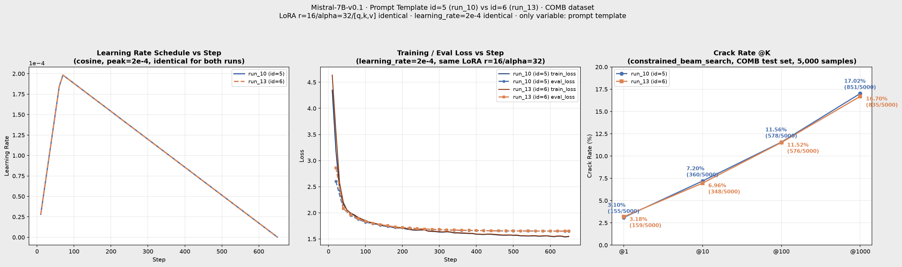
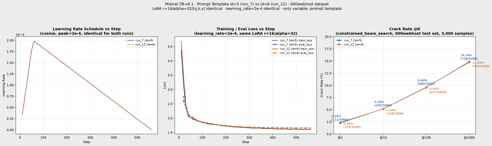
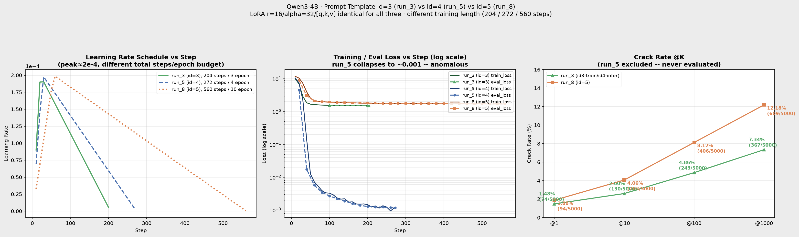
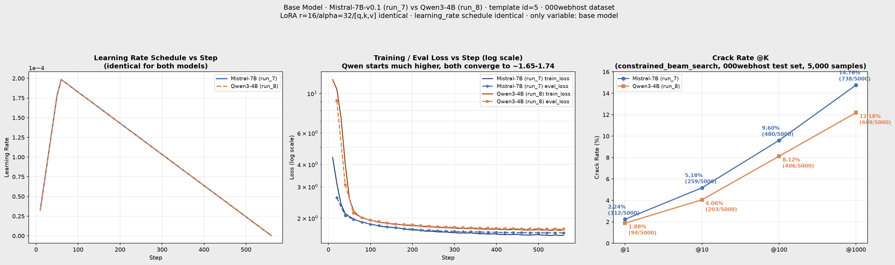

# 參數調整比較報告（Param Compare）

Mistral-7B-v0.1 / Qwen3-4B · constrained_beam_search（5,000 筆測試）

本文彙整各次參數調整（prompt template / learning rate / batch size / LoRA）的訓練 loss 與 crack rate 對照，每節聚焦單一變因，其餘參數保持相同。

---

## 1. Prompt Template

固定：LoRA r=16/alpha=32/[q,k,v]、learning_rate=2e-4、10 epoch。唯一差異：prompt 格式（id=5 有 JSON 包裝＋詳細指示；id=6 精簡純文字）。分別在 COMB、000webhost 兩個資料集上驗證。

### 1.1 Mist +COMB dataset：run_10（id=5）vs run_13（id=6）

| 指標 | run_10（id=5） | run_13（id=6） |
|---|---|---|
| 最終 train_loss | 1.545 | 1.552 |
| 最終 eval_loss | 1.649 | 1.651 |
| @1 | 3.10%（155/5000） | 3.18%（159/5000） |
| @10 | 7.20%（360/5000） | 6.96%（348/5000） |
| @100 | 11.56%（578/5000） | 11.52%（576/5000） |
| @1000 | 17.02%（851/5000） | 16.70%（835/5000） |

左：learning rate schedule（兩者完全重疊，證實排程一致）；中：train/eval loss；右：crack rate @K。

> loss 曲線幾乎完全重疊，crack rate 差距在四個 K 值方向不一致且皆 <3.3%，屬隨機波動範圍。

### 1.2 Mist + 000webhost dataset：run_7（id=5）vs run_12（id=6）

| 指標 | run_7（id=5） | run_12（id=6） |
|---|---|---|
| 最終 train_loss | 1.607 | 1.613 |
| 最終 eval_loss | 1.654 | 1.654 |
| @1 | 2.24%（112/5000） | 2.38%（119/5000） |
| @10 | 5.18%（259/5000） | 5.16%（258/5000） |
| @100 | 9.60%（480/5000） | 9.54%（477/5000） |
| @1000 | 14.76%（738/5000） | 14.88%（744/5000） |

> loss 曲線幾乎重疊，crack rate 四個 K 值差距皆 <1pp，屬隨機波動。

### 小結（Mistral-7B-v0.1）

兩個資料集上結論一致：**id=5 與 id=6 效果統計等效**。id=6 因移除 JSON 包裝、指示更精簡，prompt token 數更少，成本效益較佳。

### 1.3 Qwen3-4B + 000webhost dataset：run_3（id=3）vs run_5（id=4）vs run_8（id=5）

> **資料限制：** run_3 訓練用 id=3、推論用 id=4（訓練/推論 template 不一致，非乾淨對照）；run_5 從未跑過 crack-rate 評估（`gen/`、`docs/reports/` 皆無對應檔案），只能比較訓練 loss；三者訓練長度也都不同（204／272／560 steps），並非嚴格單一變因對照，僅供參考觀察趨勢。

| 指標 | run_3（id3-train/id4-infer） | run_5（id=4） | run_8（id=5） |
|---|---|---|---|
| LoRA | r=16/alpha=32/[q,k,v] | r=16/alpha=32/[q,k,v] | r=16/alpha=32/[q,k,v] |
| 訓練長度 | 204 steps（3 epoch） | 272 steps（4 epoch） | 560 steps（10 epoch，完整排程） |
| 最終 train_loss | 1.515 | 0.00117 | 1.718 |
| 最終 eval_loss | 1.510 | 0.00118 | 1.736 |
| @1 | 1.48%（74/5000） | 未評估 | 1.88%（94/5000） |
| @10 | 2.60%（130/5000） | 未評估 | 4.06%（203/5000） |
| @100 | 4.86%（243/5000） | 未評估 | 8.12%（406/5000） |
| @1000 | 7.34%（367/5000） | 未評估 | 12.18%（609/5000） |

左：learning rate schedule（三者排程長度不同）；中：train/eval loss（log scale）；右：crack rate @K（僅 run_3 vs run_8，run_5 無資料排除在外）。

> **⚠️ run_5 異常：** loss 在 60 step 內從 10.6 崩塌到 0.001 量級並持平，比 run_3／run_8（同樣的 LoRA）低了 3 個數量級以上。這不是正常的語言模型收斂行為，較可能的原因是 id=4 prompt 設計（`expand_tag_description()`）在訓練資料中造成答案洩漏（prompt 內容與 label 高度重疊），而非模型真的學得更好。**在有真正的 crack-rate 評估驗證之前，不應把這個 loss 數字解讀為 id=4 優於 id=3/id=5。**
>
> **run_3 vs run_8：** run_8（id=5）@1000 破解率 12.18% 高於 run_3（id3-train/id4-infer）的 7.34%，但 run_3 訓練/推論 template 不一致、訓練步數也只有 run_8 的約 1/3（204 vs 560 steps），差距無法單純歸因於 prompt template，訓練充分度也是混淆因子。

---

## 2. 模型基底（Base Model）

### 2.1 000webhost dataset：Mistral-7B-v0.1（run_7）vs Qwen3-4B（run_8）

固定：template id=5、LoRA r=16/alpha=32/[q,k,v]、learning_rate=2e-4、560 steps（10 epoch，排程完全相同）。唯一差異：基底模型。

| 指標 | Mistral-7B（run_7） | Qwen3-4B（run_8） |
|---|---|---|
| 最終 train_loss | 1.607 | 1.718 |
| 最終 eval_loss | 1.654 | 1.736 |
| @1 | 2.24%（112/5000） | 1.88%（94/5000） |
| @10 | 5.18%（259/5000） | 4.06%（203/5000） |
| @100 | 9.60%（480/5000） | 8.12%（406/5000） |
| @1000 | 14.76%（738/5000） | 12.18%（609/5000） |

左：learning rate schedule（兩者完全重疊，證實排程一致）；中：train/eval loss（log scale，Qwen 初始 loss 遠高於 Mistral，但兩者最終都收斂到 1.65~1.74 區間）；右：crack rate @K。

> **結論：** 在 LoRA、learning rate、訓練步數完全一致的前提下，Mistral-7B（7B 參數）在四個 K 值全面領先 Qwen3-4B（4B 參數），@1000 領先幅度約 +21%（14.76% vs 12.18%）。Qwen 訓練初期 loss 遠高於 Mistral（step 10：12.0 vs 4.4），推測與兩者 tokenizer 差異（tiktoken vs SentencePiece）及參數量有關，但收斂後 eval_loss 差距不大（1.654 vs 1.736），crack rate 的差距比 loss 差距更明顯，顯示 loss 收斂程度不能完全代表下游破解率表現。

---

## 3. Learning Rate（Mistral-7B-v0.1）

### 3.1 lr=2e-4 vs lr=5e-4：run_16 vs run_17

固定：batch_size=4、LoRA r=32/alpha=64（biglora）、COMB dataset、template id=5。唯一差異：learning_rate（run_16=2e-4／run_17=5e-4）。是目前唯一乾淨的 learning_rate-only 對照組。

| 項目 | run_16 | run_17 |
|---|---|---|
| learning_rate | 2e-4 | 5e-4 |
| batch_size | 4 | 4 |
| LoRA | r=32/alpha=64 | r=32/alpha=64 |
| 訓練狀態 | 訓練中 | 訓練中 |

> 待比較：train/eval loss 曲線、crack rate @K。**正式結論需等 run_16、run_17 訓練完成並跑完評估後才能補上。**

---

## 4. Batch Size（Mistral-7B-v0.1）

### 4.1 batch=64 vs batch=4：run_15 vs run_17

固定：learning_rate=5e-4、LoRA r=32/alpha=64（biglora）、COMB dataset、template id=5。唯一差異：batch_size（run_15=64／run_17=4）。

| 項目 | run_15 | run_17 |
|---|---|---|
| batch_size | 64 | 4 |
| learning_rate | 5e-4 | 5e-4 |
| LoRA | r=32/alpha=64 | r=32/alpha=64 |
| 訓練狀態 | 已完成（650/650 steps） | 訓練中（10,250 steps 排程） |

> 待比較：train/eval loss 曲線、crack rate @K。**正式結論需等 run_17 訓練完成並跑完評估後才能補上。**

---

## 參考

- [id5_run10_Mistral-7B_id5_COMB_constrained_beam_search.md](id5_run10_Mistral-7B_id5_COMB_constrained_beam_search.md)
- [comparison_id5run7_vs_id6run12_Mistral-7B_constrained_beam_search.md](comparison_id5run7_vs_id6run12_Mistral-7B_constrained_beam_search.md)（run_7 vs run_12 完整版報告，含 prompt 設計對照細節）
- [id5_run15_Mistral-7B_id5_constrained_beam_search.md](id5_run15_Mistral-7B_id5_constrained_beam_search.md)
- [id5_run16_Mistral-7B_id5_constrained_beam_search.md](id5_run16_Mistral-7B_id5_constrained_beam_search.md)
- [id5_run17_Mistral-7B_id5_constrained_beam_search.md](id5_run17_Mistral-7B_id5_constrained_beam_search.md)
- [id5_run8_Qwen3-4B_id5_constrained_beam_search.md](id5_run8_Qwen3-4B_id5_constrained_beam_search.md)（run_8 crack rate 來源）
- [id3_Qwen3-4B_id4_constrained_beam_search.md](id3_Qwen3-4B_id4_constrained_beam_search.md)（run_3 crack rate 來源）
- [comparison_Mistral-7B_vs_Qwen3-4B_id5_constrained_beam_search.md](comparison_Mistral-7B_vs_Qwen3-4B_id5_constrained_beam_search.md)（Mistral vs Qwen 完整版報告，含 run_6 三方比較）
